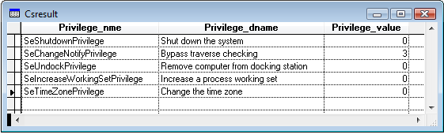

[ Home ](https://github.com/VFPX/Win32API)  

## Function name : LookupPrivilegeName
Group: [Authorization](../../functions_group.md#Authorization)  -  Library: [advapi32](../../Libraries.md#advapi32)  
***  


#### Retrieves the name that corresponds to the privilege represented on a specific system by a specified locally unique identifier (LUID).
***  


## Code examples:
[Reading and setting system access privileges for the current process](../../samples/sample_554.md)  

## Declaration:
```foxpro  
BOOL WINAPI LookupPrivilegeName(
  __in_opt   LPCTSTR lpSystemName,
  __in       PLUID lpLuid,
  __out_opt  LPTSTR lpName,
  __inout    LPDWORD cchName
);  
```  
***  


## FoxPro declaration:
```foxpro  
DECLARE INTEGER LookupPrivilegeName IN advapi32;
	INTEGER lpSystemName,;
	STRING @lpLuid,;
	STRING @lpName,;
	LONG @cchName  
```  
***  


## Parameters:
lpSystemName [in, optional]
A pointer to a null-terminated string that specifies the name of the system on which the privilege name is retrieved.

lpLuid [in]
A pointer to the LUID by which the privilege is known on the target system.

lpName [out, optional]
A pointer to a buffer that receives a null-terminated string that represents the privilege name. For example, this string could be "SeSecurityPrivilege".

cchName [in, out]
A pointer to a variable that specifies the size, in a TCHAR value, of the lpName buffer.   
***  


## Return value:
If the function succeeds, the function returns nonzero.  
***  


## Comments:
typedef struct _LUID {  
&nbsp;&nbsp;DWORD LowPart;  
&nbsp;&nbsp;LONG  HighPart;  
} LUID, *PLUID;  
  
Default privileges for VFP9 process on Vista:  
  


See also: [LookupPrivilegeDisplayName](../advapi32/LookupPrivilegeDisplayName.md), [LookupPrivilegeValue](../advapi32/LookupPrivilegeValue.md).  
  
***  

