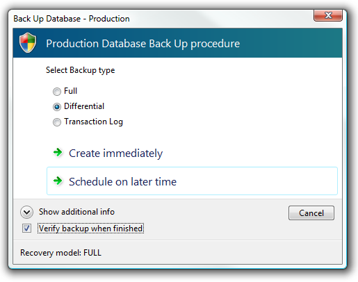

[ Home ](https://github.com/VFPX/Win32API)  

## Function name : TaskDialogIndirect
Group: [Common Dialog Box](../../functions_group.md#Common_Dialog_Box)  -  Library: [comdlg32](../../Libraries.md#comdlg32)  
***  


#### Creates, displays, and operates a task dialog.
***  


## Code examples:
[How to display advanced Task Dialog (Vista)](../../samples/sample_558.md)  

## Declaration:
```foxpro  
HRESULT TaskDialogIndirect(
	const TASKDIALOGCONFIG *pTaskConfig,
	int *pnButton,
	int *pnRadioButton,
	BOOL *pfVerificationFlagChecked
);  
```  
***  


## FoxPro declaration:
```foxpro  
DECLARE INTEGER TaskDialogIndirect IN comctl32;
	STRING pTaskConfig,;
	INTEGER @pnButton,;
	INTEGER @pnRadioButton,;
	INTEGER @pfVerificationFlagChecked  
```  
***  


## Parameters:
pTaskConfig
[in] Pointer to a TASKDIALOGCONFIG structure that contains information used to display the task dialog.

pnButton
[out] 
Address of a variable that receives the Id of the pressed button.

pnRadioButton
[out] Address of a variable that receives one of the button IDs specified in the pRadioButtons member of the pTaskConfig parameter.

pfVerificationFlagChecked
[out] 
Address of a variable that receives the Cheked status of the checkbox.  
***  


## Return value:
Returns S_OK (0) on success.  
***  


## Comments:
The task dialog contains application-defined icons, messages, title, verification check box, command links, push buttons, and radio buttons. This function can register a callback function to receive notification messages.  
  


This is Unicode function. The minimum OS is Vista.  
  
***  

