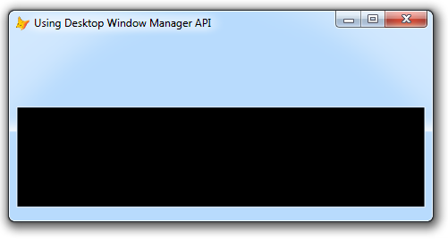
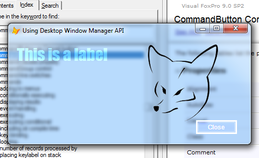

[ Home ](https://github.com/VFPX/Win32API)  

## Function name : DwmExtendFrameIntoClientArea
Group: [Desktop Window Manager (DWM)](../../functions_group.md#Desktop_Window_Manager_(DWM))  -  Library: [dwmapi](../../Libraries.md#dwmapi)  
***  


#### Extends the window frame behind the client area.
***  


## Code examples:
[Customizing the frame of top-level form: removing the standard frame (VFP9, Vista)](../../samples/sample_574.md)  

## Declaration:
```foxpro  
DECLARE INTEGER DwmExtendFrameIntoClientArea IN Dwmapi;
	INTEGER hWindow,;
	STRING @pMarInset  
```  
***  


## FoxPro declaration:
```foxpro  
HRESULT WINAPI DwmExtendFrameIntoClientArea(
        HWND hWnd,
  __in  const MARGINS *pMarInset
);  
```  
***  


## Parameters:
hWnd
The handle to the window in which the frame will be extended into the client area.

pMarInset [in]
A pointer to a MARGINS structure that describes the margins to use when extending the frame into the client area.  
***  


## Return value:
If the method succeeds, it returns S_OK. Otherwise, it returns an HRESULT error code.  
***  


## Comments:
Minimum supported client: <Em>Windows Vista</Em>.  
Note: works for <Em>top-level forms</Em> only (ShowWindow=2).  
  
This function is used to extend the application frame into the client area. With some extra work, controls can be integrated into the extra space on the frame.  
  


A transparent form is created by calling this function with all negative margins.  
  


***  

