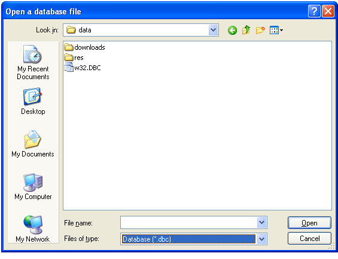

[ Home ](https://github.com/VFPX/Win32API)  

## Function name : GetFileNameFromBrowse
Group: [Shell Functions](../../functions_group.md#Shell_Functions)  -  Library: [shell32](../../Libraries.md#shell32)  
***  


#### This function creates an Open dialog box that lets the user specify the drive, directory, and name of a file to open. 
***  


## Code examples:
[Creating an Open dialog box to specify the drive, directory, and name of a file to open (Shell32 version)](../../samples/sample_365.md)  

## Declaration:
```foxpro  
BOOL GetFileNameFromBrowse(
	HWND hwnd,
	LPWSTR pszFilePath,
	UINT cchFilePath,
	LPCWSTR pszWorkingDir,
	LPCWSTR pszDefExt,
	LPCWSTR pszFilters,
	LPCWSTR szTitle
);  
```  
***  


## FoxPro declaration:
```foxpro  
DECLARE INTEGER GetFileNameFromBrowse IN shell32;
	INTEGER  hwnd,;
	STRING @ pszFilePath,;
	LONG     cchFilePath,;
	STRING   pszWorkingDir,;
	STRING   pszDefExt,;
	STRING   pszFilters,;
	STRING   szTitle
  
```  
***  


## Parameters:
hwnd
[in] Handle to the window that owns the dialog box.

pszFilePath
[in] A null-terminated Unicode string that contains a file name used to initialize the File Name edit control. 

cchFilePath
[in] The number of characters in pszFilePath, including the terminating null character.

pszWorkingDir
[in] The fully-qualified file path of the initial directory.

pszDefExt
[in] A null-terminated Unicode string that contains the default file extension.

pszFilters
[in] A null-terminated Unicode string that defines the filter. 

szTitle
[in] A null-terminated Unicode string that is placed in the title bar of the dialog box.   
***  


## Return value:
If the user specifies a file name and clicks OK, the return value is TRUE. The buffer that pszFilePath points to contains the full path and file name that the user specifies.  
***  


## Comments:
Evidently this function is a wrapper around the GetOpenFileName.  

  

***  

