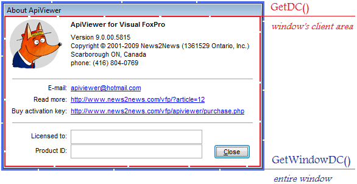

[ Home ](https://github.com/VFPX/Win32API)  

## Function name : GetDC
Group: [Device Context](../../functions_group.md#Device_Context)  -  Library: [user32](../../Libraries.md#user32)  
***  

## Note that this document contains some links to the old news2news website which does not work at the moment. This material will be available sometime in the future.

#### The GetDC function retrieves a handle of a display device context (DC) for the client area of the specified window
***  


## Code examples:
[How to view icons stored in executable files (Icon Viewer) - II](../../samples/sample_019.md)  
[Printing text on the client area of the main VFP window](../../samples/sample_034.md)  
[Using GetNearestColor](../../samples/sample_044.md)  
[Creating a window using CreateWindowEx function](../../samples/sample_050.md)  
[Placing an arbitrary rectangular area of main VFP window on the Clipboard](../../samples/sample_081.md)  
[Drawing standard Windows icons](../../samples/sample_112.md)  
[How to view icons stored in executable files (Icon Viewer)](../../samples/sample_113.md)  
[Converting twips to pixels and vice versa](../../samples/sample_161.md)  
[Retrieving graphic capabilities of your display](../../samples/sample_188.md)  
[Form Magnifier](../../samples/sample_414.md)  
[Placing On-screen Alert on top of all windows](../../samples/sample_504.md)  
[How to make a VFP form fading out when released (GDI version)](../../samples/sample_528.md)  
[GDI+: Scrolling through large image using the mouse](../../samples/sample_546.md)  
[GDI+: Creating thumbnails to preview images in a directory](../../samples/sample_547.md)  
[GDI+ fun: roach-infested desktop](../../samples/sample_548.md)  
[GDI+: Color Transparency](../../samples/sample_549.md)  
[GDI+: Implementing image scrolling with inertia](../../samples/sample_595.md)  
[GDI+: custom control, base class](../../samples/sample_599.md)  

## Declaration:
```foxpro  
HDC GetDC(
    HWND  hWnd 	// handle of window
   );  
```  
***  


## FoxPro declaration:
```foxpro  
DECLARE INTEGER GetDC IN user32 INTEGER hwnd
  
```  
***  


## Parameters:
hWnd
Identifies the window whose device context is to be retrieved  
***  


## Return value:
If the function succeeds, the return value identifies the device context for the given window"s client area  
***  


## Comments:
<!-- Anatoliy -->
<a href="http://www.news2news.com/vfp/?article=12&src=GetDC"></a>  

See also: [GetWindowDC](../user32/GetWindowDC.md), [WindowFromDC](../user32/WindowFromDC.md).  
  
***  

