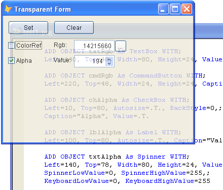

[ Home ](https://github.com/VFPX/Win32API)  

## Function name : SetLayeredWindowAttributes
Group: [Window](../../functions_group.md#Window)  -  Library: [user32](../../Libraries.md#user32)  
***  


#### The SetLayeredWindowAttributes function sets the opacity and transparency color key of a layered window.
***  


## Code examples:
[Creating irregularly shaped FoxPro form using transparency color key](../../samples/sample_033.md)  
[Semi-transparent Form](../../samples/sample_453.md)  
[Transparent Menu Class (requires VFP9)](../../samples/sample_496.md)  
[Placing On-screen Alert on top of all windows](../../samples/sample_504.md)  
[How to make a VFP form fading out when released (GDI+ version)](../../samples/sample_527.md)  
[How to make a VFP form fading out when released (GDI version)](../../samples/sample_528.md)  
[Displaying dimmed window behind VFP top-level form](../../samples/sample_578.md)  

## Declaration:
```foxpro  
BOOL SetLayeredWindowAttributes(
    HWND hwnd,
    COLORREF crKey,
    BYTE bAlpha,
    DWORD dwFlags
);  
```  
***  


## FoxPro declaration:
```foxpro  
DECLARE INTEGER SetLayeredWindowAttributes IN user32;
	INTEGER hwnd,;
	INTEGER crKey,;
	SHORT   bAlpha,;
	INTEGER dwFlags
  
```  
***  


## Parameters:
hwnd
[in] Handle to the layered window.

crKey
[in] COLORREF structure that specifies the transparency color key to be used when composing the layered window.

bAlpha
[in] Alpha value used to describe the opacity of the layered window. 

dwFlags
[in] Specifies an action to take: LWA_COLORKEY, LWA_ALPHA  
***  


## Return value:
If the function succeeds, the return value is nonzero.  
***  


## Comments:
A layered window is created by specifying WS_EX_LAYERED when creating the window with the CreateWindowEx function or by setting WS_EX_LAYERED via SetWindowLong after the window has been created.  
  
[](../../samples/sample_453.md)

[](../../samples/sample_143.md)

[](../../samples/sample_496.md)

***  

