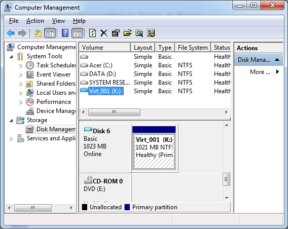

[ Home ](https://github.com/VFPX/Win32API)  

## Function name : AttachVirtualDisk
Group: [Virtual Hard Disk (Win7)](../../functions_group.md#Virtual_Hard_Disk_(Win7))  -  Library: [virtdisk](../../Libraries.md#virtdisk)  
***  


#### Attaches a virtual hard disk (VHD) by locating an appropriate VHD provider to accomplish the attachment.
***  


## Declaration:
```foxpro  
DWORD AttachVirtualDisk(
	__in  HANDLE VirtualDiskHandle,
	__in  PSECURITY_DESCRIPTOR SecurityDescriptor,
	__in  ATTACH_VIRTUAL_DISK_FLAG Flags,
	__in  ULONG ProviderSpecificFlags,
	__in  PATTACH_VIRTUAL_DISK_PARAMETERS Parameters,
	__in  LPOVERLAPPED Overlapped
);  
```  
***  


## FoxPro declaration:
```foxpro  
DECLARE LONG AttachVirtualDisk IN virtdisk;
	INTEGER VirtualDiskHandle,;
	INTEGER SecurityDescriptor,;
	INTEGER VirtualDiskFlags,;
	LONG ProviderSpecificFlags,;
	STRING @VirtualDiskParameters,;
	INTEGER Overlapped  
```  
***  


## Parameters:
VirtualDiskHandle [in]
A handle to an open virtual disk. For information on how to open a virtual disk, see the OpenVirtualDisk function.

SecurityDescriptor [in]
An optional pointer to a SECURITY_DESCRIPTOR to apply to the attached virtual disk. If this parameter is NULL, the security descriptor of the virtual disk image file will be used.

Flags [in]
A valid combination of values of the ATTACH_VIRTUAL_DISK_FLAG enumeration.

ProviderSpecificFlags [in]
Flags specific to the type of virtual disk being attached. May be zero if none are required.

Parameters [in]
A pointer to a valid ATTACH_VIRTUAL_DISK_PARAMETERS structure that contains attachment parameter data.

Overlapped [in]
An optional pointer to a valid OVERLAPPED structure if asynchronous operation is desired.  
***  


## Return value:
If the function succeeds, the return value is ERROR_SUCCESS (0).  
***  


## Comments:
Minimum supported client: Windows 7  
  
The caller must have SE_MANAGE_VOLUME_PRIVILEGE access rights (SeManageVolumePrivilege).  

  

See also: [DetachVirtualDisk](../virtdisk/DetachVirtualDisk.md), [OpenVirtualDisk,](..//OpenVirtualDisk,.md).  

[How to enable the SE_SHUTDOWN_NAME privilege for the application](../../samples/sample_552.md)

***  