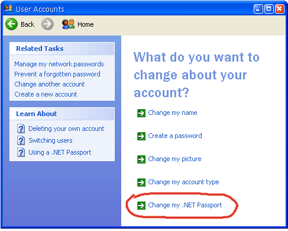

[ Home ](https://github.com/VFPX/Win32API)  

## Function name : CreateMD5SSOHash
Group: [Internet Functions (WinInet)](../../functions_group.md#Internet_Functions_(WinInet))  -  Library: [wininet](../../Libraries.md#wininet)  
***  


#### Obtains the default Microsoft Passport password for a specified account or realm, creates an MD5 hash from it using a specified wide-character challenge string, and returns the result as a string of hexadecimal digit bytes.
***  


## Declaration:
```foxpro  
BOOL CreateMD5SSOHash(
	PWSTR pszChallengeInfo,
	PWSTR pwszRealm,
	PWSTR pwszTarget,
	PBYTE pbHexHash
);  
```  
***  


## FoxPro declaration:
```foxpro  
DECLARE INTEGER CreateMD5SSOHash IN wininet;
	STRING pszChallengeInfo,;
	STRING pwszRealm,;
	STRING pwszTarget,;
	STRING @pbHexHash  
```  
***  


## Parameters:
pszChallengeInfo 
[in] Pointer to wide-character challenge string.

pwszRealm 
[in] Pointer to a string that names a realm for which to obtain the password. This parameter is ignored unless pwszTarget is NULL. If both pwszTarget and pwszRealm are NULL, the default realm is used. 
pwszTarget 

[in] Pointer to a string that names an account for which to obtain the password. If pwszTarget is NULL, the realm indicated by pwszRealm is used. 
pbHexHash 

[out] Pointer to an output buffer into which the MD5 hash is returned in hex string format. This buffer must be at least 33 bytes long.  
***  


## Return value:
Returns TRUE if successful, or FALSE otherwise.  
***  


## Comments:
There is no need to call the InternetOpen before calling the CreateMD5SSOHash.  
  
The usage is as simple as it can be:  
```foxpro
cSource=STRCONV("challenge"+CHR(0),5)  
cRealm=NULL  
cTarget=NULL && "myaddress@msn.com"  
cHash = REPLICATE(CHR(0), 33)  
  
? CreateMD5SSOHash(cSource, cRealm, cTarget, @cHash)  
cHash = STRTRAN(cHash, CHR(0))  
? LEN(cHash), "[" + cHash + "]"
```
For this code to return a valid result, a .Net Passport (<a href="http://en.wikipedia.org/wiki/Microsoft_Passport_Network">Microsoft Passport</a>) must be installed on the Windows XP computer.  

  

***  

