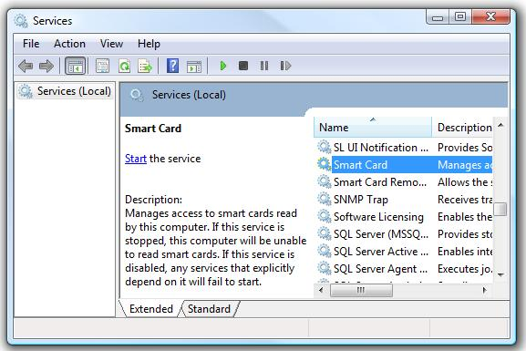

[ Home ](https://github.com/VFPX/Win32API)  

## Function name : SCardEstablishContext
Group: [Authentication](../../functions_group.md#Authentication)  -  Library: [winscard](../../Libraries.md#winscard)  
***  

## Note that this document contains some links to the old news2news website which does not work at the moment. This material will be available sometime in the future.


#### Establishes the resource manager context (the scope) within which database operations are performed.
***  

## Code examples:
[Smart Card Database Query Functions](../../samples/sample_539.md)  

## Declaration:
```foxpro  
LONG SCardEstablishContext(
	__in   DWORD dwScope,
	__in   LPCVOID pvReserved1,
	__in   LPCVOID pvReserved2,
	__out  LPSCARDCONTEXT phContext
);  
```  
***  


## FoxPro declaration:
```foxpro  
DECLARE LONG SCardEstablishContext IN Winscard;
	INTEGER dwScope,;
	INTEGER pvReserved1,;
	INTEGER pvReserved2,;
	INTEGER @phContext  
```  
***  


## Parameters:
dwScope [in] 
Scope of the resource manager context.

pvReserved1 [in] 
Reserved for future use and must be NULL. 

pvReserved2 [in] 
Reserved for future use and must be NULL.

phContext [out] 
A handle to the established resource manager context.
  
***  


## Return value:
If the function succeeds, the function returns SCARD_S_SUCCESS (0).  
***  


## Comments:
<!-- Anatoliy -->
Purchase complete VFP solution.  
<a href="http://www.news2news.com/vfp/?solution=2&src=fn1132"></a>  

  
Upon successful call the <Em>phContext</Em> handle can be supplied to other functions attempting to do work within this context.  
  
The error code SCARD_E_NO_SERVICE (0x8010001D), <Em>"The smart card resource manager is not running"</Em>, means that the SCardSvr service is not started. By default this service is stopped.  
  
  
  
The error code SCARD_E_NO_READERS_AVAILABLE (0x8010002E) speaks for itself.  
  

See also: [SCardReleaseContext](../winscard/SCardReleaseContext.md).  

  
***  

