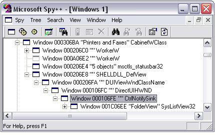
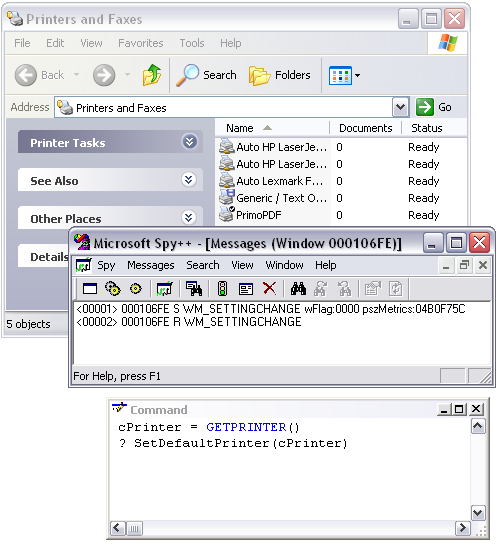

[ Home ](https://github.com/VFPX/Win32API)  

## Function name : SetDefaultPrinter
Group: [Printing and Print Spooler](../../functions_group.md#Printing_and_Print_Spooler)  -  Library: [winspool.drv](../../Libraries.md#winspool.drv)  
***  


#### Sets the printer name of the default printer for the current user on the local computer.
***  


## Code examples:
[Setting default printer](../../samples/sample_589.md)  

## Declaration:
```foxpro  
BOOL SetDefaultPrinter(
	LPCTSTR pszPrinter  // default printer name
);  
```  
***  


## FoxPro declaration:
```foxpro  
DECLARE INTEGER SetDefaultPrinter IN winspool.drv;
	STRING pszPrinter
  
```  
***  


## Parameters:
pszPrinter 
[in] Pointer to a null-terminated string containing the default printer name. For a remote printer, the name format is \\server\printername. For a local printer, the name format is printername.  
***  


## Return value:
If the function succeeds, the return value is a nonzero value.  
***  


## Comments:
If <Em>pszPrinter</Em> is NULL or an empty string, SetDefaultPrinter does nothing if there is already a default printer. However, if there is no default printer, SetDefaultPrinter sets the default printer to the first printer, if any, in an enumeration of printers installed on the local computer.  
  
The function is as simple as it is and hardly requires a sample code. If SetDefaultPrinter returns 0, call GetLastError to get an extended error information.  
  
#DEFINE ERROR_INVALID_PRINTER_NAME 1801  
  
Also consider using Windows scripting objects:  
```foxpro
ws = CreateObject("WScript.Network")  
ws.SetDefaultPrinter("\\MyServer\HP5")
```

See also: [GetDefaultPrinter](../winspool.drv/GetDefaultPrinter.md), [EnumPrinters](../winspool.drv/EnumPrinters.md), [PrinterProperties](../winspool.drv/PrinterProperties.md).  
  
* * *  
As you prpobably noticed the Printer And Faxes OS Window immediately reflects a change in default printer. Here is a screen copy of a tap put on the messages received by a member of this window subtree (window class CtrlNotifySink).  

  
  


Each successful SetDefaultPrinter call broadcasts the <a href="http://msdn2.microsoft.com/en-us/library/ms725497(VS.85).aspx">WM_SETTINGCHANGE message</a>.  
  
 

***  

