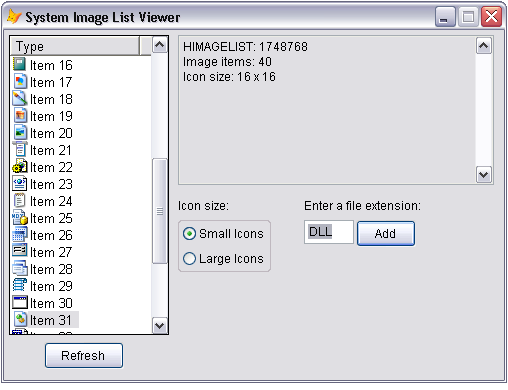

[ Home ](https://github.com/VFPX/Win32API)  

# System Image List Viewer

## Before you begin:
  

See also:

* [How to view system icons for the classes installed on the local machine](sample_544.md)  
* [Displaying the associated icons and descriptions for files and folders](sample_530.md)  
  
***  


## Code:
```foxpro  
PUBLIC oForm As TForm
oForm = CREATEOBJECT("TForm")
oForm.Visible=.T.
* end of main

DEFINE CLASS Tform As Form
#DEFINE CRLF CHR(13)+CHR(10)
#DEFINE FILE_ATTRIBUTE_NORMAL 0x00000080
#DEFINE GWL_STYLE -16
#DEFINE MAX_PATH 260

#DEFINE LVM_FIRST 0x1000
#DEFINE LVM_GETIMAGELIST (LVM_FIRST + 2)
#DEFINE LVM_SETIMAGELIST (LVM_FIRST + 3)
#DEFINE LVM_SETITEM (LVM_FIRST + 6)
#DEFINE LVIF_IMAGE 0x0002
#DEFINE LVSIL_SMALL 1
#DEFINE LVSIL_NORMAL 0
#DEFINE LVS_SHAREIMAGELISTS 0x0040
#DEFINE SHGFI_SYSICONINDEX 0x000004000
#DEFINE SHGFI_SMALLICON 0x000000001
#DEFINE SHGFI_ICON 0x000000100
#DEFINE SHGFI_TYPENAME 0x000000400
#DEFINE SHGFI_USEFILEATTRIBUTES 0x000000010

	Width=500
	Height=350
	Borderstyle=2
	MaxButton=.F.
	Autocenter=.T.
	Caption="System Image List Viewer"
	hSysImageList=0
	
	ADD OBJECT img As TImagelist
	
	ADD OBJECT txtFiletype As TextBox WITH Left=300, Top=190,;
	Width=50, Height=24, Format="!K"
	
	ADD OBJECT cmdAddfiletype As CommandButton WITH Left=352,;
	Top=190, Width=60, Height=27, Caption="Add", Default=.T.

	ADD OBJECT lst As TListView WITH Left=5, Top=5,;
	Width=160, Height=300
	
	ADD OBJECT syslistinfo As EditBox WITH Left=174, Top=5,;
	Width=316, Height=150, Readonly=.T.
	
	ADD OBJECT Label1 As TLabel WITH Caption="Icon size:",;
	Left=174, Top=168
	
	ADD OBJECT icontype As TIconType WITH Left=174, Top=190
	
	ADD OBJECT Label2 As TLabel WITH Left=300, Top=168,;
	Caption="Enter a file extension:"
	
	ADD OBJECT cmdRefresh As CommandButton WITH Left=40,;
	Top=312, Width=80, Height=27, Caption="Refresh"
	
PROCEDURE Init
	THIS.declare

PROCEDURE Destroy
	CLEAR EVENTS

PROCEDURE cmdRefresh.Click
	ThisForm.GetSyslistItems

PROCEDURE icontype.InteractiveChange
	ThisForm.GetSyslistItems

PROCEDURE cmdAddfiletype.Click
	ThisForm.AddFileType(ThisForm.txtFiletype.Value)
	ThisForm.txtFiletype.SetFocus

PROCEDURE AddFileType(cFileType As String)
	cFileType = ALLTRIM(m.cFileType)
	IF "." $ m.cFileType
		cFileType = "*" + SUBSTR(m.cFileType, RAT(".", m.cFileType))
	ELSE
		cFileType = "*." + m.cFileType
	ENDIF

	LOCAL nTypeIndex, nBufsize, cBuffer, nFlags, hIcon, nTypeIndex

	nBufsize=1024
	cBuffer = REPLICATE(CHR(0), nBufsize)

	nFlags = BITOR(SHGFI_SYSICONINDEX, SHGFI_SMALLICON, SHGFI_ICON,;
		SHGFI_TYPENAME, SHGFI_USEFILEATTRIBUTES)

	= SHGetFileInfo(m.cFileType, FILE_ATTRIBUTE_NORMAL,;
		@cBuffer, nBufsize, nFlags)
	
	hIcon = buf2dword(SUBSTR(cBuffer, 1, 4))
	nTypeIndex = buf2dword(SUBSTR(cBuffer,5, 4))
	cFileType = STRTRAN(SUBSTR(m.cBuffer,13+MAX_PATH), CHR(0),"")
	
	WAIT WINDOW NOWAIT TRANSFORM(nTypeIndex) + " " + m.cFileType

	IF hIcon <> 0
		= DestroyIcon(hIcon)
	ENDIF
	ThisForm.GetSyslistItems
	
	WITH THIS.lst.ListItems.Item(nTypeIndex+1)
		.Selected=.T.
		.EnsureVisible
	ENDWITH

PROCEDURE GetSyslistItems
	THIS.lst.ListItems.Clear
	THIS.SwitchToSystemList

	LOCAL nImageCount, nImageIndex, oItem
	nImageCount = ImageList_GetImageCount(THIS.hSysImageList)
	
	FOR nImageIndex=0 TO nImageCount-1
		oItem = THIS.lst.ListItems.Add(,, "Item " +;
			TRANSFORM(nImageIndex))
		THIS.SetIcon(oItem.Index, nImageIndex)
	NEXT

PROCEDURE SetIcon(nItemIndex, nImageIndex)
* sets the icon for the listitem
    LOCAL cItemBuffer  && LVITEM structure

    cItemBuffer = num2dword(LVIF_IMAGE) +;
    	num2dword(nItemIndex-1) + num2dword(0) + num2dword(0) +;
    	num2dword(0) + num2dword(0) + num2dword(0) +;
    	num2dword(nImageIndex) + num2dword(0)

    = SendMessageS(THIS.lst.hWnd, LVM_SETITEM, 0, @cItemBuffer)

PROCEDURE SwitchToSystemList
	LOCAL nWStyle, cBuffer, nImageCount, nISizeX, nISizeY
	cBuffer = REPLICATE(CHR(0), 1024)

	THIS.hSysImageList = SHGetFileInfo("", FILE_ATTRIBUTE_NORMAL,;
		@cBuffer, LEN(cBuffer),;
		BITOR(SHGFI_SYSICONINDEX,;
			IIF(THIS.icontype.Value=1, SHGFI_SMALLICON, SHGFI_ICON),;
			SHGFI_TYPENAME, SHGFI_USEFILEATTRIBUTES))

	WITH THIS.lst
		nWStyle = GetWindowLong(.HWND, GWL_STYLE)
		nWStyle = BITOR(m.nWStyle, LVS_SHAREIMAGELISTS)
		SetWindowLong(.HWND, GWL_STYLE, nWStyle)

		* a kick is required for the system image list get connected
		= SendMessage(.HWND, LVM_SETIMAGELIST, LVSIL_SMALL, 0)
		= SendMessage(.HWND, LVM_SETIMAGELIST, LVSIL_NORMAL, 0)
		= INKEY(0.1)
		= SendMessage(.HWND, LVM_SETIMAGELIST, LVSIL_SMALL,;
			THIS.hSysImageList)
	ENDWITH

	nImageCount = ImageList_GetImageCount(THIS.hSysImageList)
	STORE 0 TO nISizeX, nISizeY
	= ImageList_GetIconSize(THIS.hSysImageList, @nISizeX, @nISizeY)
	
	THIS.syslistinfo.Value = "HIMAGELIST: " +;
		TRANSFORM(THIS.hSysImageList) + CRLF +;
		"Image items: " + TRANSFORM(m.nImageCount) + CRLF +;
		"Icon size: " + TRANSFORM(nISizeX) + " x " +;
		TRANSFORM(nISizeY)
	
PROCEDURE declare
	DECLARE INTEGER DestroyIcon IN user32 INTEGER hIcon

	DECLARE INTEGER SHGetFileInfo IN shell32;
		STRING pszPath, LONG dwFileAttributes,;
		STRING @psfi, LONG cbFileInfo, LONG uFlags

	DECLARE INTEGER SendMessage IN user32;
		INTEGER hWindow, INTEGER Msg,;
		INTEGER wParam, INTEGER lParam

	DECLARE INTEGER SendMessage IN user32;
	AS SendMessageS;
		INTEGER hWindow, INTEGER Msg,;
		INTEGER wParam, STRING @lParam

	DECLARE INTEGER SetWindowLong IN user32;
		INTEGER hWindow, INTEGER nIndex, INTEGER dwNewLong

	DECLARE INTEGER GetWindowLong IN user32;
		INTEGER hWindow, INTEGER nIndex

	DECLARE INTEGER ImageList_GetImageCount IN comctl32 INTEGER himl

	DECLARE INTEGER ImageList_GetIconSize IN comctl32;
		INTEGER himl, INTEGER @cx, INTEGER @cy

	DECLARE INTEGER ImageList_GetImageInfo IN comctl32;
		INTEGER himl, INTEGER i, STRING @pImageInfo

ENDDEFINE

DEFINE CLASS TLabel As Label
	Backstyle=0
	Autosize=.T.
ENDDEFINE

DEFINE CLASS TIconType As OptionGroup
	Autosize=.T.
	Backstyle=0

	ADD OBJECT TSmall As OptionButton WITH Caption="Small Icons",;
	Autosize=.T., Backstyle=0, Top=5, Left=5

	ADD OBJECT TLarge As OptionButton WITH Caption="Large Icons",;
	Autosize=.T., Backstyle=0, Top=30, Left=5
ENDDEFINE

DEFINE CLASS TListView As OleControl
	OleClass="MSComctlLib.ListViewCtrl"

PROCEDURE Init
	WITH THIS
		.View=3
		.Appearance=0
		.BorderStyle=1
		.Arrange=0
		.LabelEdit=1
		.FullRowSelect=0
		.Font.Size=10
		.AddColumnHeader("Type", 130)
		.hideselection=.F.
	ENDWITH

PROCEDURE AddColumnHeader(cCaption, nWidth)
	WITH THIS.ColumnHeaders.Add()
		.Text=cCaption
		.Width=nWidth
	ENDWITH

ENDDEFINE

DEFINE CLASS TImagelist As OleControl
	OleClass="MSComctlLib.ImageListCtrl"
	ImageHeight=16
	ImageWidth=16
	MaskColor=0

ENDDEFINE

FUNCTION buf2dword(lcBuffer)
RETURN Asc(SUBSTR(lcBuffer, 1,1)) + ;
	BitLShift(Asc(SUBSTR(lcBuffer, 2,1)), 8) +;
	BitLShift(Asc(SUBSTR(lcBuffer, 3,1)), 16) +;
	BitLShift(Asc(SUBSTR(lcBuffer, 4,1)), 24)

FUNCTION num2dword(lnValue)
#DEFINE m0 256
#DEFINE m1 65536
#DEFINE m2 16777216
	IF lnValue < 0
		lnValue = 0x100000000 + lnValue
	ENDIF
	LOCAL b0, b1, b2, b3
	b3 = Int(lnValue/m2)
	b2 = Int((lnValue - b3*m2)/m1)
	b1 = Int((lnValue - b3*m2 - b2*m1)/m0)
	b0 = Mod(lnValue, m0)
RETURN Chr(b0)+Chr(b1)+Chr(b2)+Chr(b3)  
```  
***  


## Listed functions:
[DestroyIcon](../libraries/user32/DestroyIcon.md)  
[GetWindowLong](../libraries/user32/GetWindowLong.md)  
[ImageList_GetIconSize](../libraries/comctl32/ImageList_GetIconSize.md)  
[ImageList_GetImageCount](../libraries/comctl32/ImageList_GetImageCount.md)  
[ImageList_GetImageInfo](../libraries/comctl32/ImageList_GetImageInfo.md)  
[SHGetFileInfo](../libraries/shell32/SHGetFileInfo.md)  
[SendMessage](../libraries/user32/SendMessage.md)  
[SetWindowLong](../libraries/user32/SetWindowLong.md)  
