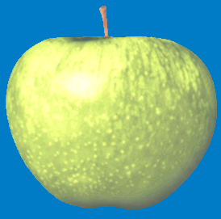
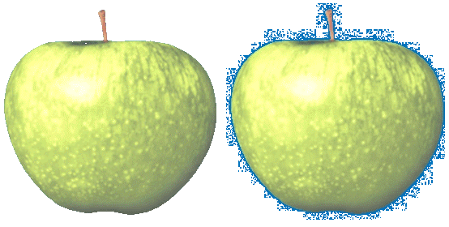
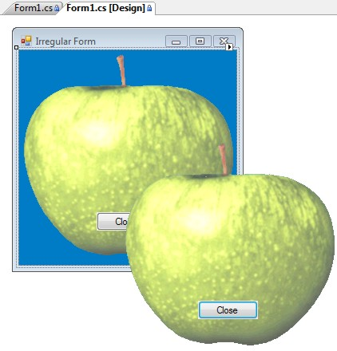
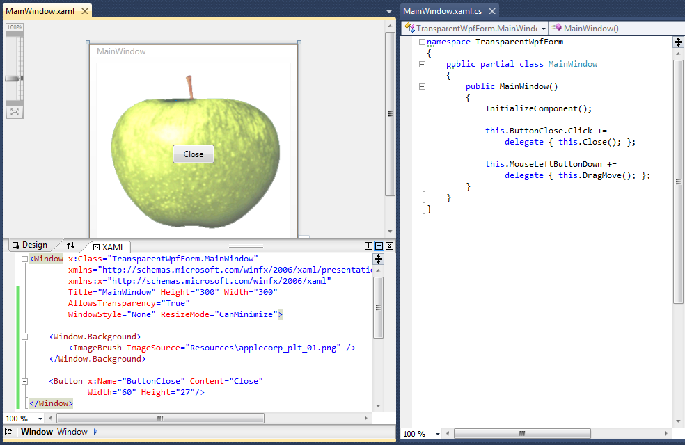

[ Home ](https://github.com/VFPX/Win32API)  

# Creating irregularly shaped FoxPro form using transparency color key

## Short description:
The SetLayeredWindowAttributes function can be used to define the transparency color for the top-level FoxPro form. That means all areas on the form with this color, including native windowless FoxPro controls, become transparent.   
***  


## Before you begin:
Download this image file before testing the code sample:  

  

The SetLayeredWindowAttributes function can be used to define the transparency color key for the top-level FoxPro form. That means all areas on the form with this color, including native windowless FoxPro controls, become transparent.   

Such transparency is not only visual. The masked area is also transparent for the *mouse events*. Those events are directed to the windows below. It looks like the mouse transparency is provided only for bitmap images, not for gifs and jpegs.  

Bluish background color on this image has value of RGB(0,121,197), which is passed as the transparency color key to the SetLayeredWindowAttributes function.   

See also:

* [Round FoxPro form](sample_143.md)  
* [How to draw a custom Window Caption on FoxPro form](sample_499.md)  
* [A way to make a transparent area in a form -- a hole in the form](sample_126.md)  
* [Semi-transparent form](sample_453.md)  
  
***  


## Code:
```foxpro  
oForm = CREATEOBJECT("Tform")
oForm.Visible=.T.
READ EVENTS

DEFINE CLASS Tform As Form
#DEFINE WM_SYSCOMMAND 0x112
#DEFINE WM_LBUTTONUP 0x202
#DEFINE MOUSE_MOVE 0xf012
#DEFINE LWA_COLORKEY 1
#DEFINE LWA_ALPHA 2
#DEFINE GWL_EXSTYLE -20
#DEFINE WS_EX_LAYERED 0x80000
#DEFINE SM_CYSIZE 31
#DEFINE SM_CXFRAME 32
#DEFINE SM_CYFRAME 33

	Width=350
	Height=350
	BorderStyle=0
	ShowWindow=2  && important!!
	Autocenter=.T.
	KeyPreview=.T.

	ADD OBJECT img As Image WITH Left=10, Top=10, Width=100, Height=100,;
	Picture="applecorp_plt.bmp", MaskingColor=RGB(0,123,197)

	ADD OBJECT Label1 As Label WITH Alignment=2,;
	Left=100, Top=140, BackStyle=0, Autosize=.T.,;
	Caption="Press ESC to close this form." + CHR(13) + CHR(13) +;
		"Use the mouse to move this form.", WordWrap=.T.

PROCEDURE Init(cImageFile, nMaskingColor)
	THIS.declare
	THIS.RemoveFrame
	THIS.SetTransparentMode

PROCEDURE Destroy
	CLEAR EVENTS

PROCEDURE KeyPress
LPARAMETERS nKeyCode, nShiftAltCtrl
	IF nKeyCode=27
		THIS.Release
	ENDIF

PROCEDURE OnMouseDown
LPARAMETERS nButton, nShift, nXCoord, nYCoord
	IF nButton = 1
		= ReleaseCapture()
		= SendMessage(THIS.HWnd, WM_SYSCOMMAND, MOUSE_MOVE, 0)
		= SendMessage(THIS.HWnd, WM_LBUTTONUP, 0, 0)
	ENDIF

PROCEDURE img.MouseDown
LPARAMETERS nButton, nShift, nXCoord, nYCoord
	ThisForm.OnMouseDown(nButton, nShift, nXCoord, nYCoord)

PROCEDURE Label1.MouseDown
LPARAMETERS nButton, nShift, nXCoord, nYCoord
	ThisForm.OnMouseDown(nButton, nShift, nXCoord, nYCoord)

PROTECTED PROCEDURE SetTransparentMode
	LOCAL nExStyle
	nExStyle = GetWindowLong(THIS.HWnd, GWL_EXSTYLE)
	nExStyle = BITOR(nExStyle, WS_EX_LAYERED)
	= SetWindowLong(THIS.HWnd, GWL_EXSTYLE, nExStyle)
	= SetLayeredWindowAttributes(THIS.HWnd,;
		THIS.img.MaskingColor, 0, LWA_COLORKEY)

PROTECTED PROCEDURE RemoveFrame
	LOCAL x0, y0, x1, y1, hRgn

	* calculate the region
	* you can use SYSMETRIC() instead
	x0 = GetSystemMetrics(SM_CXFRAME) +;
		THIS.img.Left

	y0 = GetSystemMetrics(SM_CYSIZE) +;
		GetSystemMetrics(SM_CYFRAME) +;
		THIS.img.Top

	x1 = x0 + THIS.img.Width - 4
	y1 = y0 + THIS.img.Height - 4
	
	hRgn = CreateRectRgn(x0, y0, x1, y1)
	= SetWindowRgn(THIS.HWnd, m.hRgn, 1)

PROTECTED PROCEDURE declare
	DECLARE INTEGER ReleaseCapture IN user32
	DECLARE INTEGER GetSystemMetrics IN user32 INTEGER nIndex

	DECLARE INTEGER SendMessage IN user32;
		INTEGER hWindow, INTEGER Msg,;
		INTEGER wParam, INTEGER lParam

	DECLARE INTEGER CreateRectRgn IN gdi32;
		INTEGER nLeftRect, INTEGER nTopRect,;
	    INTEGER nRightRect, INTEGER nBottomRect

	DECLARE INTEGER SetWindowRgn IN user32;
		INTEGER hWindow, INTEGER hRgn, INTEGER bRedraw

	DECLARE INTEGER GetWindowLong IN user32;
		INTEGER hWindow, INTEGER nIndex

	DECLARE INTEGER SetWindowLong IN user32;
		INTEGER hWindow, INTEGER nIndex, INTEGER dwNewLong

	DECLARE INTEGER SetLayeredWindowAttributes IN user32;
		INTEGER hWindow, INTEGER crKey,;
		SHORT bAlpha, INTEGER dwFlags

ENDDEFINE  
```  
***  


## Listed functions:
[CreateRectRgn](../libraries/gdi32/CreateRectRgn.md)  
[GetSystemMetrics](../libraries/user32/GetSystemMetrics.md)  
[GetWindowLong](../libraries/user32/GetWindowLong.md)  
[ReleaseCapture](../libraries/user32/ReleaseCapture.md)  
[SendMessage](../libraries/user32/SendMessage.md)  
[SetLayeredWindowAttributes](../libraries/user32/SetLayeredWindowAttributes.md)  
[SetWindowLong](../libraries/user32/SetWindowLong.md)  
[SetWindowRgn](../libraries/user32/SetWindowRgn.md)  

## Comment:
It is important to have the background perfectly solid. Conversion to JPEG may create color artefacts because of the way the image is compressed with removing supposedly unnecessary part of it.  
  
Observe the difference between the masked bitmap image and originated from it masked JPEG image. As I mentioned above, only bitmap images provide mouse event transparency. 



Note that the Region API functions are still used to hide the frame of the form.   
  
This combined approach can create irregular forms effortlessly, if compared to using solely Region API calls. After all, truly irregular forms may not be easily shaped with a combination of regions.  
  
The SetLayeredWindowAttributes requires at least Win2K, and works with top-level forms only (ShowWindow=2). Also a twinkling black border may appear around the the form when it is being moved.  
  
* * *  
.NET WinForm implementation:  
  


* * *  
.NET WPF implementation is as brief as it is simple. In this case the background of PNG image must be transparent.  
  


***  

