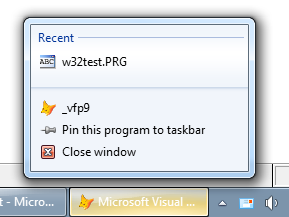

[ Home ](https://github.com/VFPX/Win32API)  

# Reading and setting explicit Application User Model ID for the current process (Win7)

## Note that this document contains some links to the old news2news website which does not work at the moment. This material will be available sometime in the future.


## Before you begin:
Application User Model IDs ([AppUserModelIDs](http://msdn.microsoft.com/en-us/library/dd378459(v=vs.85).aspx)) are used extensively by the [taskbar in Windows 7](http://windows.microsoft.com/en-CA/windows7/products/features/windows-taskbar) and later systems to associate processes, files, and windows with a particular application.  

  


See also:

* [Accessing the list of Windows Recent Documents](sample_094.md)  
  
***  


## Code:
```foxpro  
LOCAL oAppUserModel As AppUserModel

oAppUserModel = CREATEOBJECT("AppUserModel")
? "[" + oAppUserModel.AppID + "]"

oAppUserModel.AppID = "VFP.MyApplication.MainForm"
? "[" + oAppUserModel.AppID + "]"

* end of main

DEFINE CLASS AppUserModel As Custom
* implements access to Application User Model ID (AppUserModelID)
* that identifies the current process to the taskbar

	AppID=""
	ErrorCode=0

PROCEDURE Init( cAppID As String )
	IF VAL(OS(3))*10 + VAL(OS(4)) < 61
		WAIT WINDOW "Minimum supported OS: Win7 !" TIMEOUT 10
		RETURN .F.
	ENDIF

	THIS.declare
	IF NOT EMPTY(m.cAppID)
		THIS.AppID = m.cAppID
	ENDIF

PROCEDURE AppID_ASSIGN(vValue As Variant)
	LOCAL cAppID
	cAppID = TRANSFORM(m.vValue)

	* note: converted to Unicode
	THIS.ErrorCode = API_SetAppID(;
		STRCONV(m.cAppID,5) )

	IF THIS.ErrorCode = 0
	* you may need to hide and show
	* VFP main window to refresh its jump list
		THIS.AppID = m.cAppID
	ENDIF

PROCEDURE AppID_ACCESS() As String
	LOCAL hAppID, cAppID, nBufSize

	hAppID=0
	THIS.ErrorCode = API_GetAppID( @hAppID )
	
	IF THIS.ErrorCode = 0
		nBufSize = GlobalSize( m.hAppID )
		cAppID = REPLICATE( CHR(0), nBufSize )
		MemToStr( @cAppID, hAppId, nBufSize )
		
		* note: converted from Unicode
		nBufSize = AT(CHR(0)+CHR(0), m.cAppID)
		IF nBufSize > 0
			cAppID = STRCONV(SUBSTR(m.cAppID, 1,;
				m.nBufSize), 6)
		ENDIF
	ELSE
		cAppID = ""
	ENDIF

	IF hAppId <> 0
		= CoTaskMemFree( hAppId )
	ENDIF
RETURN m.cAppID

PROCEDURE declare
	DECLARE INTEGER GlobalSize IN kernel32 INTEGER hMem
	DECLARE CoTaskMemFree IN Ole32 INTEGER hMem

	DECLARE RtlMoveMemory IN kernel32 As MemToStr;
		STRING @, INTEGER, INTEGER

	DECLARE SHORT GetCurrentProcessExplicitAppUserModelID IN Shell32;
	AS API_GetAppID;
		INTEGER @AppID

	DECLARE SHORT SetCurrentProcessExplicitAppUserModelID IN Shell32;
	AS API_SetAppID;
		STRING AppID

ENDDEFINE  
```  
***  


## Listed functions:
[CoTaskMemFree](../libraries/ole32/CoTaskMemFree.md)  
[GlobalSize](../libraries/kernel32/GlobalSize.md)  

## Comment:
Read <a href="http://msdn.microsoft.com/en-us/library/dd378459(v=vs.85).aspx">Application User Model IDs</a> article on MSDN.  
  
Legacy applications do not declare an explicit AppUserModelID. In that case, the system uses a series of heuristics to assign an internal AppUserModelID.  Applications cannot retrieve a system-assigned AppUserModelID.  
  
If an application uses an explicit AppUserModelID, it must also assign the same AppUserModelID to all running windows or processes, shortcuts, and file associations. It must also use that AppUserModelID when customizing its Jump List through ICustomDestinationList, and in any calls to SHAddToRecentDocs.  
  
* * *  
An explicit application ID better be created before the main application window shows on. When VFP main window appears on the screen, the system has already assigned a default application ID to this VFP instance.  
  
After setting an explicit application ID, hide and show again VFP main window. That refreshes the jump list attached to the VFP taskbar icon. That simple:
```foxpro
_screen.Visible = .F.  
_screen.Visible = .T.
```
Another option is using SCREEN=OFF and COMMAND settings in VFP configuration file. The COMMAND should start a program that sets application ID and then turns the main window on.  
  
* * *  
<!-- Anatoliy -->
Setting application ID for an individual VFP top-level form requires access to the [IPropertyStore](http://msdn.microsoft.com/en-us/library/bb761474(v=vs.85).aspx) interface. Apparently it can be done only through writing an external library. A fragment of such FLL is shown in <a href="?example=38&ver=vcpp">C++ section</a> of this code sample.   
  
* * *  
If a window owns an explicit application ID, calling the GetProp with this window handle and property name "{9F4C2855-9F79-4B39-A8D0-E1D42DE1D5F3} 5" returns valid data handle (IPropertyStore ?).  
  
***  

