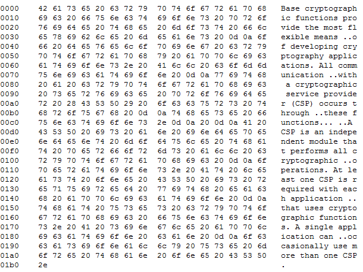

[ Home ](https://github.com/VFPX/Win32API)  

# How to perform Base64 encoding/decoding using Cryptography API Functions

## Code:
```foxpro  
#DEFINE CRYPT_STRING_BASE64 0x0001
#DEFINE CRYPT_STRING_NOCRLF 0x40000000
#DEFINE CRYPT_STRING_NOCR 0x80000000

DO declare
SET MEMOWIDTH TO 120

LOCAL cBuffer, cEncoded, cDecoded

TEXT TO cBuffer NOSHOW
Base cryptographic functions provide the most flexible means
of developing cryptography applications. All communication
with a cryptographic service provider (CSP) occurs through
these functions.

A CSP is an independent module that performs all cryptographic
operations. At least one CSP is required with each application
that uses cryptographic functions. A single application can
occasionally use more than one CSP.
ENDTEXT

cEncoded = ToBase64(m.cBuffer)
? cEncoded

cDecoded = FromBase64(cEncoded)
? cDecoded

* end of main

FUNCTION ToBase64(cSrc)
	LOCAL nFlags, nBufsize, cDst
	nFlags=CRYPT_STRING_BASE64

	nBufsize=0
	= CryptBinaryToString(@cSrc, LEN(cSrc),;
		m.nFlags, NULL, @nBufsize)

	cDst = REPLICATE(CHR(0), m.nBufsize)
	IF CryptBinaryToString(@cSrc, LEN(cSrc), m.nFlags,;
		@cDst, @nBufsize) = 0
		RETURN ""
	ENDIF
RETURN cDst

FUNCTION FromBase64(cSrc)
	LOCAL nFlags, nBufsize, cDst
	nFlags=CRYPT_STRING_BASE64

	nBufsize=0
	= CryptStringToBinary(@cSrc, LEN(m.cSrc),;
		nFlags, NULL, @nBufsize, 0,0)

	cDst = REPLICATE(CHR(0), m.nBufsize)
	IF CryptStringToBinary(@cSrc, LEN(m.cSrc),;
		nFlags, @cDst, @nBufsize, 0,0) = 0
		RETURN ""
	ENDIF
RETURN m.cDst

PROCEDURE declare
	DECLARE INTEGER CryptBinaryToString IN Crypt32;
		STRING @pbBinary, LONG cbBinary, LONG dwFlags,;
		STRING @pszString, LONG @pcchString

	DECLARE INTEGER CryptStringToBinary IN crypt32;
		STRING @pszString, LONG cchString, LONG dwFlags,;
		STRING @pbBinary, LONG @pcbBinary,;
		LONG pdwSkip, LONG pdwFlags  
```  
***  


## Listed functions:
[CryptBinaryToString](../libraries/crypt32/CryptBinaryToString.md)  
[CryptStringToBinary](../libraries/crypt32/CryptStringToBinary.md)  

## Comment:
Starting VFP8, base64 conversion can be performed with STRCONV().   
  
In my tests, API routines presented on this page encoded and decoded strings approximately 2 times faster than STRCONV() did -- on 100K cycles 3.7 seconds vs. 7.7 seconds.  
  
* * *  
This is an output from call to CryptBinaryToString with *dwFlags* set to CRYPT_STRING_HEXASCIIADDR (0x000b). Can make a good starting point for developing a simple binary viewer.  



* * *  
From *Burkhard Stiller`s* VFP Blog:  
<a href="http://myvfpblog.blogspot.com/2007/10/encoded-your-images-base64-binary.html">Another way to encode and store picture-data inside your classes</a> -- relates to base64 encoding, and is an interesting sample of code by itself.  
  
***  

