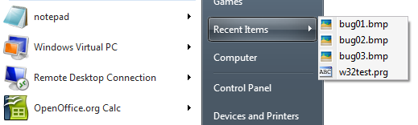

[ Home ](https://github.com/VFPX/Win32API)  

# Accessing the list of Windows Recent Documents

## Before you begin:
This class implements adding documents to the system *Recent Documents* list.   

  


  

See also:

* [Reading and setting explicit Application User Model ID for the current process](sample_038.md)  
  
***  


## Code:
```foxpro  
LOCAL oRecentDocs As WindowsRecentDocuments
oRecentDocs = CREATEOBJECT("WindowsRecentDocuments")

WITH oRecentDocs
*	.ClearDocuments
	.AddDocument( "C:\images\bug01.bmp" )
	.AddDocument( .PIDLFromPath("C:\images\image02.bmp") )

#IF VAL(OS(3))*10 + VAL(OS(4)) >= 61 && Win7
	* only VFP type documents will be added
	* to the Recent list for the VFP application:
	* DBF, PRG, SCX, PJX, VCX and so on
	.AddDocumentToCurrentApp( "C:\projects\w32test.prg" )
#ENDIF

ENDWITH

DEFINE CLASS WindowsRecentDocuments As Session
#DEFINE SHARD_PIDL 0x00000001
#DEFINE SHARD_PATHA 0x00000002
#DEFINE SHARD_PATHW 0x00000003
#DEFINE MAX_PATH 260

#IF VAL(OS(3))*10 + VAL(OS(4)) >= 61 && Win7
	#DEFINE SHARD_APPIDINFO 0x00000004
	#DEFINE SHARD_APPIDINFOIDLIST 0x00000005
	#DEFINE SHARD_LINK 0x00000006
	#DEFINE SHARD_APPIDINFOLINK 0x00000007
	#DEFINE SHARD_SHELLITEM 0x00000008
#ENDIF

PROTECTED AppID
	AppID=0

PROCEDURE Init
	THIS.declare

PROCEDURE Destroy
	THIS.ReleaseAppID

PROTECTED PROCEDURE ReleaseAppID
	IF THIS.AppID <> 0
		= CoTaskMemFree( THIS.AppID )
		THIS.AppID = 0
	ENDIF

PROCEDURE ClearDocuments
* clears Recent Documents
	SHAddToRecentDocsC( SHARD_PATHA, NULL )

#IF VAL(OS(3))*10 + VAL(OS(4)) >= 61 && Win7

PROCEDURE AddDocumentToCurrentApp( vValue As Variant )
* adds to the Recent category in the taskbar
* of the current VFP application

	LOCAL nPIDL, cBuffer

	DO CASE
	CASE EMPTY( m.vValue )
		RETURN

	CASE VARTYPE(m.vValue) = "C"
		nPIDL = THIS.PIDLFromPath( m.vValue )

	CASE VARTYPE(m.vValue) = "N"
		nPIDL = m.vValue

	OTHERWISE
		RETURN
	ENDCASE

	THIS.ReadCurrentAppID && populates THIS.AppID
	
	cBuffer =;
		num2dword(m.nPIDL) +;
		num2dword( THIS.AppID )

	SHAddToRecentDocsC(;
		SHARD_APPIDINFOIDLIST, @cBuffer )

#ENDIF

PROCEDURE AddDocument( vValue As Variant )
	DO CASE
	CASE EMPTY( m.vValue )

	CASE VARTYPE(m.vValue) = "C"
	* vValue must be a path
		SHAddToRecentDocsC( SHARD_PATHA, m.vValue+CHR(0) )

	CASE VARTYPE(m.vValue) = "N"
	* vValue must be a pointer to an ITEMIDLIST (PIDL)
		SHAddToRecentDocsN( SHARD_PIDL, m.vValue )

	ENDCASE

PROCEDURE PIDLFromPath(cPath As String) As Number
RETURN SHSimpleIDListFromPath(;
	THIS.ToUnicode(m.cPath))

PROCEDURE PathFromPIDL(nPIDL As Number) As String
	LOCAL cBuffer
	cBuffer = REPLICATE(CHR(0), MAX_PATH)
	SHGetPathFromIDList( nPIDL, @cBuffer )
RETURN STRTRAN(m.cBuffer, CHR(0), "")

PROCEDURE ToUnicode(cSource As String) As String
RETURN STRCONV(m.cSource+CHR(0),5)

PROCEDURE FindExecutable(cPath As String) As String
	LOCAL cBuffer
	cBuffer = REPLICATE(CHR(0), MAX_PATH)
	FindExecutable(cPath, NULL, @cBuffer)
RETURN STRTRAN(m.cBuffer, CHR(0), "")

PROCEDURE ReadCurrentAppID()
	THIS.ReleaseAppID

	LOCAL hAppID
	hAppID=0
	= API_GetAppID( @hAppID )
	THIS.AppID = m.hAppID

PROCEDURE declare
	DECLARE SHAddToRecentDocs IN shell32;
	AS SHAddToRecentDocsC;
		INTEGER uFlags, STRING @lpName

	DECLARE SHAddToRecentDocs IN shell32;
	AS SHAddToRecentDocsN;
		INTEGER uFlags, INTEGER lpName

	DECLARE INTEGER SHSimpleIDListFromPath IN shell32;
		STRING pszPath

	DECLARE INTEGER SHGetPathFromIDList IN shell32;
		INTEGER pidl, STRING @pszPat

	DECLARE INTEGER FindExecutable IN shell32;
		STRING lpFile, STRING lpDir,;
		STRING @lpResult

	DECLARE SHORT GetCurrentProcessExplicitAppUserModelID IN Shell32;
	AS API_GetAppID;
		INTEGER @AppID

	DECLARE CoTaskMemFree IN Ole32 INTEGER hMem

ENDDEFINE

FUNCTION num2dword(lnValue)
#DEFINE m0 0x0000100
#DEFINE m1 0x0010000
#DEFINE m2 0x1000000
	IF lnValue < 0
		lnValue = 0x100000000 + lnValue
	ENDIF
	LOCAL b0, b1, b2, b3
	b3 = Int(lnValue/m2)
	b2 = Int((lnValue - b3*m2)/m1)
	b1 = Int((lnValue - b3*m2 - b2*m1)/m0)
	b0 = Mod(lnValue, m0)
RETURN Chr(b0)+Chr(b1)+Chr(b2)+Chr(b3)  
```  
***  


## Listed functions:
[CoTaskMemFree](../libraries/ole32/CoTaskMemFree.md)  
[FindExecutable](../libraries/shell32/FindExecutable.md)  
[SHAddToRecentDocs](../libraries/shell32/SHAddToRecentDocs.md)  
[SHGetPathFromIDList](../libraries/shell32/SHGetPathFromIDList.md)  
[SHSimpleIDListFromPath](../libraries/shell32/SHSimpleIDListFromPath.md)  

## Comment:
Method *AddDocumentToCurrentApp* is available if the instance of the class is created under Windows 7.  
  
* * *  
When application starts, the system restores its jump list, if one exists for this application ID ([AppUserModelID](http://msdn.microsoft.com/en-us/library/dd378459(v=vs.85).aspx)).  
  
Under Windows 7, a VFP application on start receives a generic application ID. Apparently the system generates such ID based on the file that initiated the application (a shortcut, an executable). For example, two VFP instances launched by identical shortcuts (except different paths) have separate jump lists.  
  
[Changing the application ID](sample_038.md) does not immediately refresh the jump list attached to the main VFP window. But any top-level window created after the change will display the jump list linked to new application ID.  
  
After setting a new application ID, hide and show again VFP main window. That refreshes the jump list attached to the VFP taskbar icon. That ```foxpro
_screen.Visible = .F.  
_screen.Visible = .T.
```

***  

