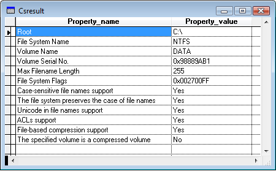

[ Home ](https://github.com/VFPX/Win32API)  

# Basic Volume information

## Before you begin:
  

See also:

* [Displaying the drive type value](sample_012.md)  
* [Setting the volume label](sample_151.md)  
* [Disk in drive A:](sample_319.md)  
* [Obtaining physical parameters for a drive: sectors, clusters, cylinders...](sample_101.md)  
  
***  


## Code:
```foxpro  
#DEFINE FILE_CASE_SENSITIVE_SEARCH 1
#DEFINE FILE_CASE_PRESERVED_NAMES 2
#DEFINE FILE_UNICODE_ON_DISK 4
#DEFINE FILE_PERSISTENT_ACLS 8
#DEFINE FILE_FILE_COMPRESSION 16
#DEFINE FILE_VOLUME_IS_COMPRESSED 0x8000
#DEFINE MAX_PATH 260
#DEFINE CRLF CHR(13)+CHR(10)

	DO declare
	DO GetVolumeInfo WITH "C:\"
* end of main

PROCEDURE GetVolumeInfo(cRoot As String)
	LOCAL cVolNameBuffer, nVolSerialNo, nMaxCompLen, nFlags, nError
	
	STORE REPLICATE(CHR(0),MAX_PATH) TO;
		cVolNameBuffer, nFilesysNameBuffer

	STORE 0 TO nVolSerialNo, nMaxCompLen, nFlags

	nResult = GetVolumeInformation(cRoot, @cVolNameBuffer,;
		MAX_PATH, @nVolSerialNo, @nMaxCompLen, @nFlags,;
		@nFilesysNameBuffer, MAX_PATH)

	IF nResult = 0
	* 3=ERROR_PATH_NOT_FOUND
	* 21=ERROR_NOT_READY
	* 87=ERROR_INVALID_PARAMETER
		nError = GetLastError()
		= MESSAGEBOX("GetVolumeInformation() call failed: " +;
			TRANSFORM(m.nError), 48, m.cRoot)
		RETURN
	ENDIF

	DO LogInfo WITH "Root", m.cRoot

	DO LogInfo WITH "File System Name",;
		LEFT(nFilesysNameBuffer, AT(CHR(0),nFilesysNameBuffer)-1)

	DO LogInfo WITH "Volume Name",;
		LEFT(cVolNameBuffer, AT(CHR(0),cVolNameBuffer)-1)

	DO LogInfo WITH "Volume Serial No.",;
		TRANSFORM(nVolSerialNo, "@0")

	DO LogInfo WITH "Max Filename Length", nMaxCompLen

	DO LogInfo WITH "File System Flags", TRANSFORM(nFlags, "@0")

	DO LogInfo WITH "Case-sensitive file names support",;
		IIF(BITAND(nFlags, FILE_CASE_SENSITIVE_SEARCH)=0, "No", "Yes")

	DO LogInfo WITH "The file system preserves the case of file names",;
		IIF(BITAND(nFlags, FILE_CASE_PRESERVED_NAMES)=0, "No", "Yes")

	DO LogInfo WITH "Unicode in file names support",;
		IIF(BITAND(nFlags, FILE_UNICODE_ON_DISK)=0, "No", "Yes")

	DO LogInfo WITH "ACLs support",;
		IIF(BITAND(nFlags, FILE_PERSISTENT_ACLS)=0, "No", "Yes")

	DO LogInfo WITH "File-based compression support",;
		IIF(BITAND(nFlags, FILE_FILE_COMPRESSION)=0, "No", "Yes")

	DO LogInfo WITH "The specified volume is a compressed volume",;
		IIF(BITAND(nFlags, FILE_VOLUME_IS_COMPRESSED)=0, "No", "Yes")

	IF USED("csResult")
		SELECT csResult
		GO TOP
		BROWSE NORMAL NOWAIT
	ENDIF

PROCEDURE LogInfo(cName, vValue)
	IF NOT USED("csResult")
		CREATE CURSOR csResult (property_name C(50), property_value C(50))
	ENDIF
	
	INSERT INTO csResult (property_name, property_value);
	VALUES (m.cName, TRANSFORM(m.vValue))

PROCEDURE declare
	DECLARE INTEGER GetLastError IN kernel32

	DECLARE SHORT GetVolumeInformation IN kernel32;
		STRING lpRootPathName, STRING @lpVolumeNameBuffer,;
		LONG nVolumeNameSize, LONG @lpVolumeSerialNumber,;
		LONG @lpMaximumComponentLength, LONG @lpFlags,;
		STRING @lpFileSystemNameBuffer, LONG nFilesysNameSize  
```  
***  


## Listed functions:
[GetLastError](../libraries/kernel32/GetLastError.md)  
[GetVolumeInformation](../libraries/kernel32/GetVolumeInformation.md)  
