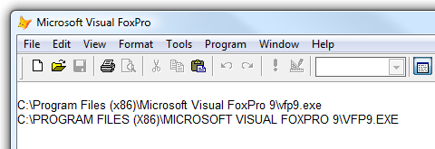

[ Home ](https://github.com/VFPX/Win32API)  

# Converting path to original case

## Before you begin:
  

  
***  


## Code:
```foxpro  
CLEAR
CLEAR ALL

#DEFINE MAX_PATH 260
DO declare

? GetFullPath( _vfp.ServerName )
? FULLPATH( _vfp.ServerName )

? GetFullPath( "%systemroot\system32%" )
* end of main

FUNCTION GetFullPath( cPath As String ) As String
	LOCAL cFileSpec
	
	cPath = GetQualifiedPath(ExpandEnvStrings( m.cPath ))

	IF PathIsDirectory(m.cPath) = 0
		cFileSpec = JUSTFNAME(m.cPath)
		cPath = SUBSTR(m.cPath, 1, RAT(m.cFileSpec, m.cPath)-1)
	ELSE
		cFileSpec = ""
	ENDIF
	
	cPath = GetQualifiedPath(GetLongPath(GetShortPath( m.cPath )) +;
		IIF(EMPTY(cFileSpec), "", "\" + cFileSpec) )
RETURN m.cPath

FUNCTION ExpandEnvStrings( cStr As String ) As String
	LOCAL cBuffer
	cBuffer = REPLICATE(CHR(0), MAX_PATH)
	ExpandEnvironmentStrings( m.cStr, @cBuffer, MAX_PATH)
RETURN STRTRAN(m.cBuffer, CHR(0), "")

FUNCTION GetQualifiedPath( cStr As String ) As String
	LOCAL cBuffer
	cBuffer = REPLICATE(CHR(0), MAX_PATH)
	PathSearchAndQualify( m.cStr, @cBuffer, MAX_PATH)
RETURN STRTRAN(m.cBuffer, CHR(0), "")

FUNCTION GetShortPath( cStr As String ) As String
	LOCAL cBuffer
	cBuffer = REPLICATE(CHR(0), MAX_PATH)
	GetShortPathName( m.cStr, @cBuffer, MAX_PATH)
RETURN STRTRAN(m.cBuffer, CHR(0), "")

FUNCTION GetLongPath( cStr As String ) As String
	LOCAL cBuffer
	cBuffer = REPLICATE(CHR(0), MAX_PATH)
	GetLongPathName( m.cStr, @cBuffer, MAX_PATH)
RETURN STRTRAN(m.cBuffer, CHR(0), "")

PROCEDURE declare
	DECLARE INTEGER ExpandEnvironmentStrings IN kernel32;
		STRING lpSrc, STRING @lpDst, INTEGER nSize

	DECLARE INTEGER PathSearchAndQualify IN Shlwapi;
		STRING pcszPath, STRING @pszFullyQualifiedPath,;
		INTEGER cchFullyQualifiedPath

	DECLARE INTEGER GetShortPathName IN Kernel32;
		STRING lpszLongPath, STRING @lpszShortPath,;
		INTEGER cchBuffer

	DECLARE INTEGER GetLongPathName IN Kernel32;
		STRING lpszShortPath, STRING @lpszLongPath,;
		INTEGER cchBuffer

	DECLARE INTEGER PathIsDirectory IN Shlwapi;
		STRING pszPath  
```  
***  


## Listed functions:
[ExpandEnvironmentStrings](../libraries/kernel32/ExpandEnvironmentStrings.md)  
[GetLongPathName](../libraries/kernel32/GetLongPathName.md)  
[GetShortPathName](../libraries/kernel32/GetShortPathName.md)  
[PathIsDirectory](../libraries/shlwapi/PathIsDirectory.md)  
[PathSearchAndQualify](../libraries/shlwapi/PathSearchAndQualify.md)  

## Comment:
The presented procedure also expands environment string (like *%SystemRoot%, %Public%, %Temp%* and so on) in source path.  
  
File names in some operating systems are case sensitive. This should be considered when, for example, exchanging files with Apache FTP server.  
  
***  

