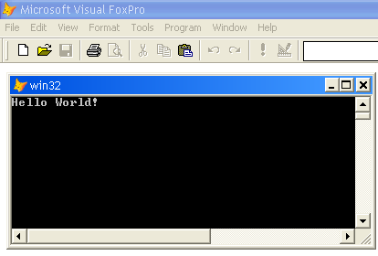

[ Home ](https://github.com/VFPX/Win32API)  

# Saying "Hello World!" with VFP and WinAPI

## Before you begin:
A [hello world program](http://en.wikipedia.org/wiki/Hello_world_program#Windows_API_.28in_C.29) is a frequently used programming example, usually designed to show the easiest possible application on a system that can actually do something (i.e. print a line that says "Hello World").  

  
This message is great to start a day with!  

  
***  


## Code:
```foxpro  
#DEFINE STD_OUTPUT_HANDLE -11

DECLARE INTEGER AllocConsole IN kernel32
DECLARE INTEGER GetConsoleWindow IN kernel32
DECLARE INTEGER GetStdHandle IN kernel32 LONG nStdHandle

DECLARE INTEGER ShowWindow IN user32 AS ShowWindowA;
	INTEGER hWindow, INTEGER nCmdShow

DECLARE INTEGER WriteConsole IN kernel32;
	INTEGER hConsoleOutput, STRING @lpBuffer,;
	INTEGER nCharsToWrite, INTEGER lpCharsWritten,;
	INTEGER lpReserved

= AllocConsole()
= ShowWindowA(GetConsoleWindow(), 1)
= WriteConsole(GetStdHandle(STD_OUTPUT_HANDLE), "Hello World!", 12,0,0)  
```  
***  


## Listed functions:
[AllocConsole](../libraries/kernel32/AllocConsole.md)  
[GetConsoleWindow](../libraries/kernel32/GetConsoleWindow.md)  
[GetStdHandle](../libraries/kernel32/GetStdHandle.md)  
[ShowWindow](../libraries/user32/ShowWindow.md)  
[WriteConsole](../libraries/kernel32/WriteConsole.md)  

## Comment:
>The original hello-world program in the Windows 1.0 SDK was a bit of a scandal. HELLO.C was about 150 lines long, and the HELLO.RC resource script had another 20 or so more lines. (...) Veteran C programmers often curled up in horror or laughter when encountering the Windows hello-world program.*  
  
&reg; Charles Petzold, Programming Microsoft Windows with C#  
  
* * *  
What could be easier of that?
```foxpro
? "Hello World!"
```
 
or this  
```foxpro
DEFINE WINDOW helloworld FROM 10,10 TO 20,50 SYSTEM CLOSE  
ACTIVATE WINDOW helloworld  
? "Hello World!"
```
* * *  
Find more than 20 different ways of saying [Hello World on FoxPro Wiki](http://fox.wikis.com/wc.dll?Wiki~HelloWorld).  
Read about [Hello World program in Wikipedia](http://en.wikipedia.org/wiki/Hello_world_program).  
  
***  

