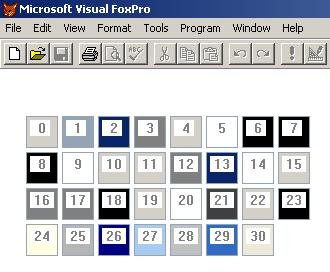

[ Home ](https://github.com/VFPX/Win32API)  

# Using FrameRgn for displaying system colors

## Before you begin:
This is how it looks:  

  

  
***  


## Code:
```foxpro  
#DEFINE sqTop       120
#DEFINE sqLeft       30
#DEFINE sqHeight     64
#DEFINE sqWidth      64
#DEFINE stroke       32
#DEFINE sqInterval   10
#DEFINE dsHeight    600
#DEFINE dsWidth     600

DO decl

	X = sqLeft
	Y = sqTop
	lnColorIndex = 0

	DO WHILE .T.
		IF Not _display (lnColorIndex, X,Y, sqWidth,sqHeight)
			EXIT
		ENDIF

		lnColorIndex = lnColorIndex + 1
		X = X + sqWidth + sqInterval

		IF X > dsWidth
			X = sqLeft
			Y = Y + sqHeight + sqInterval
		ENDIF
	ENDDO

FUNCTION  _display (lnColorIndex, X,Y, width, height)
* draw a frame using system color

	LOCAL hwnd, hDc, hBrush, hRgn
	hBrush = GetSysColorBrush (lnColorIndex)

	IF hBrush <> 0
		hwnd = GetFocus()
		hDc = GetWindowDC(hwnd)
		hRgn = CreateRectRgn (X, Y, X+width, Y+height)
		
		* draw a bold frame
		= FrameRgn (hDc, hRgn, hBrush, stroke, stroke)
		
		* set text color
		= SetTextColor (hDC, Rgb (128,128,128))

		* print color index value
		lcColorIndex = STR(lnColorIndex, 3) + " "
		= TextOut (hDc, X+4,Y+4,;
			lcColorIndex, Len(lcColorIndex))

		* draw a thin frame with system color 1
		hBrush = GetSysColorBrush (1)
		= FrameRgn (hDc, hRgn, hBrush, 1, 1)
	
		= DeleteObject (hRgn)
		= ReleaseDC (hwnd, hdc)
		RETURN .T.
	ENDIF
RETURN .F.

PROCEDURE  decl
	DECLARE INTEGER GetFocus IN user32
	DECLARE INTEGER GetWindowDC IN user32 INTEGER hwnd
	DECLARE INTEGER ReleaseDC IN user32;
		INTEGER hwnd, INTEGER hdc
	DECLARE INTEGER DeleteObject IN gdi32 INTEGER hObject

    DECLARE INTEGER GetSysColorBrush IN user32 INTEGER nIndex

	DECLARE INTEGER CreateRectRgn IN gdi32;
		INTEGER nLeftRect, INTEGER nTopRect,;
		INTEGER nRightRect,INTEGER nBottomRect

	DECLARE SHORT FrameRgn IN gdi32;
		INTEGER hdc,;
		INTEGER hrgn, INTEGER hbr,;
		INTEGER nWidth, INTEGER nHeight

	DECLARE INTEGER TextOut IN gdi32;
		INTEGER hdc,;
		INTEGER x, INTEGER y,;
		STRING  lpString, INTEGER nCount

	DECLARE INTEGER SetTextColor IN gdi32;
		INTEGER hdc, INTEGER crColor  
```  
***  


## Listed functions:
[CreateRectRgn](../libraries/gdi32/CreateRectRgn.md)  
[DeleteObject](../libraries/gdi32/DeleteObject.md)  
[FrameRgn](../libraries/gdi32/FrameRgn.md)  
[GetFocus](../libraries/user32/GetFocus.md)  
[GetSysColorBrush](../libraries/user32/GetSysColorBrush.md)  
[GetWindowDC](../libraries/user32/GetWindowDC.md)  
[ReleaseDC](../libraries/user32/ReleaseDC.md)  
[SetTextColor](../libraries/gdi32/SetTextColor.md)  
[TextOut](../libraries/gdi32/TextOut.md)  
