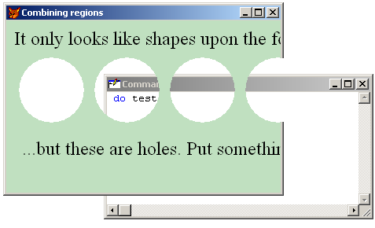

[ Home ](https://github.com/VFPX/Win32API)  

# How to create transparent areas inside a form -- punching holes in the form

## Before you begin:
  
A region is a rectangle, polygon, or ellipse or a combination of two or more of these shapes. The SetWindowRgn function sets the window region of a window.   

The window region determines the area within the window where the system permits drawing. In other words, parts of the form beyond the region are not visible. Any mouse clicks on invisible parts pass through them to the windows beneath.  

See also:

* [How to draw a custom Window Caption on FoxPro form](sample_499.md)  
* [Round FoxPro form](sample_143.md)  
* [An alternative way of setting Form.Closable to False](sample_127.md)  
* [Semi-transparent form](sample_453.md)  
* [Transparent Menu on top-level form (requires VFP9) ](sample_496.md)  

  
***  


## Code:
```foxpro  
PUBLIC frm
frm = CreateObject ("Tform")
frm.Visible = .T.
* end of main

DEFINE CLASS Tform As Form
	Width = 500
	Height = 300
	AutoCenter = .T.
	BackColor = Rgb(192,224,192)
	Caption = "Combining regions"
	
	ADD OBJECT lbl1 As Tlabel WITH;
		Caption="It only looks like shapes upon the form...",;
		Left=10, Top=10
	
	ADD OBJECT lbl2 As Tlabel WITH;
		Caption="...but these are holes. Put something behind.",;
		Left=20, Top=150

PROCEDURE  Load
	THIS.declare
ENDPROC

PROCEDURE  Resize
*	THIS.RemoveRegions   && does not make any difference
	ThisForm.ApplyRegions
ENDPROC

PROCEDURE  Activate
	ThisForm.ApplyRegions
ENDPROC

PROCEDURE  RemoveRegions
	= SetWindowRgn (GetFocus(), 0, 1)
ENDPROC

PROCEDURE  ApplyRegions
#DEFINE RGN_AND  1
#DEFINE RGN_OR   2
#DEFINE RGN_XOR  3
#DEFINE RGN_DIFF 4
#DEFINE RGN_COPY 5

#DEFINE radius  84
#DEFINE interspace 12

	LOCAL hRgnBase, hRgn, hwnd, x0,y0,x1,y1
	DIMEN hRgnExclude [5]  && an array to store elliptical regions

	* create a rectangle region
	* and set it by the rectangle of the form
	hRgn = CreateRectRgn (0,0,1,1)
	hwnd = GetFocus()  && get window handle for the form
	THIS.GetRect (hwnd, @x0,@y0,@x1,@y1)
	hRgnBase = CreateRectRgn (0,0,x1-x0,y1-y0)

	x0 = 20
	y0 = 70
	y1 = y0 + radius
	* create several elliptical regions
	FOR ii=1 TO 5
		hRgnExclude[ii] = CreateEllipticRgn (x0,y0, x0+radius,y1)
 		x0 = x0 + radius + interspace
	ENDFOR

	* combine elliptical regions into one region
	= CombineRgn (hRgn, hRgnExclude[1], hRgnExclude [2], RGN_OR)
	= CombineRgn (hRgn, hRgn, hRgnExclude [3], RGN_OR)
	= CombineRgn (hRgn, hRgn, hRgnExclude [4], RGN_OR)
	= CombineRgn (hRgn, hRgn, hRgnExclude [5], RGN_OR)

	* subtract the resulting region
	* from the region defined by the rectangle of the form
	= CombineRgn (hRgn, hRgnBase, hRgn, RGN_XOR)

	* apply final region to the form
	= SetWindowRgn (hwnd, hRgn, 1)
	
	* free system resources
	= DeleteObject (hRgn)
	FOR ii=1 TO 5
		= DeleteObject (hRgnExclude[ii])
	ENDFOR
	= DeleteObject (hRgnBase)
ENDPROC

PROCEDURE  GetRect (hwnd, x0,y0,x1,y1)
	LOCAL lpRect
	lpRect = SPACE (16)

	= GetWindowRect (hwnd, @lpRect)
	x0 = THIS.buf2dword (SUBSTR(lpRect,  1,4))
	y0 = THIS.buf2dword (SUBSTR(lpRect,  5,4))
	x1 = THIS.buf2dword (SUBSTR(lpRect,  9,4))
	y1 = THIS.buf2dword (SUBSTR(lpRect, 13,4))
ENDPROC

FUNCTION  buf2dword (lcBuffer)
RETURN;
	Asc(SUBSTR(lcBuffer, 1,1)) + ;
	Asc(SUBSTR(lcBuffer, 2,1)) * 256 +;
	Asc(SUBSTR(lcBuffer, 3,1)) * 65536 +;
	Asc(SUBSTR(lcBuffer, 4,1)) * 16777216
ENDFUNC

PROCEDURE  declare
	DECLARE INTEGER CreateEllipticRgn IN gdi32;
		INTEGER nLeftRect, INTEGER nTopRect,;
		INTEGER nRightRect, INTEGER nBottomRect

	DECLARE INTEGER CreateRectRgn IN gdi32;
		INTEGER nLeftRect, INTEGER nTopRect,;
		INTEGER nRightRect, INTEGER nBottomRect

	DECLARE INTEGER CombineRgn IN gdi32;
		INTEGER hrgnDest, INTEGER hrgnSrc1,;
		INTEGER hrgnSrc2, INTEGER fnCombineMode

	DECLARE SetWindowRgn IN user32;
		INTEGER hWnd, INTEGER hRgn, SHORT bRedraw

	DECLARE SHORT GetWindowRect IN user32;
		INTEGER hwnd, STRING @lpRect

	DECLARE INTEGER DeleteObject IN gdi32 INTEGER hObject
	DECLARE INTEGER GetFocus IN user32
ENDPROC
ENDDEFINE

DEFINE CLASS Tlabel As Label
	FontName="Times New Roman"
	FontSize=18
	AutoSize=.T.
	BackStyle=0
ENDDEFINE  
```  
***  


## Listed functions:
[CombineRgn](../libraries/gdi32/CombineRgn.md)  
[CreateEllipticRgn](../libraries/gdi32/CreateEllipticRgn.md)  
[CreateRectRgn](../libraries/gdi32/CreateRectRgn.md)  
[DeleteObject](../libraries/gdi32/DeleteObject.md)  
[GetFocus](../libraries/user32/GetFocus.md)  
[GetWindowRect](../libraries/user32/GetWindowRect.md)  
[SetWindowRgn](../libraries/user32/SetWindowRgn.md)  

## Comment:

  
The SetLayeredWindowAttributes function can be used for creating transparent areas on forms, and even for making a [whole form partially or totally transparent](sample_453.md). A layered window is created by specifying WS_EX_LAYERED when creating the window with the CreateWindowEx function or by setting WS_EX_LAYERED via SetWindowLong after the window has been created.  
  
Only top-level windows (<a href="http://msdn.microsoft.com/en-us/library/h0ea0kz8(v=vs.80).aspx">ShowWindow</a>=2) can be made layered windows, whereas through using GDI regions even a child window can be "punched out".  
  
Read [Window Features](https://msdn.microsoft.com/en-us/library/windows/desktop/ms632599(v=vs.85).aspx) article on MSDN.  
  
***  

