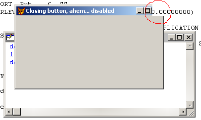

[ Home ](https://github.com/VFPX/Win32API)  

# An alternative way of setting Form.Closable to False

## Before you begin:
  

Similar examples:  
* [How to draw a custom Window Caption on FoxPro form](sample_499.md)  
* [A way to make a transparent area in a form -- a hole in the form](sample_126.md)  
* [Round FoxPro form](sample_143.md)  
* [Semi-transparent form](sample_453.md)  
  
***  


## Code:
```foxpro  
PUBLIC oForm
oForm = CREATEOBJECT("TestForm")
oForm.Visible = .T.

DEFINE CLASS TestForm As Form
#DEFINE SM_CXSIZE 30
#DEFINE SM_CYSIZE 31
#DEFINE SM_CXFRAME 32
#DEFINE SM_CYFRAME 33
#DEFINE RGN_XOR 3

	Width=500
	Height=300
	AutoCenter=.T.
	Caption="Closing button, ahem... disabled"

PROCEDURE Load
	THIS.declare

PROCEDURE Activate
	THIS.RegionOn

PROCEDURE Resize
	THIS.RegionOn

PROCEDURE RegionOn
	LOCAL lnBtnWidth, lnBtnHeight, hRgnBase,;
		hRgnExcl, hWindow, x1,y1

	* or use SYSMETRIC
	lnBtnWidth = GetSystemMetrics(SM_CXSIZE) +;
		GetSystemMetrics(SM_CXFRAME) + 1

	lnBtnHeight = GetSystemMetrics(SM_CYSIZE) +;
		GetSystemMetrics(SM_CYFRAME) + 1

	hWindow = GetFocus()
*	hWindow = ThisForm.HWnd
	THIS.GetFormRect(hWindow, @x1,@y1)

	hRgnBase = CreateRectRgn(0,0,x1,y1)

	hRgnExcl = CreateRectRgn(x1-lnBtnWidth,0,;
		x1,lnBtnHeight)

	= CombineRgn(hRgnBase, hRgnBase,;
		hRgnExcl, RGN_XOR)

	= SetWindowRgn(hWindow, hRgnBase, 1)
	= DeleteObject(hRgnBase)
	= DeleteObject(hRgnExcl)

PROCEDURE GetFormRect(hWindow, x1,y1)
	LOCAL lpRect
	lpRect = SPACE(16)
	= GetWindowRect(hWindow, @lpRect)

	x1 = THIS.buf2dword(SUBSTR(lpRect, 9,4)) -;
		THIS.buf2dword(SUBSTR(lpRect, 1,4))

	y1 = THIS.buf2dword(SUBSTR(lpRect, 13,4)) -;
		THIS.buf2dword(SUBSTR(lpRect, 5,4))

FUNCTION buf2dword(cBuffer)
RETURN Asc(SUBSTR(cBuffer, 1,1)) + ;
	BitLShift(Asc(SUBSTR(cBuffer, 2,1)), 8) +;
	BitLShift(Asc(SUBSTR(cBuffer, 3,1)), 16) +;
	BitLShift(Asc(SUBSTR(cBuffer, 4,1)), 24)

PROCEDURE declare
	DECLARE INTEGER GetSystemMetrics IN user32;
		INTEGER nIndex

	DECLARE INTEGER DeleteObject IN gdi32;
		INTEGER hObject

	DECLARE INTEGER GetFocus IN user32

	DECLARE SetWindowRgn IN user32;
		INTEGER hWindow, INTEGER hRgn, SHORT bRedraw

	DECLARE SHORT GetWindowRect IN user32;
		INTEGER hWindow, STRING @lpRect

	DECLARE INTEGER CreateRectRgn IN gdi32;
		INTEGER nLeftRect, INTEGER nTopRect,;
		INTEGER nRightRect, INTEGER nBottomRect

	DECLARE INTEGER CombineRgn IN gdi32;
		INTEGER hrgnDest, INTEGER hrgnSrc1,;
		INTEGER hrgnSrc2,;
		INTEGER fnCombineMode

ENDDEFINE  
```  
***  


## Listed functions:
[CombineRgn](../libraries/gdi32/CombineRgn.md)  
[CreateRectRgn](../libraries/gdi32/CreateRectRgn.md)  
[DeleteObject](../libraries/gdi32/DeleteObject.md)  
[GetFocus](../libraries/user32/GetFocus.md)  
[GetSystemMetrics](../libraries/user32/GetSystemMetrics.md)  
[GetWindowRect](../libraries/user32/GetWindowRect.md)  
[SetWindowRgn](../libraries/user32/SetWindowRgn.md)  


***  

