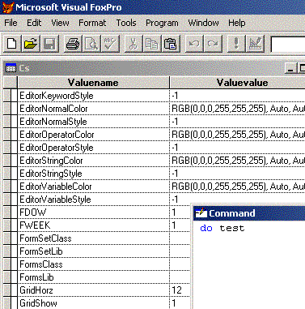

[ Home ](https://github.com/VFPX/Win32API)  

# Reading VFP settings from the Windows Registry

## Before you begin:
  
  
***  


## Code:
```foxpro  
#DEFINE ERROR_SUCCESS 0
#DEFINE KEY_READ 0x020019
#DEFINE KEY_ALL_ACCESS 0x0F003F
#DEFINE HKEY_CURRENT_USER 0x80000001

DO declare

hBaseKey = 0

*!*	lcBaseKey = "Software\Microsoft\VisualFoxPro\3.0\Options"
*!*	lcBaseKey = "Software\Microsoft\VisualFoxPro\5.0\Options"
*!*	lcBaseKey = "Software\Microsoft\VisualFoxPro\6.0\Options"
*!*	lcBaseKey = "Software\Microsoft\VisualFoxPro\7.0\Options"
lcBaseKey = "Software\Microsoft\VisualFoxPro\8.0\Options"
*!*	lcBaseKey = "Software\Microsoft\VisualFoxPro\9.0\Options"

*!*	* try this option too
*!*	lcBaseKey = "Software\ODBC\ODBC.INI\ODBC Data Sources"

IF RegOpenKeyEx(HKEY_CURRENT_USER, lcBaseKey,;
	0, KEY_ALL_ACCESS, @hBaseKey) <> ERROR_SUCCESS
	? "Error opening registry key"
	RETURN
ENDIF

CREATE CURSOR cs (valuename C(50), valuevalue C(200))

dwIndex = 0
DO WHILE .T.
	lnValueLen = 250
	lcValueName = Repli(Chr(0), lnValueLen)
	lnType = 0
	lnDataLen = 250
	lcData = Repli(Chr(0), lnDataLen)

	lnResult = RegEnumValue(hBaseKey, dwIndex,;
		@lcValueName, @lnValueLen, 0,;
		@lnType, @lcData, @lnDataLen)
		
	* for this case on return the type of data (lnType)
	* is always equal to 1 (REG_SZ)
	* that means null-terminated string
	
	IF lnResult <> ERROR_SUCCESS
		EXIT
	ENDIF

	lcValueName = Left(lcValueName, lnValueLen)
	lcData = Left(lcData, lnDataLen-1)
	INSERT INTO cs VALUES (lcValueName, lcData)

	dwIndex = dwIndex + 1
ENDDO

= RegCloseKey(hBaseKey)
SELECT cs
INDEX ON valuename TAG valuename
GO TOP
BROW NORMAL NOWAIT

PROCEDURE declare
	DECLARE INTEGER RegCloseKey IN advapi32 INTEGER hKey

	DECLARE INTEGER RegOpenKeyEx IN advapi32;
		INTEGER hKey, STRING lpSubKey, INTEGER ulOptions,;
		INTEGER samDesired, INTEGER @phkResult

	DECLARE INTEGER RegEnumValue IN advapi32;
		INTEGER hKey, INTEGER dwIndex, STRING @lpValueName,;
		INTEGER @lpcValueName, INTEGER lpReserved, INTEGER @lpType,;
		STRING @lpData, INTEGER @lpcbData  
```  
***  


## Listed functions:
[RegCloseKey](../libraries/advapi32/RegCloseKey.md)  
[RegEnumValue](../libraries/advapi32/RegEnumValue.md)  
[RegOpenKeyEx](../libraries/advapi32/RegOpenKeyEx.md)  
