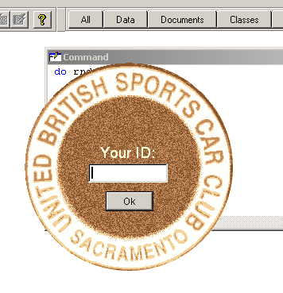
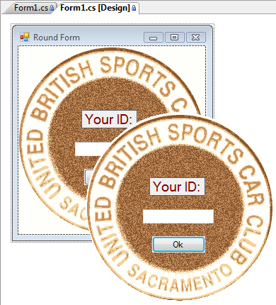
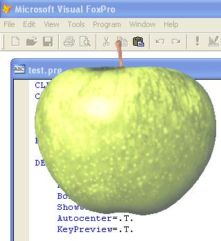

[ Home ](https://github.com/VFPX/Win32API)  

# Round FoxPro form

## Before you begin:
Download [Badge.zip](../downloads/badge.zip) and extract an image file before testing this code sample:  

  
See also:

* [Creating irregularly shaped FoxPro form using transparency color key](sample_033.md)  
* [How to draw a custom Window Caption on FoxPro form](sample_499.md)  
* [A way to make a transparent area in a form -- a hole in the form](sample_126.md)  
* [An alternative way of setting Form.Closable to False](sample_127.md)  
* [Semi-transparent form](sample_453.md)  

The VFP code converts to C# with only language and platform specific changes:  

  
  
***  


## Code:
```foxpro  
PUBLIC oForm
oForm = CreateObject("Tform")
oForm.Visible = .T.
* end of main

DEFINE CLASS Tform As Form
#DEFINE badgeDiameter 264
#DEFINE topMargin 4
#DEFINE leftMargin 2
	Width=300
	Height=350
	AutoCenter=.T.
	Picture="badge1.bmp"
	hRgn=0
	
	ADD OBJECT lbl As Label WITH Caption="Your ID:",;
	FontName="Arial", FontSize=14, Bold=.T., BackStyle=0, Alignment=2,;
	Forecolor=Rgb(255,255,225), Left=82, Top=105, Width=100, Height=25

	ADD OBJECT txt As TextBox WITH Width=100, Height=24,;
	Left=82, Top=130, PasswordChar="*"

	ADD OBJECT cmd As CommandButton WITH Width=60, Height=25,;
	Left=104, Top=165, Caption="Ok", Default=.T.

PROCEDURE Init
	DO decl

PROCEDURE Activate
	IF THIS.hRgn = 0
		THIS.RegionOn
	ENDIF

PROCEDURE RegionOn
#DEFINE SM_CYSIZE  31
#DEFINE SM_CXFRAME 32
#DEFINE SM_CYFRAME 33
	LOCAL hwnd, x0, y0, x1, y1

	* calculating position of the region
	* you can use SYSMETRIC() instead
	x0 = GetSystemMetrics(SM_CXFRAME) + leftMargin
	y0 = GetSystemMetrics(SM_CYSIZE) +;
		GetSystemMetrics(SM_CYFRAME) + topMargin
	x1 = x0 + badgeDiameter
	y1 = y0 + badgeDiameter

	* creating an elliptical region
	THIS.hRgn = CreateEllipticRgn (x0, y0, x1, y1)
	hwnd = GetFocus()

	* applying the region to the form
	IF SetWindowRgn(hwnd, THIS.hRgn, 1) = 0
	* if failed then release the handle
		= DeleteObject (THIS.hRgn)
		THIS.hRgn = 0
	ENDIF
ENDPROC

PROCEDURE MouseDown
LPARAMETERS nButton, nShift, nXCoord, nYCoord
#DEFINE WM_SYSCOMMAND  0x112
#DEFINE WM_LBUTTONUP   0x202
#DEFINE MOUSE_MOVE     0xf012
	IF nButton = 1
		LOCAL hWindow
		hWindow = GetFocus()
		= ReleaseCapture()
		= SendMessage(hWindow, WM_SYSCOMMAND, MOUSE_MOVE, 0)
		= SendMessage(hWindow, WM_LBUTTONUP, 0, 0)
	ENDIF

PROCEDURE cmd.Click
	ThisForm.Release
ENDDEFINE

PROCEDURE decl
	DECLARE INTEGER GetFocus IN user32
	DECLARE INTEGER DeleteObject IN gdi32 INTEGER hObject
	DECLARE INTEGER GetSystemMetrics IN user32 INTEGER nIndex
	DECLARE INTEGER ReleaseCapture IN user32

	DECLARE INTEGER SendMessage IN user32;
		INTEGER hWnd, INTEGER Msg,;
		INTEGER wParam, INTEGER lParam

	DECLARE INTEGER CreateEllipticRgn IN gdi32;
		INTEGER nLeftRect, INTEGER nTopRect,;
		INTEGER nRightRect, INTEGER nBottomRect

	DECLARE INTEGER SetWindowRgn IN user32;
		INTEGER hWnd, INTEGER hRgn, INTEGER bRedraw  
```  
***  


## Listed functions:
[CreateEllipticRgn](../libraries/gdi32/CreateEllipticRgn.md)  
[DeleteObject](../libraries/gdi32/DeleteObject.md)  
[GetFocus](../libraries/user32/GetFocus.md)  
[GetSystemMetrics](../libraries/user32/GetSystemMetrics.md)  
[ReleaseCapture](../libraries/user32/ReleaseCapture.md)  
[SendMessage](../libraries/user32/SendMessage.md)  
[SetWindowRgn](../libraries/user32/SetWindowRgn.md)  

## Comment:
Although this form has no visible title bar, you can still move it by clicking and dragging at any point beyond controls.  
  

***  
Nov.7, 2005:   
  


With the SetLayeredWindowAttributes function, parts of the form with the same color can be cut off. Note that the frame of the form still must be removed using Region API calls.  
  

***  
In .NET, the Region property of Form object allows to create irregular forms without directly calling API functions.  
  
***  

