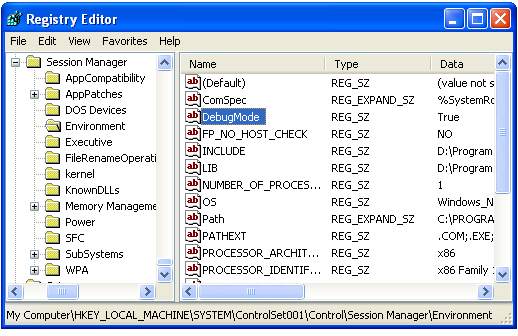

[ Home ](https://github.com/VFPX/Win32API)  

# Reading and setting Environment variables

## Before you begin:
See also:

* [One more way to retrieve environment strings](sample_132.md)  
* [Creating INI file and adding strings to it](sample_137.md)  
* [Storing environment strings in cursor ](sample_089.md)  
  
***  


## Code:
```foxpro  
DECLARE INTEGER GetEnvironmentVariable IN kernel32;
	STRING lpName, STRING @lpBuffer, INTEGER nSize

DECLARE INTEGER SetEnvironmentVariable IN kernel32;
	STRING lpName, STRING lpValue

lcName = "DebugMode"
? _GetEnv (lcName)
= _SetEnv (lcName, "True")
? _GetEnv (lcName)

FUNCTION _GetEnv(lcName)
	LOCAL lcBuffer, lnResult
	lcBuffer = SPACE(1024)
	lnResult = GetEnvironmentVariable (lcName, @lcBuffer, Len(lcBuffer))
RETURN  Iif(lnResult=0, "#nothing#", Left(lcBuffer, lnResult))

FUNCTION _SetEnv(lcName, lcValue)
RETURN SetEnvironmentVariable(lcName, lcValue) <> 0  
```  
***  


## Listed functions:
[GetEnvironmentVariable](../libraries/kernel32/GetEnvironmentVariable.md)  
[SetEnvironmentVariable](../libraries/kernel32/SetEnvironmentVariable.md)  

## Comment:
A reminder: any changes you made to environment variables are effective only for current VFP session.   
  
Every process, when created, acquires its own separate environment block. And to my knowledge there is no way of information exchange between two VFP instances through environment variables.  
  
* * *  
After C# code executes:  

  

***  

