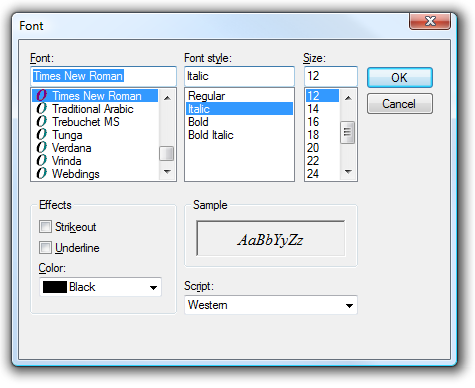

[ Home ](https://github.com/VFPX/Win32API)  

# Enhanced GetFont dialog

## Before you begin:
Comparing to the dialog invoked by the GETFONT(), this one offers few more adjustable parameters: strikeout and underline effects and font color.  
  

See also:

* [GDI+: enumerating fonts installed on the system](sample_462.md)  
* [How to change font name and size in the MessageBox dialog](sample_434.md)  
* [How to position the GETPRINTER() dialog](sample_482.md)  
* [Vertical Label control](sample_398.md)  
  
***  


## Code:
```foxpro  
DO decl

#DEFINE GMEM_FIXED                 0
#DEFINE LF_FACESIZE               32
#DEFINE FW_NORMAL                400
#DEFINE DEFAULT_CHARSET            1
#DEFINE OUT_DEFAULT_PRECIS         0
#DEFINE CLIP_DEFAULT_PRECIS        0
#DEFINE DEFAULT_QUALITY            0
#DEFINE DEFAULT_PITCH              0
#DEFINE CF_SCREENFONTS             1
#DEFINE CF_INITTOLOGFONTSTRUCT    64
#DEFINE CF_EFFECTS               256
#DEFINE CF_FORCEFONTEXIST      65536

*| typedef struct {
*|   DWORD        lStructSize;     4
*|   HWND         hwndOwner;       4
*|   HDC          hDC;             4
*|   LPLOGFONT    lpLogFont;       4
*|   INT          iPointSize;      4
*|   DWORD        Flags;           4
*|   COLORREF     rgbColors;       4
*|   LPARAM       lCustData;       4
*|   LPCFHOOKPROC lpfnHook;        4
*|   LPCTSTR      lpTemplateName;  4
*|   HINSTANCE    hInstance;       4
*|   LPTSTR       lpszStyle;       4
*|   WORD         nFontType;       2
*|   WORD         ___MISSING_ALIGNMENT__; 2
*|   INT          nSizeMin;        4
*|   INT          nSizeMax;        4
*| } CHOOSEFONT, *LPCHOOSEFONT; total: 60 bytes

*| typedef struct tagLOGFONT {
*|   LONG lfHeight;                   4
*|   LONG lfWidth;                    4
*|   LONG lfEscapement;               4
*|   LONG lfOrientation;              4
*|   LONG lfWeight;                   4
*|   BYTE lfItalic;                   1
*|   BYTE lfUnderline;                1
*|   BYTE lfStrikeOut;                1
*|   BYTE lfCharSet;                  1
*|   BYTE lfOutPrecision;             1
*|   BYTE lfClipPrecision;            1
*|   BYTE lfQuality;                  1
*|   BYTE lfPitchAndFamily;           1
*|   TCHAR lfFaceName[LF_FACESIZE];  32
*| } LOGFONT, *PLOGFONT; total: 60 bytes

	LOCAL lcChooseFont, lcLogFont, hLogFont, lcFontFace

	* initializing LOGFONT structure:
	* Times New Roman, Italic
	lcLogFont = num2dword(16) +;
		num2dword(0)  +;
		num2dword(0)  +;
		num2dword(0)  +;
		num2dword(FW_NORMAL) +;
		Chr(1) +;
		Chr(0) +;
		Chr(0) +;
		Chr(DEFAULT_CHARSET)     +;
		Chr(OUT_DEFAULT_PRECIS)  +;
		Chr(CLIP_DEFAULT_PRECIS) +;
		Chr(DEFAULT_QUALITY)     +;
		Chr(DEFAULT_PITCH)       +;
		PADR("Times New Roman"+Chr(0),32)

	* copying the LOGFONT data into the global memory object
	* because CHOOSEFONT structure uses the pointer
	lnLogFontSize = 60
	hLogFont = GlobalAlloc(GMEM_FIXED, lnLogFontSize)

	* this function is re-declared below
	* with different parameter types
	DECLARE RtlMoveMemory IN kernel32 As String2Heap;
		INTEGER Destination, STRING @ Source,;
		INTEGER nLength
	= String2Heap (hLogFont, @lcLogFont, lnLogFontSize)

	* initializing CHOOSEFONT structure
	lcChooseFont = num2dword(60) +;
		num2dword(0) +;
		num2dword(0) +;
		num2dword(hLogFont) +;
		num2dword(0) +;
		num2dword(CF_SCREENFONTS + CF_EFFECTS +;
			CF_INITTOLOGFONTSTRUCT + CF_FORCEFONTEXIST) +;
		num2dword(0) +;
		num2dword(0) +;
		num2dword(0) +;
		num2dword(0) +;
		num2dword(0) +;
		num2dword(0) +;
		num2dword(0) +;
		num2dword(0) +;
		num2dword(0)

	IF ChooseFont (@lcChooseFont) <> 0
	* displaying selection
		* re-declaring API function with different parameters
		DECLARE RtlMoveMemory IN kernel32 As Heap2String;
			STRING @Dest, INTEGER Source, INTEGER nLength

		* copying data from the global memory object to VFP string
		= Heap2String (@lcLogFont, hLogFont, lnLogFontSize)

		? "*** CHOOSEFONT Structure:"
		? "Point size:", buf2dword(SUBSTR(lcChooseFont, 17,4))
		? "RGB color: ", buf2dword(SUBSTR(lcChooseFont, 25,4))
		
		?
		? "*** LOGFONT Structure:"
		? "Font Weight:", buf2dword(SUBSTR(lcLogFont, 17,4))
		? "Italic:     ", Iif(Asc(SUBSTR(lcLogFont, 21,1))=0, "No","Yes")
		? "Underline:  ", Iif(Asc(SUBSTR(lcLogFont, 22,1))=0, "No","Yes")
		? "Strikeout:  ", Iif(Asc(SUBSTR(lcLogFont, 23,1))=0, "No","Yes")
		
		lcFontFace = SUBSTR(lcLogFont, 29)
		lcFontFace = SUBSTR(lcFontFace, 1, AT(Chr(0),lcFontFace)-1)
		? "Font Face:  ", lcFontFace
	ENDIF

	* releasing system resources
	= GlobalFree (hLogFont)
RETURN

PROCEDURE  decl
	DECLARE INTEGER ChooseFont IN comdlg32 STRING @lpcf
	DECLARE INTEGER GlobalFree IN kernel32 INTEGER hMem
	DECLARE INTEGER GlobalAlloc IN kernel32;
		INTEGER wFlags,;
		INTEGER dwBytes

FUNCTION  num2dword (lnValue)
#DEFINE m0       256
#DEFINE m1     65536
#DEFINE m2  16777216
	LOCAL b0, b1, b2, b3
	b3 = Int(lnValue/m2)
	b2 = Int((lnValue - b3*m2)/m1)
	b1 = Int((lnValue - b3*m2 - b2*m1)/m0)
	b0 = Mod(lnValue, m0)
RETURN Chr(b0)+Chr(b1)+Chr(b2)+Chr(b3)

FUNCTION  buf2dword (lcBuffer)
RETURN Asc(SUBSTR(lcBuffer, 1,1)) + ;
	Asc(SUBSTR(lcBuffer, 2,1)) * 256 +;
	Asc(SUBSTR(lcBuffer, 3,1)) * 65536 +;
	Asc(SUBSTR(lcBuffer, 4,1)) * 16777216  
```  
***  


## Listed functions:
[ChooseFont](../libraries/comdlg32/ChooseFont.md)  
[GlobalAlloc](../libraries/kernel32/GlobalAlloc.md)  
[GlobalFree](../libraries/kernel32/GlobalFree.md)  

## Comment:
```foxpro
GETFONT(cFontName [, nFontSize [, cFontStyle [, nFontCharSet])
```
  
  
***  

