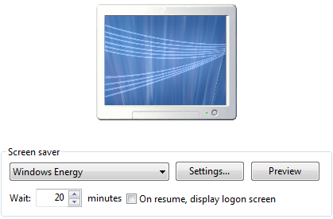

[ Home ](https://github.com/VFPX/Win32API)  

# How to start the screen saver and how to find whether the screen saver is active

## Before you begin:
Screen Saver can be started programmatically by calling SendMessage or PostMessage function.  

  

See also:

* [Closing access to the Windows Desktop and to other applications](sample_492.md)  
* [Using the SystemParametersInfo function](sample_283.md)  

  
***  


## Code:
```foxpro  
#DEFINE WM_SYSCOMMAND 0x112
#DEFINE HWND_BROADCAST 0xffff
#DEFINE SC_SCREENSAVE 0xf140
#DEFINE GENERIC_READ 0x80000000
#DEFINE SS_DESKTOP_NAME "Screen-saver"
#DEFINE SS_WINDOW_CLASS "WindowsScreenSaverClass"

DO StartScreenSaver
WAIT WINDOW "Wait a moment..." TIMEOUT 1
? "Screen Saver status:", GetScreenSaverStatus()

FUNCTION GetScreenSaverStatus() As Number
* 0-not running, 1-screen saver, 2-password protected screen saver

	DECLARE INTEGER CloseDesktop IN user32 INTEGER hDesktop

	DECLARE INTEGER FindWindow IN user32;
		STRING lpClassName, STRING lpWindowName

	DECLARE INTEGER OpenDesktop IN user32;
		STRING lpszDesktop, LONG dwFlags,;
		INTEGER fInherit, INTEGER dwDesiredAccess

	LOCAL hWindow
	hWindow = FindWindow(SS_WINDOW_CLASS, NULL)
	IF hWindow <> 0
	* the screen saver is active, no password protection
		RETURN 1
	ENDIF

	LOCAL hSSDesktop
	hSSDesktop = OpenDesktop(SS_DESKTOP_NAME, 0,0, GENERIC_READ)
	IF hSSDesktop <> 0
	* the screen saver is active and password protected
		= CloseDesktop(hSSDesktop)
		RETURN 2
	ENDIF
RETURN 0

PROCEDURE StartScreenSaver
	DECLARE INTEGER GetFocus IN user32

	DECLARE INTEGER SendMessage IN user32;
		INTEGER hWindow, INTEGER Msg,;
		INTEGER wParam, INTEGER lParam

	*= SendMessage(GetFocus(), WM_SYSCOMMAND, SC_SCREENSAVE, 0)
	= SendMessage(HWND_BROADCAST, WM_SYSCOMMAND, SC_SCREENSAVE, 0)  
```  
***  


## Listed functions:
[CloseDesktop](../libraries/user32/CloseDesktop.md)  
[FindWindow](../libraries/user32/FindWindow.md)  
[GetFocus](../libraries/user32/GetFocus.md)  
[OpenDesktop](../libraries/user32/OpenDesktop.md)  
[SendMessage](../libraries/user32/SendMessage.md)  

## Comment:
Use *HWnd* of a form or of the Main FoxPro screen as the first parameter. With *hWindow=HWND_BROADCAST*, the message is posted to all top-level windows in the system, including disabled or invisible unowned windows, overlapped windows, and pop-up windows.  
  
Initiated this way, the screen saver may not become password protected immediately, regardless of  the setting in the Display Properties "On resume, password protect". It changes to protected status only after the Wait period expires. This is true for at least XP Home systems.  
  
For the password protected screen saver, the system creates "WinSta0\Screen-saver" desktop and starts a process with "Screen Saver" window attached. So the application may judge about the state of the sreen server by finding out if this desktop exists.  
  
Screen saver without password protection is running on "WinSta0\Default" desktop. It owns "Screen Saver" window that class is "WindowsScreenSaverClass". So this is another way of detecting whether a screen saver is active.  
  
***  

