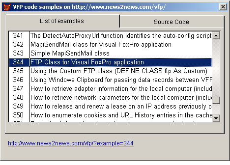

[ Home ](https://github.com/VFPX/Win32API)  

# Accessing examples contained in this reference from a VFP application

## Note that this document contains some links to the old news2news website which does not work at the moment. This material will be available sometime in the future.

## Before you begin:
With this code you can reach the list of examples on this reference from your VFP application through HTTP connection.   
 
  
<!-- Anatoliy --> 
Downloadable code samples are available for <a href="?generic=project#membership">registered annual subscribers</a>.


Try similar example [Accessing examples contained in this reference through Web Services](sample_469.md) (requires VFP8).

***  

## Code:
```foxpro  
PUBLIC objForm
objForm = CreateObject("Tform")
objForm.Visible = .T.
* end of main

DEFINE CLASS Tform As Form
#DEFINE ccBaseAddr "http://www.news2news.com/vfp/"
#DEFINE ccCgiAddr  "http://www.news2news.com/cgi-bin/w32query.php?quser=guest&"
	Caption=" VFP code samples on " + ccBaseAddr
	Width=760
	Height=500
	Autocenter=.T.
	ShowTips=.T.
	csList="cs" + SUBSTR(SYS(2015),3,10)
	
	ADD OBJECT pframe As Tframe WITH Left=6, Top=5, Width=748, Height=440
	ADD OBJECT lblUrl As Label WITH Left=12, Top=460, Autosize=.T.,;
		ForeColor=Rgb(0,0,192), FontUnderline=.T.,;
		TooltipText="Click to open"

PROCEDURE Init
	DECLARE INTEGER ShellExecute IN shell32;
    	INTEGER, STRING, STRING, STRING, STRING, INTEGER
	DECLARE INTEGER URLDownloadToCacheFile IN urlmon;
		INTEGER lpUnkcaller, STRING szURL, STRING @szFileName,;
		INTEGER dwBufLength, INTEGER dwReserved, INTEGER pBSC
	THIS.pframe.Resize
	THIS.PopulateList

PROCEDURE Destroy
	THIS.pframe.pgList.lst.RowsourceType = 0
	IF USED(THIS.csList)
		USE IN (THIS.csList)
	ENDIF

procedure resize
* Thanks Bruce :)
	with this
		stor .Width - 12 to .pframe.Width
		stor .Height - 60 to .pframe.Height
		stor .Height - 40 to .lblUrl.Top
	endWith

PROCEDURE pframe.pgList.lst.InteractiveChange
	ThisForm.lblUrl.Caption = ThisForm.GetUrl()

PROCEDURE lblUrl.MouseDown
LPARAMETERS nButton, nShift, nXCoord, nYCoord
	= ShellExecute(0, "open", ThisForm.GetUrl(), "", "", 3)

PROCEDURE pframe.pgExample.Activate
	ThisForm.DisplayExample

PROCEDURE pframe.pglist.lst.DblClick
	ThisForm.pframe.ActivePage = 2

FUNCTION GetUrl
RETURN ccBaseAddr + "?example=" + ALLT(THIS.pframe.pgList.lst.Value)

PROCEDURE PopulateList
	LOCAL cRequest, cTargetFile
	cRequest = ccCgiAddr + "qtarget=examples&qmode=list"
	cTargetFile = THIS.RemoteToLocal(cRequest)

	IF Not EMPTY(cTargetFile)
		CREATE CURSOR (THIS.csList) (id N(5), name C(200))
		APPEND FROM (cTargetFile) TYPE DELIM WITH ,
		WITH THIS.pframe.pgList.lst
			.RowsourceType = 2
			.Rowsource = THIS.csList
			.ColumnWidths="40,500"
			IF .listCount > 0
				.listIndex = 1
			ENDIF
			.InteractiveChange
		ENDWITH
	ENDIF

PROCEDURE DisplayExample
	LOCAL cRequest, cTargetFile
	cRequest = ccCgiAddr + "qtarget=examples&qmode=source&qindex=" +;
		ALLTRIM(ThisForm.pframe.pgList.lst.Value)
	cTargetFile = THIS.RemoteToLocal(cRequest)

	IF Not EMPTY(cTargetFile)
		WITH ThisForm.pframe.pgExample.txtSource
			.Value = FILETOSTR(cTargetFile)
			.Refresh
		ENDWITH
	ENDIF

FUNCTION RemoteToLocal(cRequest)
	LOCAL nResult, cTargetFile
	cTargetFile = Repli(Chr(0), 250)
	WAIT WINDOW NOWAIT "Downloading remote file..."
	nResult = URLDownloadToCacheFile(0, cRequest, @cTargetFile,;
		Len(cTargetFile), 0,0)
	WAIT CLEAR
	DOEVENTS
RETURN STRTRAN(cTargetFile, Chr(0), "")
ENDDEFINE

DEFINE CLASS Tframe As PageFrame
	ADD OBJECT pgList As TpageList WITH Caption="List of examples"
	ADD OBJECT pgExample As TpageExample WITH Caption="Source Code"

PROCEDURE Resize
	WITH THIS.pgList
		.lst.Width = THIS.Width - 14
		.lst.Height = THIS.height - .lst.Top - 50
	ENDWITH
	WITH THIS.pgExample
		.txtSource.Width = THIS.Width - 14
		.txtSource.Height = THIS.height - .txtSource.Top - 50
	ENDWITH
ENDDEFINE

DEFINE CLASS TpageList As Page  && Page object
	ADD OBJECT lst As ListBox WITH Left=5, Top=5, FontName="Arial",;
		FontSize=10, ColumnCount=2, BoundColumn=1
ENDDEFINE

DEFINE CLASS TpageExample As Page  && Page object
	ADD OBJECT txtSource As EditBox WITH Left=5, Top=5,;
		FontName="Courier New", FontSize=9, ForeColor = RGB(0,96,128)
ENDDEFINE  
```  
***  


## Listed functions:
[ShellExecute](../libraries/shell32/ShellExecute.md)  
[URLDownloadToCacheFile](../libraries/urlmon/URLDownloadToCacheFile.md)  

## Comment:
This is how the interaction between VFP and remote data works (*almost a Web service* :). The VFP code sends a request to a remote script. Two request types are supported:  

- list of examples  
- the source code of a particular example (<a href="?generic=project#membership">membership</a> is required)*  
  
The remote script retrieves data from a database and sends it back. Finally the VFP code converts received data to a local ASCII file.  
  
P.S. Sometimes you need to clear your local Internet cache to view the latest changes.  
  
***  

