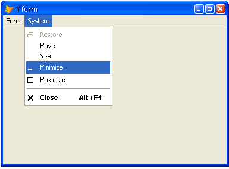

[ Home ](https://github.com/VFPX/Win32API)  

# Attaching menu to a top-level form

## Before you begin:
In this example menu is created and attached to a top-level VFP form. The System popup and a user-defined popup are inserted in the menu.  

  

See also:

* [Adding user-defined items to the Control Menu of VFP form (requires VFP9)](sample_512.md)  
* [Transparent Menu Class (requires VFP9) ](sample_496.md)  
* [Reading structure of menu attached to the main VFP window ](sample_337.md)  
* [Accessing Adobe Reader 7.0 main menu from VFP application](sample_495.md)  

  
***  


## Code:
```foxpro  
PUBLIC frm
frm = CreateObject("Tform")
frm.Visible = .T.

DEFINE CLASS Tform As Form
PROTECTED hWindow, hMenu, hPopup, hSysPopup
	Autocenter=.T.
	ShowWindow=2  && this is important

PROCEDURE Load
	THIS.declare

PROCEDURE Init
	STORE 0 TO THIS.hWindow, THIS.hMenu,;
		THIS.hPopup, THIS.hSysPopup

PROCEDURE Destroy
	* DestroyMenu is recursive, which means
	* it destroys the menu including all submenus
	= DestroyMenu(THIS.hMenu)

PROCEDURE Activate
	IF THIS.hWindow = 0
		THIS.InitMenu()
	ENDIF

PROCEDURE InitMenu
#DEFINE MF_STRING  0
	THIS.hWindow = GetFocus()

	THIS.hSysPopup = GetSystemMenu(THIS.hWindow, 0)
	THIS.hPopup = CreateMenu()
	= AppendMenu(THIS.hPopup, MF_STRING, 1, "Option &1")
	= AppendMenu(THIS.hPopup, MF_STRING, 1, "Option &2")
	= AppendMenu(THIS.hPopup, MF_STRING, 1, "Option &3")

	THIS.hMenu = CreateMenu()
	THIS.AddMenuItem(THIS.hMenu, 0, "&Form", THIS.hPopup)
	THIS.AddMenuItem(THIS.hMenu, 1, "&System", THIS.hSysPopup)

	= SetMenu(THIS.hWindow, THIS.hMenu)

PROCEDURE AddMenuItem(hMenu, lnPosition, lcCaption, lnPopup)
*| typedef struct tagMENUITEMINFO {
*|   UINT    cbSize;         0:4
*|   UINT    fMask;          4:4
*|   UINT    fType;          8:4
*|   UINT    fState;        12:4
*|   UINT    wID;           16:4
*|   HMENU   hSubMenu;      20:4
*|   HBITMAP hbmpChecked;   24:4
*|   HBITMAP hbmpUnchecked; 28:4
*|   ULONG_PTR dwItemData;  32:4
*|   LPTSTR  dwTypeData;    36:4
*|   UINT    cch;           40:4
*|   HBITMAP hbmpItem;      44:4
*| } MENUITEMINFO, *LPMENUITEMINFO; total = 48 bytes
#DEFINE MENUITEMINFO_SIZE  48

#DEFINE MFT_STRING 0
#DEFINE MIIM_STATE 1
#DEFINE MIIM_ID 2
#DEFINE MIIM_SUBMENU 4
#DEFINE MIIM_TYPE 16
#DEFINE MFS_ENABLED 0

	LOCAL lcMask, lcItemInfo, loCaption
	loCaption = CREATEOBJECT("PChar", lcCaption)
	lcMask = MIIM_STATE + MIIM_ID + MIIM_TYPE + MIIM_SUBMENU

	* fill MENUITEMINFO structure
	lcItemInfo =;
		num2dword(MENUITEMINFO_SIZE) +;
		num2dword(lcMask) +;
		num2dword(MFT_STRING) +;
		num2dword(MFS_ENABLED) +;
		num2dword(lnPosition) +;
		num2dword(lnPopup) +;
		num2dword(0) +;
		num2dword(0) +;
		num2dword(0) +;
		num2dword(loCaption.GetAddr()) +;
		num2dword(Len(lcCaption)) +;
		num2dword(0)

	= InsertMenuItem(hMenu, lnPosition, 1, @lcItemInfo)
RETURN

PROCEDURE declare
	DECLARE INTEGER GetFocus IN user32
	DECLARE INTEGER CreateMenu IN user32
	DECLARE INTEGER CreatePopupMenu IN user32
	DECLARE INTEGER DestroyMenu IN user32 INTEGER hMenu

	DECLARE INTEGER SetMenu IN user32;
		INTEGER hWindow, INTEGER hMenu

	DECLARE INTEGER GetSystemMenu IN user32;
		INTEGER hWindow, INTEGER bRevert

	DECLARE INTEGER AppendMenu IN user32;
		INTEGER hMenu, INTEGER uFlags,;
		INTEGER uIDNewItem, STRING @lpNewItem

	DECLARE INTEGER InsertMenuItem IN user32;
		INTEGER hMenu, INTEGER uItem,;
		INTEGER fByPosition, STRING @lpmii
ENDDEFINE

DEFINE CLASS PChar As Session
PROTECTED hMem

PROCEDURE Init(lcString)
	THIS.hMem = 0
	THIS.setValue(lcString)

PROCEDURE Destroy
	THIS.ReleaseString

FUNCTION GetAddr
RETURN THIS.hMem

FUNCTION GetValue
	LOCAL lnSize, lcBuffer
	lnSize = THIS.getAllocSize()
	lcBuffer = SPACE(lnSize)

	IF THIS.hMem <> 0
		DECLARE RtlMoveMemory IN kernel32 As MemToStr;
			STRING @, INTEGER, INTEGER
		= MemToStr(@lcBuffer, THIS.hMem, lnSize)
	ENDIF
RETURN lcBuffer

FUNCTION GetAllocSize
	DECLARE INTEGER GlobalSize IN kernel32 INTEGER hMem
RETURN Iif(THIS.hMem=0, 0, GlobalSize(THIS.hMem))

PROCEDURE SetValue(lcString)
#DEFINE GMEM_FIXED 0
	THIS.ReleaseString

	DECLARE INTEGER GlobalAlloc IN kernel32 INTEGER, INTEGER
	DECLARE RtlMoveMemory IN kernel32 As StrToMem;
		INTEGER, STRING @, INTEGER

	LOCAL lnSize
	lcString = lcString + Chr(0)
	lnSize = Len(lcString)
	THIS.hMem = GlobalAlloc(GMEM_FIXED, lnSize)
	IF THIS.hMem <> 0
		= StrToMem(THIS.hMem, @lcString, lnSize)
	ENDIF

PROCEDURE ReleaseString
	IF THIS.hMem <> 0
		DECLARE INTEGER GlobalFree IN kernel32 INTEGER
		= GlobalFree (THIS.hMem)
		THIS.hMem = 0
	ENDIF
ENDDEFINE

FUNCTION num2dword(lnValue)
#DEFINE m0 0x0000100
#DEFINE m1 0x0010000
#DEFINE m2 0x1000000
	IF lnValue < 0
		lnValue = 0x100000000 + lnValue
	ENDIF
	LOCAL b0, b1, b2, b3
	b3 = Int(lnValue/m2)
	b2 = Int((lnValue - b3*m2)/m1)
	b1 = Int((lnValue - b3*m2 - b2*m1)/m0)
	b0 = Mod(lnValue, m0)
RETURN Chr(b0)+Chr(b1)+Chr(b2)+Chr(b3)  
```  
***  


## Listed functions:
[AppendMenu](../libraries/user32/AppendMenu.md)  
[CreateMenu](../libraries/user32/CreateMenu.md)  
[CreatePopupMenu](../libraries/user32/CreatePopupMenu.md)  
[DestroyMenu](../libraries/user32/DestroyMenu.md)  
[GetFocus](../libraries/user32/GetFocus.md)  
[GetSystemMenu](../libraries/user32/GetSystemMenu.md)  
[GlobalAlloc](../libraries/kernel32/GlobalAlloc.md)  
[GlobalFree](../libraries/kernel32/GlobalFree.md)  
[GlobalSize](../libraries/kernel32/GlobalSize.md)  
[InsertMenuItem](../libraries/user32/InsertMenuItem.md)  
[SetMenu](../libraries/user32/SetMenu.md)  

## Comment:
Take a note that the Sh0wWindow property for the form should be set to 2. That means *"a top-level form in which child forms can be placed"*.   
 
  
***  

