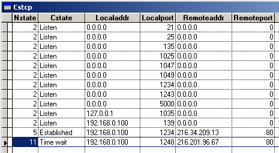

[ Home ](https://github.com/VFPX/Win32API)  

# Displaying all TCP connections for the local system

## Before you begin:
This code produces results similar to the following command:
```dos
RUN "NETSTAT -n -a > netstat.txt"  
MODI FILE netstat.txt
```

  

  
***  


## Code:
```foxpro  
#DEFINE NO_ERROR  0
#DEFINE ANY_SIZE  1

* state of connection
#DEFINE MIB_TCP_STATE_CLOSED       1
#DEFINE MIB_TCP_STATE_LISTEN       2
#DEFINE MIB_TCP_STATE_SYN_SENT     3
#DEFINE MIB_TCP_STATE_SYN_RCVD     4
#DEFINE MIB_TCP_STATE_ESTAB        5
#DEFINE MIB_TCP_STATE_FIN_WAIT1    6
#DEFINE MIB_TCP_STATE_FIN_WAIT2    7
#DEFINE MIB_TCP_STATE_CLOSE_WAIT   8
#DEFINE MIB_TCP_STATE_CLOSING      9
#DEFINE MIB_TCP_STATE_LAST_ACK    10
#DEFINE MIB_TCP_STATE_TIME_WAIT   11
#DEFINE MIB_TCP_STATE_DELETE_TCB  12

DO decl

*| typedef struct _MIB_TCPTABLE {
*|   DWORD dwNumEntries;         // number of entries in the table
*|   MIB_TCPROW table[ANY_SIZE]; // array of TCP connections
*| } MIB_TCPTABLE, *PMIB_TCPTABLE;

*| typedef struct _MIB_TCPROW {
*| DWORD dwState; // state of the connection
*| DWORD dwLocalAddr; // address on local computer
*| DWORD dwLocalPort; // port number on local computer
*| DWORD dwRemoteAddr; // address on remote computer
*| DWORD dwRemotePort; // port number on remote computer
*| } MIB_TCPROW, *PMIB_TCPROW; total bytes = 20
#DEFINE MIB_TCPROW   20

LOCAL lcBuffer, lnBufsize, lnTcpCount, lnTcpIndex, lcTcpBuffer

* allocating a space enough to keep 20 bytes per entry + 4 starting bytes
lnBufsize = 8192
lcBuffer = Repli(Chr(0), lnBufsize)

IF GetTcpTable (@lcBuffer, @lnBufsize, 1) = NO_ERROR
	* number of entries in the list
	lnTcpCount = buf2dword(SUBSTR(lcBuffer, 1,4))
	
	CREATE CURSOR csTcp (nstate N(3), cstate C(20), localaddr C(15),;
		localport N(6), remoteaddr C(15), remoteport N(6))

	FOR lnTcpIndex = 1 TO lnTcpCount
		lcTcpBuffer = SUBSTR(lcBuffer, 5 + (lnTcpIndex-1)*MIB_TCPROW, MIB_TCPROW)
		= AddTcpRecord (lcTcpBuffer)
	ENDFOR
	
	GO TOP
	BROWSE NORMAL NOWAIT
ENDIF

PROCEDURE  AddTcpRecord (lcTcpBuffer)
	LOCAL lnState, lcLocalIP, lnLocalPort, lcRemoteIP, lnRemotePort

	* connection state
	lnState = buf2dword(SUBSTR(lcTcpBuffer, 1,4))

	* local computer address and port
	lcLocalIP = GetIPAddress(SUBSTR(lcTcpBuffer, 5,4))
	lnLocalPort = buf2port(SUBSTR(lcTcpBuffer, 9,4))

	* remote computer address and port
	lcRemoteIP = GetIPAddress(SUBSTR(lcTcpBuffer, 13,4))
	lnRemotePort = Iif(lcRemoteIP="0.0.0.0",;
		0, buf2port(SUBSTR(lcTcpBuffer, 17,4)))

	INSERT INTO csTcp VALUES (lnState, GetState(lnState),;
		lcLocalIP, lnLocalPort,;
		lcRemoteIP, lnRemotePort)
RETURN

FUNCTION  GetIPAddress (lcAddrBuf)
* converting a DWORD buffer to the IP address string like "127.0.0.1"
	LOCAL lcResult, ii
	lcResult = ""
	FOR ii=1 TO 4
		lcResult = lcResult +;
			LTRIM(STR(Asc(SUBSTR(lcAddrBuf, ii,1)))) +;
			Iif(ii=4, "",".")
	ENDFOR
RETURN  lcResult

FUNCTION  GetState (lnState)
	DO CASE
	CASE lnState = MIB_TCP_STATE_CLOSED
		RETURN "Closed"
	CASE lnState = MIB_TCP_STATE_LISTEN
		RETURN "Listen"
	CASE lnState = MIB_TCP_STATE_SYN_SENT
		RETURN "Syn. Sent"
	CASE lnState = MIB_TCP_STATE_SYN_RCVD
		RETURN "Syn. Received"
	CASE lnState = MIB_TCP_STATE_ESTAB
		RETURN "Established"
	CASE lnState = MIB_TCP_STATE_FIN_WAIT1
		RETURN "Final wait 1"
	CASE lnState = MIB_TCP_STATE_FIN_WAIT2
		RETURN "Final wait 2"
	CASE lnState = MIB_TCP_STATE_CLOSE_WAIT
		RETURN "Close wait"
	CASE lnState = MIB_TCP_STATE_CLOSING
		RETURN "Closing"
	CASE lnState = MIB_TCP_STATE_LAST_ACK
		RETURN "Last Ack"
	CASE lnState = MIB_TCP_STATE_TIME_WAIT
		RETURN "Time wait"
	CASE lnState = MIB_TCP_STATE_DELETE_TCB
		RETURN "Del TCB"
	OTHER
		RETURN "???"
ENDCASE

FUNCTION  buf2dword (lcBuffer)
RETURN Asc(SUBSTR(lcBuffer, 1,1)) + ;
	Asc(SUBSTR(lcBuffer, 2,1)) * 256 +;
	Asc(SUBSTR(lcBuffer, 3,1)) * 65536 +;
	Asc(SUBSTR(lcBuffer, 4,1)) * 16777216

FUNCTION  buf2port(lcBuffer)
RETURN  Asc(SUBSTR(lcBuffer, 1,1)) * 256 + Asc(SUBSTR(lcBuffer, 2,1))

PROCEDURE  decl
	DECLARE INTEGER GetTcpTable IN iphlpapi;
		STRING @pTcpTable, INTEGER @pdwSize, INTEGER bOrder  
```  
***  


## Listed functions:
[GetTcpTable](../libraries/iphlpapi/GetTcpTable.md)  


***  

