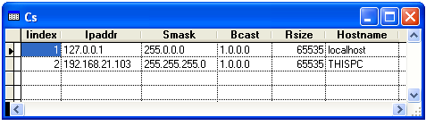

[ Home ](https://github.com/VFPX/Win32API)  

# Retrieving the interface�to�IP address mapping table

## Before you begin:
  

See also:

[Retrieving the User Datagram Protocol (UDP) listener table](sample_234.md)  
  
***  


## Code:
```foxpro  
DO declare

*| typedef struct _MIB_IPADDRTABLE {
*|   DWORD         dwNumEntries;    // number of entries in the table
*|   MIB_IPADDRROW table[ANY_SIZE]; // array of IP address entries
*| } MIB_IPADDRTABLE, *PMIB_IPADDRTABLE; total bytes = 4 + undef

*| typedef struct _MIB_IPADDRROW {
*|   DWORD   dwAddr;              // IP address           0:4
*|   DWORD   dwIndex;             // interface index      4:4
*|   DWORD   dwMask;              // subnet mask          8:4
*|   DWORD   dwBCastAddr;         // broadcast address   12:4
*|   DWORD   dwReasmSize;         // re-assembly size    16:4
*|   unsigned short   unused1;    // not currently used  20:2
*|   unsigned short   unused2;    // not currently used  22:2
*| } MIB_IPADDRROW, *PMIB_IPADDRROW; total bytes = 24
#DEFINE MIB_IPADDRROW_SIZE   24

PRIVATE lWinsockEnabled
lWinsockEnabled = InitWinsock()

LOCAL lcBuffer, lnBufsize, lnEntries, lnIndex, lcEntryBuf
* allocate a space large enough to keep the data
lnBufsize = 8192

lcBuffer = Repli(Chr(0), lnBufsize)
= GetIpAddrTable(@lcBuffer, @lnBufsize, 1)
lnEntries = buf2dword(SUBSTR(lcBuffer, 1,4))

* resulting cursor
CREATE CURSOR cs (ipaddr C(15), iindex I,;
	smask C(15), bcast C(15), rsize I,;
	hostname C(50))

FOR lnIndex = 1 TO lnEntries
	lcEntryBuf = SUBSTR(lcBuffer,;
		5+(lnIndex-1)*MIB_IPADDRROW_SIZE,;
		MIB_IPADDRROW_SIZE)

	= AddEntry(lcEntryBuf)
ENDFOR

IF lWinsockEnabled
	= WSACleanup()
ENDIF

GO TOP
BROWSE NORMAL NOWAIT
* end of main

PROCEDURE AddEntry(lcEntryBuf)
	LOCAL lcIPAddrBuf, lcIPAddr, lcHostName, lnIndex,;
		lcMask, lcBCast, lnRSize

	* IP address and the host name
	lcIPAddrBuf = SUBSTR(lcEntryBuf, 1,4)
	lcIPAddr = inet_ntoa(buf2dword(lcIPAddrBuf))
	lcHostName = GetHostName(lcIPAddrBuf)

	* the index of the interface associated with this IP address
	lnIndex = buf2dword(SUBSTR(lcEntryBuf, 5,4))

	* the subnet mask for the IP address
	lcMask = inet_ntoa(buf2dword(SUBSTR(lcEntryBuf,  9,4)))

	* the broadcast address
	lcBCast = inet_ntoa(buf2dword(SUBSTR(lcEntryBuf, 13,4)))

	* the maximum re-assembly size for received datagrams
	lnRSize = buf2dword(SUBSTR(lcEntryBuf, 17,4))
	
	INSERT INTO cs VALUES (lcIPAddr, lnIndex, lcMask,;
		lcBCast, lnRSize, lcHostName)

FUNCTION GetHostName(lcAddrBuf)
#DEFINE AF_INET 2 && internetwork: UDP, TCP, etc.
#DEFINE HOSTENT_SIZE  16
	LOCAL lcResult, lnHOSTENTptr, lcHOSTENT
	lcResult = ""

	IF lWinsockEnabled
		lnHOSTENTptr = gethostbyaddr(lcAddrBuf, 4, AF_INET)
		IF lnHOSTENTptr <> 0
			lcHOSTENT = GetMemBuf(lnHOSTENTptr, HOSTENT_SIZE)
			lcResult = GetMemStr(buf2dword(SUBSTR(lcHOSTENT, 1,4)))
		ENDIF
	ENDIF
RETURN lcResult

FUNCTION InitWinsock
* Initializing the Winsock service for the application
#DEFINE WSADATA_SIZE 398
#DEFINE WS_VERSION 0x0202
	LOCAL lcWSADATA, lnInitResult
	lcWSADATA = Repli(Chr(0), WSADATA_SIZE)
	lnInitResult = WSAStartup(WS_VERSION, @lcWSADATA)
RETURN (lnInitResult = 0)

FUNCTION GetMemBuf(lnAddr, lnBufsize)
* returns data from a memory block
	LOCAL lcBuffer
	lcBuffer = Repli(Chr(0), lnBufsize)
	= Ptr2Str(@lcBuffer, lnAddr, lnBufsize)
RETURN lcBuffer

FUNCTION GetMemStr(lnAddr)
* returns data from a memory block
* before the first occurence of a zero byte
	LOCAL lcBuffer
	lcBuffer = GetMemBuf(lnAddr, 250)
RETURN SUBSTR(lcBuffer, 1, AT(Chr(0),lcBuffer)-1)

FUNCTION buf2dword(cBuffer)
RETURN Asc(SUBSTR(cBuffer, 1,1)) + ;
	BitLShift(Asc(SUBSTR(cBuffer, 2,1)),  8) +;
	BitLShift(Asc(SUBSTR(cBuffer, 3,1)), 16) +;
	BitLShift(Asc(SUBSTR(cBuffer, 4,1)), 24)

PROCEDURE declare
	DECLARE STRING inet_ntoa IN ws2_32 INTEGER in_addr
	DECLARE INTEGER WSACleanup IN ws2_32
	DECLARE INTEGER WSAStartup IN ws2_32 INTEGER wVerRq, STRING @lpWSAData

	DECLARE INTEGER gethostbyaddr IN ws2_32;
		STRING addr, INTEGER len, INTEGER type

	DECLARE RtlMoveMemory IN kernel32 As Ptr2Str;
		STRING @Dest, INTEGER Src, INTEGER nLength

	DECLARE INTEGER GetIpAddrTable IN iphlpapi;
		STRING @pIpAddrTable, INTEGER @pdwSize, INTEGER bOrder  
```  
***  


## Listed functions:
[GetIpAddrTable](../libraries/iphlpapi/GetIpAddrTable.md)  
[WSACleanup](../libraries/ws2_32/WSACleanup.md)  
[WSAStartup](../libraries/ws2_32/WSAStartup.md)  
[gethostbyaddr](../libraries/ws2_32/gethostbyaddr.md)  
[inet_ntoa](../libraries/ws2_32/inet_ntoa.md)  


***  

