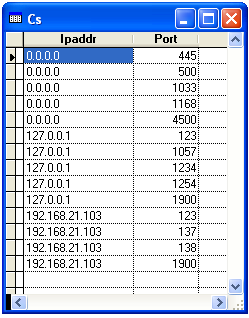

[ Home ](https://github.com/VFPX/Win32API)  

# Retrieving the User Datagram Protocol (UDP) listener table

## Before you begin:
User Datagram Protocol. A communications protocol for the Internet network layer, transport layer, and session layer, which makes it possible to send a datagram message from one computer to an application running in another computer.   

Like TCP (Transmission Control Protocol), UDP is used with IP (the Internet Protocol).   

Unlike TCP, UDP is connectionless and does not guarantee reliable communication; the application itself must process any errors and check for reliable delivery.  

The UDP listener table contains information about this computer's UDP end-points on which a local application is currently accepting datagrams.  

  

See also:

Retrieving the interface-to-IP address mapping table](sample_233.md)  
  
***  


## Code:
```foxpro  
DO declare

*| typedef struct _MIB_UDPTABLE {
*|   DWORD       dwNumEntries;    // number of entries in the table
*|   MIB_UDPROW  table[ANY_SIZE]; // table of MIB_UDPROW structs
*| } MIB_UDPTABLE, *PMIB_UDPTABLE; total bytes = 4 + undef

*| typedef struct _MIB_UDPROW {
*|   DWORD   dwLocalAddr;    // IP address on local computer
*|   DWORD   dwLocalPort;    // port number on local computer
*| } MIB_UDPROW, *PMIB_UDPROW; total bytes = 8

#DEFINE MIB_UDPROW_SIZE  8

LOCAL cBuffer, nBufsize, nEntries, nIndex, cEntry

* call GetUdpTable with null buffer to get required size
nBufsize=0
= GetUdpTable(NULL, @nBufsize, 1)

cBuffer = Repli(Chr(0), nBufsize)
= GetUdpTable(@cBuffer, @nBufsize, 1)

* get number of entries in the table
nEntries = buf2dword(SUBSTR(cBuffer, 1,4))

* create resulting cursor
CREATE CURSOR cs (ipaddr C(15), port N(12))

* parse entries and save results in cursor
FOR nIndex = 1 TO nEntries

	cEntry = SUBSTR(cBuffer,;
		5 + (nIndex-1) * MIB_UDPROW_SIZE,;
		MIB_UDPROW_SIZE)

	= AddEntry(cEntry)
ENDFOR

GO TOP
BROW NORMAL NOWAIT
* end of main

PROCEDURE AddEntry(cEntry)
	LOCAL lcIPAddr, lnPort

	* local IP address and the host name
	lcIPAddr = inet_ntoa(buf2dword(SUBSTR(cEntry, 1,4)))

	* local port
	lnPort = ntohs(buf2dword(SUBSTR(cEntry, 5,4)))

	INSERT INTO cs VALUES (lcIPAddr, lnPort)
RETURN

FUNCTION buf2dword(cBuffer)
RETURN Asc(SUBSTR(cBuffer, 1,1)) + ;
	Asc(SUBSTR(cBuffer, 2,1)) * 256 +;
	Asc(SUBSTR(cBuffer, 3,1)) * 65536 +;
	Asc(SUBSTR(cBuffer, 4,1)) * 16777216

PROCEDURE declare
	DECLARE STRING inet_ntoa IN ws2_32 INTEGER in_addr
	DECLARE INTEGER ntohs IN ws2_32 INTEGER netshort

	DECLARE INTEGER GetUdpTable IN iphlpapi;
		STRING @pUdpTable, INTEGER @pdwSize, INTEGER bOrder  
```  
***  


## Listed functions:
[GetUdpTable](../libraries/iphlpapi/GetUdpTable.md)  
[inet_ntoa](../libraries/ws2_32/inet_ntoa.md)  
[ntohs](../libraries/ws2_32/ntohs.md)  
