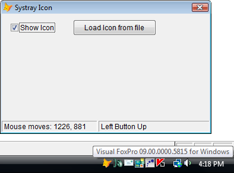
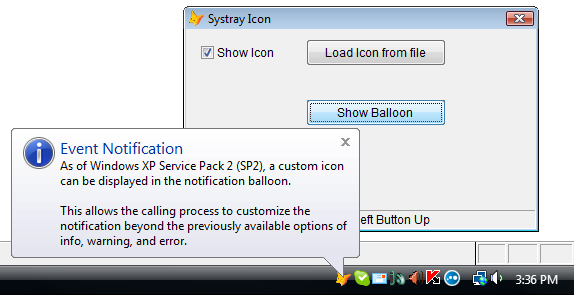
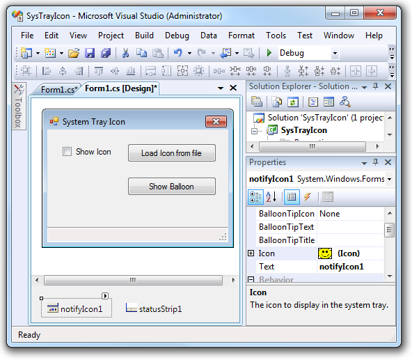

[ Home ](https://github.com/VFPX/Win32API)  

# Displaying icons in the system tray (VFP9)

## Before you begin:
This code relies on extended BINDEVENT() functionality added in VFP9.    

The TaskbarStatus object adds an icon to the systray and receives notifications on mouse events occurring in the bounding rectangle of the icon, and on balloon events (displayed, clicked, timeout).  

  

  

See also:

* [Using FoxTray ActiveX control: System Tray Icon and menu attached to VFP form](sample_336.md)  
* [Adding user-defined items to the Control Menu of VFP form (requires VFP9)](sample_512.md)  
* [Displaying Windows Shell Icons in ListView control](sample_575.md)  
  
***  


## Code:
```foxpro  
LOCAL oForm As TForm
oForm = CREATEOBJECT("TForm")
oForm.Show()
READ EVENTS
* end of main

#DEFINE CRLF CHR(13)+CHR(10)
#DEFINE NIM_ADD 0
#DEFINE NIM_MODIFY 1
#DEFINE NIM_DELETE 2
#DEFINE NIF_MESSAGE 1
#DEFINE NIF_ICON 2
#DEFINE NIF_TIP 4
#DEFINE NIF_INFO 0x10
#DEFINE NIIF_INFO 0x0001
#DEFINE NIIF_WARNING 0x0002
#DEFINE NIIF_USER 0x0004
#DEFINE NIIF_LARGE_ICON 0x0020

#DEFINE NOTIFYICON_VERSION 3
#DEFINE NOTIFYICON_VERSION_4 4

#DEFINE NOTIFYICONDATA_SIZE 88
#DEFINE NOTIFYICONDATA_XP_SIZE NOTIFYICONDATA_SIZE+400

#DEFINE MAX_PATH 260
#DEFINE GWL_WNDPROC -4
#DEFINE IMAGE_ICON 1
#DEFINE LR_LOADFROMFILE 0x0010
#DEFINE LR_DEFAULTSIZE 0x0040

#DEFINE WM_USER 0x400
#DEFINE NIN_BALLOONSHOW (WM_USER+2)
#DEFINE NIN_BALLOONHIDE (WM_USER + 3)
#DEFINE NIN_BALLOONTIMEOUT (WM_USER + 4)
#DEFINE NIN_BALLOONUSERCLICK (WM_USER + 5)

#DEFINE WM_MOUSEMOVE 0x0200
#DEFINE WM_LBUTTONDOWN 0x0201
#DEFINE WM_LBUTTONUP 0x0202
#DEFINE WM_RBUTTONDOWN 0x0204
#DEFINE WM_RBUTTONUP 0x0205
#DEFINE WM_MBUTTONDOWN 0x0207
#DEFINE WM_MBUTTONUP 0x0208

DEFINE CLASS TForm As Form
	Width=400
	Height=200
	BorderStyle=2
	MinButton=.F.
	MaxButton=.F.
	Caption="Systray Icon"
	Autocenter=.T.
	ShowWindow=2
	
	ADD OBJECT taskbaricon As TaskbarStatus
	ADD OBJECT sbar As Tbar WITH Top=398, Left=0, Height=21, Width=685

	ADD OBJECT chShowIcon As CheckBox WITH;
	Left=15, Top=15, Caption="Show Icon", Autosize=.T.
	
	ADD OBJECT cmdLoadIcon As CommandButton WITH;
	Left=120, Top=10, Width=140, Height=27,;
	Caption="Load Icon from file"
	
	ADD OBJECT cmdBalloon As CommandButton WITH;
	Left=120, Top=70, Width=140, Height=27,;
	Caption="Show Balloon", Enabled=.F.

PROCEDURE Destroy
	CLEAR EVENTS

PROCEDURE cmdBalloon.Click
	LOCAL cBlnMessage, cBlnCaption, nBlnIconId

TEXT TO cBlnMessage NOSHOW
As of Windows XP SP2, a custom icon can be
displayed in the notification balloon.
		
This allows the calling process to customize
the notification beyond the previously available
options of info, warning, and error.
ENDTEXT

	cBlnCaption="Event Notification"
*	nBlnIconId=BITOR(NIIF_USER, NIIF_LARGE_ICON)
	nBlnIconId=BITOR(NIIF_INFO, NIIF_LARGE_ICON)

	ThisForm.taskbaricon.DisplayBalloon(;
		cBlnMessage, cBlnCaption, nBlnIconId)

PROCEDURE chShowIcon.Click
	LOCAL lShow
	lShow=ThisForm.ShowIcon(THIS.Value)
	STORE lShow TO ThisForm.cmdBalloon.Enabled

PROCEDURE cmdLoadIcon.Click
	ThisForm.LoadIcon

PROCEDURE taskbaricon.OnUdfMessage
PARAMETERS wParam As Integer, lParam As Integer
	DODEFAULT()
	
	LOCAL nEvent
	nEvent=BITAND(lParam, 0x0000ffff)
	
	DO CASE
	CASE m.nEvent=WM_MOUSEMOVE
		ThisForm.sbar.Panels(1).Text = "Mouse moves: " +;
			TRANS(THIS.LastMouseX) + ", " + TRANS(THIS.LastMouseY)
	CASE m.nEvent=WM_LBUTTONDOWN
		ThisForm.sbar.Panels(2).Text = "Left Button Down"
	CASE m.nEvent=WM_LBUTTONUP
		ThisForm.sbar.Panels(2).Text = "Left Button Up"
	CASE m.nEvent=WM_RBUTTONDOWN
		ThisForm.sbar.Panels(2).Text = "Right Button Down"
	CASE m.nEvent=WM_RBUTTONUP
		ThisForm.sbar.Panels(2).Text = "Right Button Up"
	CASE m.nEvent=WM_MBUTTONDOWN
		ThisForm.sbar.Panels(2).Text = "Middle Button Down"
	CASE m.nEvent=WM_MBUTTONUP
		ThisForm.sbar.Panels(2).Text = "Middle Button Up"

	CASE m.nEvent=NIN_BALLOONSHOW
		ThisForm.sbar.Panels(2).Text = "Balloon is shown"
	CASE m.nEvent=NIN_BALLOONHIDE
		ThisForm.sbar.Panels(2).Text = "Balloon has disappeared"
	CASE m.nEvent=NIN_BALLOONTIMEOUT
		ThisForm.sbar.Panels(2).Text = "Balloon is closed or timeout occured"
	CASE m.nEvent=NIN_BALLOONUSERCLICK
		ThisForm.sbar.Panels(2).Text = "Balloon is clicked"

	ENDCASE

PROCEDURE ShowIcon(nMode)
* shows or hides icon in the systray
	WITH THIS.taskbaricon
		IF nMode = 0
			.DeleteIcon
			RETURN .F.
		ELSE
			.baloon = VERSION()
			.InitIcon(.GetDefaultIcon())
			RETURN .T.
		ENDIF
	ENDWITH

PROCEDURE LoadIcon
* loads icon from a file and displays in the systray
	LOCAL cPath, cIconFile
	cPath = SYS(5) + SYS(2003)
	cIconFile = GETFILE("ico", "Load icon file")
	SET DEFAULT TO (m.cPath)

	IF NOT EMPTY(m.cIconFile)
		THIS.taskbaricon.baloon = LOWER(m.cIconFile)
		THIS.taskbaricon.InitIcon(m.cIconFile)
		THIS.chShowIcon.Value=1
	ENDIF

ENDDEFINE

DEFINE CLASS Tbar As OleControl
	OleClass="MSComctlLib.SBarCtrl.2"

PROCEDURE Init
	THIS.Height=21
	THIS.Panels.Add
	THIS.Panels(1).Width = 160
	THIS.Panels(2).Width = 700
ENDDEFINE

DEFINE CLASS TaskbarStatus As Custom
	hWindow=0
	AppID=1
	MessageID=0x4001
	hOrigProc=0
	hIcon=0
	baloon=""
	LastMouseX=0
	LastMouseY=0

PROCEDURE Init
	THIS.declare
	THIS.hWindow = _screen.HWnd
	THIS.hOrigProc = GetWindowLong(THIS.hWindow, GWL_WNDPROC)

PROCEDURE Destroy
	THIS.DeleteIcon

PROCEDURE DeleteIcon
	IF THIS.hIcon <> 0
		THIS.SetIcon(NIM_DELETE)
		= DestroyIcon(THIS.hIcon)
		THIS.hIcon = 0

		IF VERSION(5) >= 900  && VFP9+
			UNBINDEVENTS(THIS.hWindow)
		ENDIF
	ENDIF

PROCEDURE InitIcon(hIcon)
	THIS.DeleteIcon
	
	DO CASE
	CASE VARTYPE(m.hIcon)="N"
		THIS.hIcon = m.hIcon
	CASE VARTYPE(m.hIcon)="C"
		THIS.hIcon = THIS.LoadIcon(m.hIcon)
	OTHERWISE
		RETURN
	ENDCASE
	THIS.SetIcon(NIM_ADD)

PROCEDURE DisplayBalloon(cBlnMessage, cBlnCaption, nBlnIconId)
	LOCAL cNotifyIcondDataEx, nFlags, nVersion
	nFlags=BITOR(NIF_INFO, NIF_MESSAGE, NIF_TIP)
	nVersion=NOTIFYICON_VERSION
	
	IF EMPTY(cBlnMessage)
		cBlnMessage=THIS.baloon
	ENDIF
	IF EMPTY(cBlnCaption)
		cBlnCaption=""
	ENDIF
	IF EMPTY(nBlnIconId)
		nBlnIconId=0
	ENDIF

	cNotifyIcondDataEx =;
		num2dword(NOTIFYICONDATA_XP_SIZE) +;
		num2dword(THIS.hWindow) +;
		num2dword(THIS.appid) +;
		num2dword(m.nFlags) +;
		num2dword(THIS.MessageID) +;
		num2dword(THIS.hIcon) +;
		PADR(THIS.baloon, 128, Chr(0)) +;
		num2dword(0) +;
		num2dword(0) +;
		PADR(cBlnMessage, 256, CHR(0)) +;
		num2dword(nVersion) +;
		PADR(m.cBlnCaption, 64, CHR(0)) +;
		num2dword(nBlnIconId)

	cNotifyIcondDataEx = PADR(cNotifyIcondDataEx,;
		NOTIFYICONDATA_XP_SIZE, CHR(0))

	Shell_NotifyIcon(NIM_MODIFY, @cNotifyIcondDataEx)

PROCEDURE SetIcon(cAction, nFlags)
	LOCAL cNOTIFYICONDATA
	
	IF EMPTY(nFlags)
		nFlags=BITOR(NIF_ICON, NIF_MESSAGE, NIF_TIP)
	ENDIF

	cNOTIFYICONDATA =;
		num2dword(NOTIFYICONDATA_SIZE) +;
		num2dword(THIS.hWindow) +;
		num2dword(THIS.appid) +;
		num2dword(m.nFlags) +;
		num2dword(THIS.MessageID) +;
		num2dword(THIS.hIcon) +;
		PADR(THIS.baloon, 64, Chr(0))

	cNOTIFYICONDATA=PADR(cNOTIFYICONDATA,;
		NOTIFYICONDATA_SIZE, CHR(0))

	IF Shell_NotifyIcon(m.cAction, @cNOTIFYICONDATA) <> 0
		IF VERSION(5) >= 900  && VFP9+
			= BINDEVENT(THIS.hWindow, THIS.MessageID,;
				THIS, "WindowProc")
		ENDIF
	ENDIF

PROCEDURE LoadIcon(cIconFile)
* loads icon from a file
	LOCAL hIcon
	TRY
	hIcon = LoadImage(0, m.cIconFile, IMAGE_ICON,;
		0,0, LR_LOADFROMFILE+LR_DEFAULTSIZE)
	CATCH
		hIcon=0
	ENDTRY
RETURN m.hIcon

PROCEDURE GetDefaultIcon
* loads application icon
	LOCAL cBuffer, nBufsize, nIconIndex, hIcon
	cBuffer = REPLICATE(CHR(0), MAX_PATH)
	nBufsize = GetModuleFileName (0, @cBuffer, MAX_PATH)
	cBuffer = LEFT(cBuffer, nBufsize)
	nIconIndex = 0  && works as a reference only
	hIcon = ExtractAssociatedIcon(0, cBuffer, @nIconIndex)
RETURN m.hIcon

PROCEDURE OnUdfMessage(wParam As Integer, lParam As Integer)
* a placeholder

PROCEDURE WindowProc(hWindow as Integer,;
	nMsgID as Integer, wParam as Integer, lParam as Integer)
* requires VFP9, otherwise ignored

	LOCAL nReturn
	nReturn=0
	
	DO CASE
	CASE nMsgID=THIS.MessageID
		THIS.OnUdfMessage(wParam, lParam)

	OTHERWISE
	* pass control to the original window procedure
		nReturn = CallWindowProc(THIS.hOrigProc, THIS.hWindow,;
			m.nMsgID, m.wParam, m.lParam)
	ENDCASE
RETURN nReturn

PROTECTED PROCEDURE declare
	DECLARE INTEGER DestroyIcon IN user32 INTEGER hIcon

	DECLARE INTEGER Shell_NotifyIcon IN shell32;
		INTEGER dwMsg, STRING @lpdata

	DECLARE INTEGER GetWindowLong IN user32;
		INTEGER hWindow, INTEGER nIndex

	DECLARE INTEGER ExtractAssociatedIcon IN shell32;
		INTEGER hInst, STRING lpIconPath, INTEGER @lpiIcon

	DECLARE INTEGER GetModuleFileName IN kernel32;
		INTEGER hModule, STRING @lpFilename, INTEGER nSize

	DECLARE INTEGER CallWindowProc IN user32;
		INTEGER lpPrevWndFunc, INTEGER hWindow, LONG Msg,;
		INTEGER wParam, INTEGER lParam

	DECLARE INTEGER LoadImage IN user32;
		INTEGER hinst, STRING lpszName, INTEGER uType,;
		INTEGER cxDesired, INTEGER cyDesired, INTEGER fuLoad

ENDDEFINE

FUNCTION buf2dword(cBuffer)
RETURN Asc(SUBSTR(cBuffer, 1,1)) + ;
	BitLShift(Asc(SUBSTR(cBuffer, 2,1)),  8) +;
	BitLShift(Asc(SUBSTR(cBuffer, 3,1)), 16) +;
	BitLShift(Asc(SUBSTR(cBuffer, 4,1)), 24)

FUNCTION num2dword(nValue)
#DEFINE m0  0x0100
#DEFINE m1  0x010000
#DEFINE m2  0x01000000
	IF nValue < 0
		nValue = 0x100000000 + nValue
	ENDIF
	LOCAL b0, b1, b2, b3
	b3 = Int(nValue/m2)
	b2 = Int((nValue - b3*m2)/m1)
	b1 = Int((nValue - b3*m2 - b2*m1)/m0)
	b0 = Mod(nValue, m0)
RETURN Chr(b0)+Chr(b1)+Chr(b2)+Chr(b3)  
```  
***  


## Listed functions:
[CallWindowProc](../libraries/user32/CallWindowProc.md)  
[DestroyIcon](../libraries/user32/DestroyIcon.md)  
[ExtractAssociatedIcon](../libraries/shell32/ExtractAssociatedIcon.md)  
[GetModuleFileName](../libraries/kernel32/GetModuleFileName.md)  
[GetWindowLong](../libraries/user32/GetWindowLong.md)  
[LoadImage](../libraries/user32/LoadImage.md)  
[Shell_NotifyIcon](../libraries/shell32/Shell_NotifyIcon.md)  

## Comment:

 
This code sample calls LoadImage or ExtractAssociatedIcon to obtain HICON values. The other possible ways of loading icons can be implemented through calls to SHGetStockIconInfo, SHGetFileInfo, ExtractIcon and GetIconInfo.  

 
[](sample_502.md)

* * *  
Microsoft .NET Framework conveniently includes *NotifyIcon* control that is to be simply dropped on Windows form.  
  


***  

