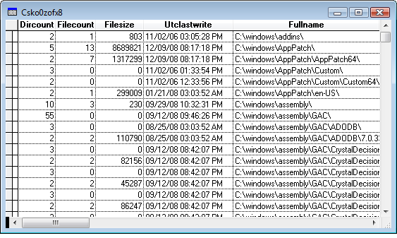

[ Home ](https://github.com/VFPX/Win32API)  

# Building a tree of subdirectories for a given path using FindFile functions

## Before you begin:
This code sample stores in a cursor the path and the size of all subdirectories within a given path.  

  
  
***  


## Code:
```foxpro  
DO declare

LOCAL loDir
loDir = CreateObject("Tdir", "C:\program files")
GO TOP
BROWSE NORMAL NOWAIT

DEFINE CLASS Tdir As Custom
cursorname=""
treelevel=0
root=""
recordid=0
parentid=-1
maxid=0

PROCEDURE Init(lcPath, loParent)
	IF TYPE("loParent")="O"
		THIS.cursorname = loParent.cursorname
		THIS.root = loParent.root
		THIS.root.maxid = THIS.root.maxid + 1
		THIS.recordid = THIS.root.maxid
		THIS.parentid = loParent.recordid
		THIS.treelevel = loParent.treelevel + 1
	ELSE
		THIS.root = THIS
		THIS.cursorname = "cs" + SUBSTR(SYS(2015), 3,10)

		SELECT 0
		CREATE CURSOR (THIS.cursorname) (recordid N(6), parentid N(6),;
			treelevel N(3), dircount N(6), filecount N(6),;
			filesize N(12), utclastwrite T, fullname C(250))
	ENDIF
	
	INSERT INTO (THIS.cursorname) VALUES (THIS.recordid,;
		THIS.parentid, THIS.treelevel, 0,0,0, {}, lcPath)

	THIS.DoFind(lcPath)

PROCEDURE DoFind(lcPath)
#DEFINE MAX_PATH 260
#DEFINE FILE_ATTRIBUTE_DIRECTORY 16
#DEFINE INVALID_HANDLE_VALUE -1
#DEFINE MAX_DWORD 0xffffffff+1

*| typedef struct _WIN32_FIND_DATA {
*|   DWORD    dwFileAttributes;           0:4
*|   FILETIME ftCreationTime;             4:8
*|   FILETIME ftLastAccessTime;          12:8
*|   FILETIME ftLastWriteTime;           20:8
*|   DWORD    nFileSizeHigh;             28:4
*|   DWORD    nFileSizeLow;              32:4
*|   DWORD    dwReserved0;               36:4
*|   DWORD    dwReserved1;               40:4
*|   TCHAR    cFileName[ MAX_PATH ];     44:260
*|   TCHAR    cAlternateFileName[ 14 ]; 304:14
*| } WIN32_FIND_DATA, *PWIN32_FIND_DATA; total bytes = 318
#DEFINE FIND_DATA_SIZE  318

	lcPath = ALLTRIM(lcPath)
	IF Right(lcPath,1) <> "\"
		lcPath = lcPath + "\"
	ENDIF

	LOCAL hFind, cFindBuffer, lnAttr, cFilename, nFileCount,;
		nDirCount, nFileSize, cWriteTime, nLatestWriteTime, oNext

	cFindBuffer = Repli(Chr(0), FIND_DATA_SIZE)
	hFind = FindFirstFile(lcPath + "*.*", @cFindBuffer)
	IF hFind = INVALID_HANDLE_VALUE
		RETURN
	ENDIF
	
	STORE 0 TO nDirCount, nFileCount, nFileSize, nLatestWriteTime
	DO WHILE .T.
		lnAttr = buf2dword(SUBSTR(cFindBuffer, 1,4))
		cFilename = SUBSTR(cFindBuffer, 45,MAX_PATH)
		cFilename = Left(cFilename, AT(Chr(0),cFilename)-1)

		cWriteTime = SUBSTR(cFindBuffer, 21,8)
		IF EMPTY(nLatestWriteTime)
			nLatestWriteTime = cWriteTime
		ELSE
			IF CompareFileTime(cWriteTime, nLatestWriteTime) = 1
				nLatestWriteTime = cWriteTime
			ENDIF
		ENDIF

		IF BITAND(lnAttr, FILE_ATTRIBUTE_DIRECTORY) = FILE_ATTRIBUTE_DIRECTORY
		* for a directory
			nDirCount = nDirCount + 1
			IF Not LEFT(cFilename,1)="."
				oNext = CreateObject("Tdir", lcPath + cFilename + "\", THIS)
			ENDIF
		ELSE
		* for a regular file
			nFileCount = nFileCount + 1
			nFileSize = nFileSize +;
				buf2dword(SUBSTR(cFindBuffer, 29,4)) * MAX_DWORD +;
				buf2dword(SUBSTR(cFindBuffer, 33,4))
		ENDIF

		IF FindNextFile(hFind, @cFindBuffer) = 0
			UPDATE (THIS.cursorname) SET dircount = m.nDirCount,;
				filecount = m.nFileCount, filesize = m.nFileSize,;
				utclastwrite = sys2dt(nLatestWriteTime);
				WHERE recordid = THIS.recordid
			EXIT
		ENDIF
	ENDDO
	= FindClose(hFind)
ENDDEFINE

FUNCTION sys2dt(lcFiletime)
* converts a SYSTEMTIME buffer to the DATETIME value
	LOCAL lcSystime, lcStoredSet, lcDate, lcTime, ltResult,;
		lnYear, lnMonth, lnDay, lnHours, lnMinutes, lnSeconds

	lcSystime = Repli(Chr(0), 16)
	= FileTimeToSystemTime(lcFiletime, @lcSystime)

	lnYear = buf2word(SUBSTR(lcSystime, 1,2))
	lnMonth = buf2word(SUBSTR(lcSystime, 3,2))
	lnDay = buf2word(SUBSTR(lcSystime, 7,2))
	lnHours = buf2word(SUBSTR(lcSystime, 9,2))
	lnMinutes = buf2word(SUBSTR(lcSystime, 11,2))
	lnSeconds = buf2word(SUBSTR(lcSystime, 13,2))
	
	lcStoredSet = SET("DATE")
	SET DATE TO MDY

	lcDate = STRTRAN(STR(lnMonth,2) + "/" + STR(lnDay,2) +;
		"/" + STR(lnYear,4), " ","0")

	lcTime = STRTRAN(STR(lnHours,2) + ":" + STR(lnMinutes,2) +;
		":" + STR(lnSeconds,2), " ","0")

	ltResult = CTOT(lcDate + " " + lcTime)
	SET DATE TO &lcStoredSet
RETURN  ltResult

FUNCTION buf2word(lcBuffer)
RETURN Asc(SUBSTR(lcBuffer, 1,1)) +;
	Asc(SUBSTR(lcBuffer, 2,1)) * 256

FUNCTION buf2dword(lcBuffer)
RETURN Asc(SUBSTR(lcBuffer, 1,1)) +;
	Asc(SUBSTR(lcBuffer, 2,1)) * 256 +;
	Asc(SUBSTR(lcBuffer, 3,1)) * 65536 +;
	Asc(SUBSTR(lcBuffer, 4,1)) * 16777216

PROCEDURE declare
	DECLARE INTEGER FindClose IN kernel32 INTEGER hFindFile

	DECLARE INTEGER FindFirstFile IN kernel32;
		STRING lpFileName, STRING @lpFindFileData

	DECLARE INTEGER FindNextFile IN kernel32;
		INTEGER hFindFile, STRING @lpFindFileData

	DECLARE INTEGER FileTimeToSystemTime IN kernel32;
		STRING lpFileTime, STRING @lpSystemTime

	DECLARE INTEGER CompareFileTime IN kernel32;
		STRING lpFileTime1, STRING lpFileTime2  
```  
***  


## Listed functions:
[CompareFileTime](../libraries/kernel32/CompareFileTime.md)  
[FileTimeToSystemTime](../libraries/kernel32/FileTimeToSystemTime.md)  
[FindClose](../libraries/kernel32/FindClose.md)  
[FindFirstFile](../libraries/kernel32/FindFirstFile.md)  
[FindNextFile](../libraries/kernel32/FindNextFile.md)  

## Comment:
The last write time this code sample displays is the UTC value, which may not be the time zone set on your computer. Use the GetTimeZoneInformation to fetch the difference in minutes between both times.  
  
The most of but not all the data returned in WIN32_FIND_DATA structure can also be retrieved by calling ADIR() function.  
  
* * *  
Also <a href="http://msdn.microsoft.com/en-us/library/bb775066(v=VS.85).aspx">IShellFolder::EnumObjects</a> can be used to enumerate file system folders, as well as other types of folders and objects in the system -- for example, special folders, printers, subfolders inside a compressed (zipped) folder.  
  
***  

