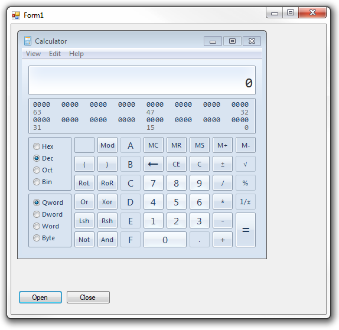

[ Home ](https://github.com/VFPX/Win32API)  

# Confining Windows calculator inside the VFP main window

## Before you begin:
This code attempts to make the VFP window the parent window for the Windows Calculator.  
  
***  


## Code:
```foxpro  
#DEFINE SW_SHOWNORMAL  1
DO declare

LOCAL hCalc

DO WHILE .T.
	hCalc = FindWindow(NULL, "Calculator")
	IF hCalc = 0
		= WinExec("calc.exe", SW_SHOWNORMAL)
	ELSE
		EXIT
	ENDIF
ENDDO

* Change the parent window for the calculator.
* As you can see, normally this is the Windows Desktop

? "Handle to the Windows Desktop:", GetDesktopWindow()

* use this line in VFP3..6
*? "Handle to the previous owner:", SetParent(hCalc,;
*	GetActiveWindow())

* VFP7+
? "Handle to the previous owner:", SetParent(hCalc, _screen.HWND)
* end of main

PROCEDURE declare
	DECLARE INTEGER GetActiveWindow IN user32
	DECLARE INTEGER GetDesktopWindow IN user32

	DECLARE INTEGER FindWindow IN user32;
		STRING lpClassName, STRING lpWindowName

	DECLARE INTEGER WinExec IN kernel32;
		STRING lpCmdLine, INTEGER nCmdShow

	DECLARE INTEGER SetParent IN user32;
		INTEGER hWndChild, INTEGER hWndNewParent  
```  
***  


## Listed functions:
[FindWindow](../libraries/user32/FindWindow.md)  
[GetActiveWindow](../libraries/user32/GetActiveWindow.md)  
[GetDesktopWindow](../libraries/user32/GetDesktopWindow.md)  
[SetParent](../libraries/user32/SetParent.md)  
[WinExec](../libraries/kernel32/WinExec.md)  

## Comment:
The parent window for the Windows calculator is usually the Windows Desktop. Changing it to the _screen.HWND makes the calculator confined inside the main VFP window.   
  
*SciCalc* is the window class for the Calculator.  
  


***  

