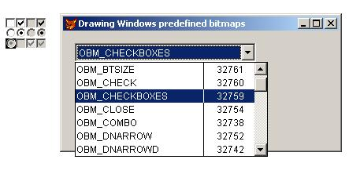

[ Home ](https://github.com/VFPX/Win32API)  

# Drawing Windows predefined bitmaps using the LoadBitmap functions

## Before you begin:
  
  
***  


## Code:
```foxpro  
DO decl

PUBLIC objForm
objForm = CreateObject("Tform")
objForm.Visible = .T.

DEFINE CLASS Tform As Form
	Caption = "Drawing Windows predefined bitmaps"
	Width=350
	Height=150
	AutoCenter = .T.

	ADD OBJECT cmb AS ComboBox WITH;
	Left=15, Top=15, Width=230, Style=2, ColumnCount=2,;
	BoundColumn=2, ColumnWidths="160,60"
	
	ADD OBJECT lbl1 As Label WITH;
	Left=15, Top=ThisForm.Height-80, Width=250,;
	Height=50, WordWrap=.T., BackStyle=0,;
	Caption="Select predefined bitmap to display it " +;
		"on the main VFP window"

PROCEDURE  Init
	WITH THIS.cmb
		.ListIndex = 1
		.InteractiveChange
	ENDWITH

PROCEDURE  cmb.InteractiveChange
	LOCAL lnBitmapType, hBitmap
	lnBitmapType = Val(THIS.Value)

	hBitmap = LoadBitmap(0, lnBitmapType)
	IF hBitmap <> 0
		= ShowBitmap (hBitmap, 100,200)
		= DeleteObject(hBitmap)
	ENDIF

PROCEDURE  cmb.Init
	THIS.NewItem ("OBM_BTNCORNERS",   32758)
	THIS.NewItem ("OBM_BTSIZE",       32761)
	THIS.NewItem ("OBM_CHECK",        32760)
	THIS.NewItem ("OBM_CHECKBOXES",   32759)
	THIS.NewItem ("OBM_CLOSE",        32754)
	THIS.NewItem ("OBM_COMBO",        32738)
	THIS.NewItem ("OBM_DNARROW",      32752)
	THIS.NewItem ("OBM_DNARROWD",     32742)
	THIS.NewItem ("OBM_DNARROWI",     32736)
	THIS.NewItem ("OBM_LFARROW",      32750)
	THIS.NewItem ("OBM_LFARROWD",     32740)
	THIS.NewItem ("OBM_LFARROWI",     32734)
	THIS.NewItem ("OBM_MNARROW",      32739)
	THIS.NewItem ("OBM_OLD_CLOSE",    32767)
	THIS.NewItem ("OBM_OLD_DNARROW",  32764)
	THIS.NewItem ("OBM_OLD_LFARROW",  32762)
	THIS.NewItem ("OBM_OLD_REDUCE",   32757)
	THIS.NewItem ("OBM_OLD_RESTORE",  32755)
	THIS.NewItem ("OBM_OLD_RGARROW",  32763)
	THIS.NewItem ("OBM_OLD_UPARROW",  32765)
	THIS.NewItem ("OBM_OLD_ZOOM",     32756)
	THIS.NewItem ("OBM_REDUCE",       32749)
	THIS.NewItem ("OBM_REDUCED",      32746)
	THIS.NewItem ("OBM_RESTORE",      32747)
	THIS.NewItem ("OBM_RESTORED",     32744)
	THIS.NewItem ("OBM_RGARROW",      32751)
	THIS.NewItem ("OBM_RGARROWD",     32741)
	THIS.NewItem ("OBM_RGARROWI",     32735)
	THIS.NewItem ("OBM_SIZE",         32766)
	THIS.NewItem ("OBM_UPARROW",      32753)
	THIS.NewItem ("OBM_UPARROWD",     32743)
	THIS.NewItem ("OBM_UPARROWI",     32737)
	THIS.NewItem ("OBM_ZOOM",         32748)
	THIS.NewItem ("OBM_ZOOMD",        32745)

PROTECTED PROCEDURE cmb.NewItem(lcName, lnValue)
	THIS.AddItem(lcName)
	THIS.List(THIS.ListCount, 2) = STR(lnValue)

ENDDEFINE

* --------------------------------------------------------------
PROCEDURE  ShowBitmap (hBitmap, lnX, lnY)
#DEFINE SRCCOPY  13369376

	* clearing the screen
	ACTI SCREEN
	CLEAR

	* a little break needed for the VFP to properly react
	= INKEY(0.1)

	LOCAL hWnd, hDC, hMemDC, lnWidth, lnHeight

	STORE 0 TO lnWidth, lnHeight
	= GetBitmapSize (hBitmap, @lnWidth, @lnHeight)

	hWnd = GetActiveWindow()
	hDC = GetWindowDC (hWnd)
	
	hMemDC = CreateCompatibleDC(hDC)
	= SelectObject (hMemDC, hBitmap)

	= BitBlt (hDC, lnX,lnY, lnWidth,lnHeight,;
		hMemDC, 0,0, SRCCOPY)

	= DeleteDC(hMemDC)
	= ReleaseDC (hWnd, hDc)

FUNCTION  GetBitmapSize (hBitmap, lnWidth, lnHeight)
#DEFINE BITMAP_STRU_SIZE   24
	LOCAL lcBuffer
	lcBuffer = Repli(Chr(0), BITMAP_STRU_SIZE)

	IF GetObjectA(hBitmap, BITMAP_STRU_SIZE, @lcBuffer) <> 0
		lnWidth  = buf2dword (SUBSTR(lcBuffer, 5,4))
		lnHeight = buf2dword (SUBSTR(lcBuffer, 9,4))
   	ENDIF

FUNCTION  buf2dword (lcBuffer)
RETURN Asc(SUBSTR(lcBuffer, 1,1)) + ;
	Asc(SUBSTR(lcBuffer, 2,1)) * 256 +;
	Asc(SUBSTR(lcBuffer, 3,1)) * 65536 +;
	Asc(SUBSTR(lcBuffer, 4,1)) * 16777216

PROCEDURE  decl
	DECLARE INTEGER LoadBitmap IN user32;
		INTEGER hInstance, INTEGER lpBitmapName

	DECLARE INTEGER CreateCompatibleDC IN gdi32 INTEGER hdc
	DECLARE INTEGER DeleteDC IN gdi32 INTEGER hdc
	DECLARE INTEGER ReleaseDC IN user32 INTEGER hwnd, INTEGER dc
	DECLARE INTEGER GetActiveWindow IN user32
	DECLARE INTEGER GetWindowDC IN user32 INTEGER hwnd
	DECLARE INTEGER DeleteObject IN gdi32 INTEGER hObject
	DECLARE INTEGER SelectObject IN gdi32 INTEGER hdc, INTEGER hObject

	DECLARE INTEGER GetObject IN gdi32 AS GetObjectA;
		INTEGER hgdiobj, INTEGER cbBuffer, STRING @lpvObject

	DECLARE INTEGER BitBlt IN gdi32;
		INTEGER hDestDC, INTEGER x, INTEGER y,;
		INTEGER nWidth, INTEGER nHeight, INTEGER hSrcDC,;
		INTEGER xSrc, INTEGER ySrc, INTEGER dwRop  
```  
***  


## Listed functions:
[BitBlt](../libraries/gdi32/BitBlt.md)  
[CreateCompatibleDC](../libraries/gdi32/CreateCompatibleDC.md)  
[DeleteDC](../libraries/gdi32/DeleteDC.md)  
[DeleteObject](../libraries/gdi32/DeleteObject.md)  
[GetActiveWindow](../libraries/user32/GetActiveWindow.md)  
[GetObject](../libraries/gdi32/GetObject.md)  
[GetWindowDC](../libraries/user32/GetWindowDC.md)  
[LoadBitmap](../libraries/user32/LoadBitmap.md)  
[ReleaseDC](../libraries/user32/ReleaseDC.md)  
[SelectObject](../libraries/gdi32/SelectObject.md)  

## Comment:
MSDN: An application can use the LoadBitmap function to access predefined bitmaps. To do so, the application must set the hInstance parameter to NULL and the lpBitmapName parameter to one of the predefined values.   
  
Note that the use of LoadBitmap to load OEM bitmaps is deprecated and is supported only for backwards compatibility. New applications should use DrawFrameControl to draw system elements.  
  
***  

