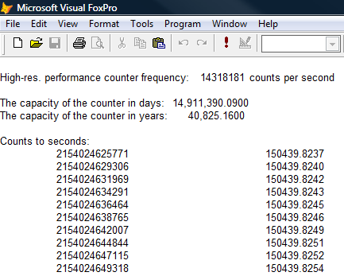

[ Home ](https://github.com/VFPX/Win32API)  

# Using the high-resolution performance counter

## Before you begin:
By default the Windows uses a low-resolution counter -- can be accessed through GetTickCount function -- that returns the number of milliseconds since current Windows session was started.   

A 32-bit unsigned number storing the counter value overflows in 49.71 days by definition (0xffffffff / (3600 * 1000 * 24)).   

An alternative to the low-resolution counter is the Performance Monitor Counter.   

  
  
***  


## Code:
```foxpro  
DO declare

LOCAL cBuffer, nFrequency, nCount, nIndex
cBuffer = Repli(Chr(0), 8)

IF QueryPerformanceFrequency(@cBuffer) = 0
	? "High-resolution performance counter " +;
		"not supported on your system"
	RETURN
ENDIF

nFrequency = Large2num(cBuffer)
? "High-res. performance counter frequency:",;
	nFrequency, "counts per second"
?
? "The capacity of the counter in days:",;
	TRANSFORM(0xffffffff * 0xffffffff /;
		(nFrequency * (3600 * 24)), "999,999,999.9999")

? "The capacity of the counter in years:",;
	TRANSFORM(0xffffffff * 0xffffffff /;
		(nFrequency * (3600 * 24 * 365.25)), "999,999,999.9999")
?
? "Counts to seconds:"
STORE 0 TO lnValue, lnStored
FOR nIndex=1 TO 10
	= QueryPerformanceCounter(@cBuffer)
	nCount = Large2num(cBuffer)
	? nCount, nCount/nFrequency
ENDFOR
* end of main

FUNCTION Large2num(cBuffer As String) As Number
#DEFINE MAX_DWORD 0xffffffff+1
RETURN buf2dword(SUBSTR(cBuffer, 1,4)) +;
	buf2dword(SUBSTR(cBuffer, 5,4)) * MAX_DWORD

FUNCTION buf2dword(cBuffer)
RETURN Asc(SUBSTR(cBuffer, 1,1)) + ;
	Asc(SUBSTR(cBuffer, 2,1)) * 256 +;
	Asc(SUBSTR(cBuffer, 3,1)) * 65536 +;
	Asc(SUBSTR(cBuffer, 4,1)) * 16777216

PROCEDURE declare
	DECLARE INTEGER QueryPerformanceCounter IN kernel32;
		STRING @lpPerformanceCount

	DECLARE INTEGER QueryPerformanceFrequency IN kernel32;
		STRING @lpFrequency  
```  
***  


## Listed functions:
[QueryPerformanceCounter](../libraries/kernel32/QueryPerformanceCounter.md)  
[QueryPerformanceFrequency](../libraries/kernel32/QueryPerformanceFrequency.md)  

## Comment:
The capacity of high-resolution counter, normally several thousand years, far exceeds the 49 days limitation for the GetTickCount function. The system resets the high-resolution counter when reboots.  
  
Revised: Mar.18, 2009  
  
***  

