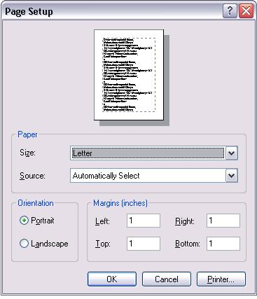

[ Home ](https://github.com/VFPX/Win32API)  

# Opening the Page Setup dialog box to specify the attributes of a printed page

## Before you begin:
  
  
***  


## Code:
```foxpro  
DO decl

LOCAL lcBuffer, lcSource
lcBuffer = GetSetupBuffer()

IF PageSetupDlg (@lcBuffer) <> 0
	LOCAL hDevmode, hDevnames
	hDevmode = buf2dword(SUBSTR(lcBuffer, 9,4))
	hDevnames = buf2dword(SUBSTR(lcBuffer, 13,4))

	* creating resulting cursor
	CREATE CURSOR csResult (src C(20), name C(50), value C(250))

	* retrieving data from three different structures
	* returned by this function

	= SavePageSetupDlg (lcBuffer)
	= SaveDevmode(hDevmode)
	= SaveDevnames(hDevnames)

	GO TOP
	BROW NORMAL NOWAIT
ENDIF
* end of main

FUNCTION  GetSetupBuffer
* this function fills and returns the PAGESETUPDLG structure
* in a FoxPro string

*| typedef struct tagPSD {
*|   DWORD           lStructSize;            0:4
*|   HWND            hwndOwner;              4:4
*|   HGLOBAL         hDevMode;               8:4
*|   HGLOBAL         hDevNames;             12:4
*|   DWORD           Flags;                 16:4
*|   POINT           ptPaperSize;           20:8
*|   RECT            rtMinMargin;           28:16
*|   RECT            rtMargin;              44:16
*|   HINSTANCE       hInstance;             60:4
*|   LPARAM          lCustData;             64:4
*|   LPPAGESETUPHOOK lpfnPageSetupHook;     68:4
*|   LPPAGEPAINTHOOK lpfnPagePaintHook;     72:4
*|   LPCTSTR         lpPageSetupTemplName;  76:4
*|   HGLOBAL         hPageSetupTempl;       80:4
*| } PAGESETUPDLG, *LPPAGESETUPDLG; total = 84 bytes
#DEFINE PAGESETUPDLG_SIZE  84

* several Page Setup flags
#DEFINE PSD_RETURNDEFAULT               1024
#DEFINE PSD_INTHOUSANDTHSOFINCHES          4
#DEFINE PSD_INHUNDREDTHSOFMILLIMETERS      8
#DEFINE PSD_ENABLEPAGESETUPTEMPLATE    32768

#DEFINE GWL_HINSTANCE  -6

	LOCAL lcBuffer, lnFlags

*	lnFlags = PSD_RETURNDEFAULT  && the dialog not displayed
	lnFlags = 0

	lcBuffer = num2dword(PAGESETUPDLG_SIZE) +;
		num2dword(0) +;
		num2dword(0) +;
		num2dword(0) +;
		num2dword(lnFlags) +;
		num2dword(0)+num2dword(0) +;
		num2dword(0)+num2dword(0)+num2dword(0)+num2dword(0) +;
		num2dword(0)+num2dword(0)+num2dword(0)+num2dword(0) +;
		num2dword(0) +;
		num2dword(0) +;
		num2dword(0) +;
		num2dword(0) +;
		num2dword(0) +;
		num2dword(0)

	* if you do not care for the page setup flags
	* the buffer becomes pretty simple:
	* lcBuffer = num2dword(PAGESETUPDLG_SIZE) +;
	* Repli(Chr(0), PAGESETUPDLG_SIZE-4)
RETURN  lcBuffer

PROCEDURE  SavePageSetupDlg (lcBuffer)
* this procedure retrieves and saves parameters from
* the PAGESETUPDLG structure passed as a string
	lcSource = "PAGESETUPDLG"
	= _save ("Paper width",      buf2dword(SUBSTR(lcBuffer, 21,4)))
	= _save ("Paper height",     buf2dword(SUBSTR(lcBuffer, 25,4)))
	= _save ("MinMargin left",   buf2dword(SUBSTR(lcBuffer, 29,4)))
	= _save ("MinMargin top",    buf2dword(SUBSTR(lcBuffer, 33,4)))
	= _save ("MinMargin right",  buf2dword(SUBSTR(lcBuffer, 37,4)))
	= _save ("MinMargin bottom", buf2dword(SUBSTR(lcBuffer, 41,4)))
	= _save ("Margin left",      buf2dword(SUBSTR(lcBuffer, 45,4)))
	= _save ("Margin top",       buf2dword(SUBSTR(lcBuffer, 49,4)))
	= _save ("Margin right",     buf2dword(SUBSTR(lcBuffer, 53,4)))
	= _save ("Margin bottom",    buf2dword(SUBSTR(lcBuffer, 57,4)))
RETURN

PROCEDURE  SaveDevnames (hMem)
* this procedure retrieves and saves parameters from
* the DEVNAMES structure

*|typedef struct tagDEVNAMES {
*|  WORD wDriverOffset;  0:2
*|  WORD wDeviceOffset;  2:2
*|  WORD wOutputOffset;  4:2
*|  WORD wDefault;       6:2
*|// Driver, device, and port name strings follow wDefault.
*|} DEVNAMES, *LPDEVNAMES;

	LOCAL lnPtr, lcBuffer, wDriverOffset, wDeviceOffset, wOutputOffset, wDefault
	* pointer to the first byte of the DEVNAMES memory block
	lnPtr = GlobalLock (hMem)

	* copying data from the memory block to a string
	lcBuffer = Repli(Chr(0), 8)
	= Heap2Str (@lcBuffer, lnPtr, 8)
	
	* retrieveing offsets to the names
	wDriverOffset = buf2word(SUBSTR(lcBuffer, 1,2))
	wDeviceOffset = buf2word(SUBSTR(lcBuffer, 3,2))
	wOutputOffset = buf2word(SUBSTR(lcBuffer, 5,2))
	wDefault      = buf2word(SUBSTR(lcBuffer, 7,2))

	lcSource = "DEVNAMES"
	= _save ("Device driver name", mem2str(lnPtr+wDriverOffset))
	= _save ("Device name",        mem2str(lnPtr+wDeviceOffset))
	= _save ("Output port",        mem2str(lnPtr+wOutputOffset))
	= _save ("The printer is default", wDefault)
	
	= GlobalUnlock(hMem)
RETURN

PROCEDURE  SaveDevmode (hMem)
* this procedure retrieves and saves parameters from
* the DEVMODE strusture

#DEFINE CCHDEVICENAME  32
#DEFINE CCHFORMNAME    32

*|typedef struct _devicemode {
*|  BCHAR  dmDeviceName[CCHDEVICENAME];   0:32
*|  WORD   dmSpecVersion;                32:2
*|  WORD   dmDriverVersion;              34:2
*|  WORD   dmSize;                       36:2
*|  WORD   dmDriverExtra;                38:2
*|  DWORD  dmFields;                     40:4
*|  union {
*|    struct {
*|      short dmOrientation;             44:2
*|      short dmPaperSize;               46:2
*|      short dmPaperLength;             48:2
*|      short dmPaperWidth;              50:2
*|      short dmScale;                   52:2
*|      short dmCopies;                  54:2
*|      short dmDefaultSource;           56:2
*|      short dmPrintQuality;            58:2
*|    };
*|    POINTL dmPosition;                 44:8
*|    DWORD  dmDisplayOrientation;       44:4
*|    DWORD  dmDisplayFixedOutput;       44:4
*|  };
*|  short  dmColor;                      60:2
*|  short  dmDuplex;                     62:2
*|  short  dmYResolution;                64:2
*|  short  dmTTOption;                   66:2
*|  short  dmCollate;                    68:2
*|  BYTE  dmFormName[CCHFORMNAME];       70:32
*|  WORD  dmLogPixels;                  102:2
*|  DWORD  dmBitsPerPel;                104:4
*|  DWORD  dmPelsWidth;                 108:4
*|  DWORD  dmPelsHeight;                112:4
*|  union {
*|    DWORD  dmDisplayFlags;            116:4
*|    DWORD  dmNup;                     116:4
*|  }
*|  DWORD  dmDisplayFrequency;          120:4
*|#if(WINVER >= 0x0400)
*|  DWORD  dmICMMethod;                 124:4
*|  DWORD  dmICMIntent;                 128:4
*|  DWORD  dmMediaType;                 132:4
*|  DWORD  dmDitherType;                136:4
*|  DWORD  dmReserved1;                 140:4
*|  DWORD  dmReserved2;                 144:4
*|#if (WINVER >= 0x0500) || (_WIN32_WINNT >= 0x0400)
*|  DWORD  dmPanningWidth;              148:4
*|  DWORD  dmPanningHeight;             152:4
*|#endif
*|#endif /* WINVER >= 0x0400 */
*|} DEVMODE; total bytes = 156
#DEFINE DEVMODE_STRU_SIZE  156

	LOCAL lnPtr, lcBuffer, lcDevicename, lcFormname

	* pointer to the first byte of the DEVMODE memory block
	lnPtr = GlobalLock (hMem)

	lcBuffer = Repli(Chr(0), DEVMODE_STRU_SIZE)
	= Heap2Str (@lcBuffer, lnPtr, DEVMODE_STRU_SIZE)

	lcDevicename = SUBSTR(lcBuffer, 1,CCHDEVICENAME)
	lcFormname = SUBSTR(lcBuffer, 71,CCHFORMNAME)

	lcSource = "DEVMODE"
	= _save ("Device name", STRTRAN(lcDevicename, Chr(0),""))
	= _save ("Form name", STRTRAN(lcFormname, Chr(0),""))

	= _save ("Driver version", buf2word(SUBSTR(lcBuffer, 35,2)))
	= _save ("DEVMODE structure size", buf2word(SUBSTR(lcBuffer, 37,2)))

	= _save ("Orientation",    buf2word(SUBSTR(lcBuffer, 45,2)))
	= _save ("Paper size",     buf2word(SUBSTR(lcBuffer, 47,2)))
	= _save ("Paper length",   buf2word(SUBSTR(lcBuffer, 49,2)))
	= _save ("Paper width",    buf2word(SUBSTR(lcBuffer, 51,2)))
	= _save ("Scale",          buf2word(SUBSTR(lcBuffer, 53,2)))
	= _save ("Copies",         buf2word(SUBSTR(lcBuffer, 55,2)))
	= _save ("Default source", buf2word(SUBSTR(lcBuffer, 57,2)))
	= _save ("Print quality",  buf2word(SUBSTR(lcBuffer, 59,2)))
	= _save ("Y resolution",   buf2word(SUBSTR(lcBuffer, 65,2)))

	= _save ("Media type", buf2word(SUBSTR(lcBuffer, 133,4)))
	= _save ("Ditherting type", buf2word(SUBSTR(lcBuffer, 137,4)))

	= GlobalUnlock(hMem)
RETURN

PROCEDURE  _save (lcName, lvValue)
	LOCAL lcType, lcValue
	lcType = TYPE("lvValue")
	DO CASE
	CASE lcType = "N"
		lcValue = LTRIM(STR(lvValue, 20,2))
	OTHER
		lcValue = lvValue
	ENDCASE
	INSERT INTO csResult VALUES (lcSource, lcName, lcValue)
RETURN

FUNCTION  buf2dword (lcBuffer)
RETURN Asc(SUBSTR(lcBuffer, 1,1)) + ;
	Asc(SUBSTR(lcBuffer, 2,1)) * 256 +;
	Asc(SUBSTR(lcBuffer, 3,1)) * 65536 +;
	Asc(SUBSTR(lcBuffer, 4,1)) * 16777216

FUNCTION  buf2word (lcBuffer)
RETURN Asc(SUBSTR(lcBuffer, 1,1)) + ;
	Asc(SUBSTR(lcBuffer, 2,1)) * 256

FUNCTION  num2dword (lnValue)
#DEFINE m0       256
#DEFINE m1     65536
#DEFINE m2  16777216
	LOCAL b0, b1, b2, b3
	b3 = Int(lnValue/m2)
	b2 = Int((lnValue - b3*m2)/m1)
	b1 = Int((lnValue - b3*m2 - b2*m1)/m0)
	b0 = Mod(lnValue, m0)
RETURN Chr(b0)+Chr(b1)+Chr(b2)+Chr(b3)

FUNCTION  mem2str(lnMemBlock)
#DEFINE BUFFER_SIZE   16
#DEFINE EMPTY_BUFFER  Repli(Chr(0), BUFFER_SIZE)
	LOCAL lnPtr, lcResult, lcBuffer, lnPos
	lnPtr = lnMemBlock
	lcResult = ""

	DO WHILE .T.
		lcBuffer = EMPTY_BUFFER
		= Heap2Str (@lcBuffer, lnPtr, BUFFER_SIZE)
		lnPos = AT(Chr(0), lcBuffer)

		IF lnPos > 0
			lcResult = lcResult + SUBSTR(lcBuffer, 1, lnPos-1)
			RETURN  lcResult
		ELSE
			lcResult = lcResult + lcBuffer
			lnPtr = lnPtr + BUFFER_SIZE
		ENDIF
	ENDDO

PROCEDURE  decl
#DEFINE GMEM_FIXED   0
	DECLARE INTEGER PageSetupDlg IN comdlg32 STRING @lppsd
	DECLARE RtlMoveMemory IN kernel32 As Heap2Str STRING @, INTEGER, INTEGER
	DECLARE INTEGER GlobalLock IN kernel32 INTEGER hMem
	DECLARE INTEGER GlobalUnlock IN kernel32 INTEGER hMem  
```  
***  


## Listed functions:
[GlobalLock](../libraries/kernel32/GlobalLock.md)  
[GlobalUnlock](../libraries/kernel32/GlobalUnlock.md)  
[PageSetupDlg](../libraries/comdlg32/PageSetupDlg.md)  

## Comment:
The attributes include the paper size and source, the page orientation (portrait or landscape), and the width of the page margins. Also you receive names for the printer (EPSON ...), printer driver file (winspool) and the output port (LPT1:).  
  
Some parameters are contained in two structures at the same time: paper size, printer name.  
  
The PSD_RETURNDEFAULT flag allows to retrieve the printer page parameters for the default printer (including its name) without displaying the dialog box.  
  
***  

