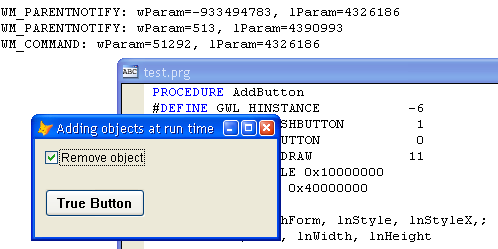

[ Home ](https://github.com/VFPX/Win32API)  

# Placing a button on the VFP form as a new child window

## Before you begin:
This code demonstrates how to create a child window (the regular Windows button is always a *child window* for its container).   

It is known that native FoxPro controls are not windows, as they are in VB or Delphi sets of controls, just name a few. Most of the times it creates a small inconvenience, unless you need more control on their properties.   

  

For example, I do not know how to shape the native VFP CommandButton control to anything but a rectangle. Correct me if I am wrong. Transparent image does not solve the problem.  
  
***  


## Code:
```foxpro  
DO declare

LOCAL oForm As Tform
oForm=CREATEOBJECT("Tform")
oForm.Show()
READ EVENTS
* end of main

DEFINE CLASS Tform As Form
#DEFINE WM_PARENTNOTIFY 0x0210
#DEFINE WM_COMMAND 0x0111
#DEFINE WM_LBUTTONDOWN 0x201
#DEFINE WM_RBUTTONDOWN 0x204
#DEFINE GWL_WNDPROC -4
PROTECTED hWindow, hOrigProc
	hWindow=0
	hOrigProc=0
	Caption = "Adding the Windows Button to the form"
	Height = 250
	Width = 450
	Autocenter = .T.
	hButton = 0

	ADD OBJECT chAddButton As CheckBox WITH;
	Left=20, Top=20, Autosize=.T., Caption="Add Button"

PROCEDURE Destroy
	THIS.RemoveButton
	CLEAR EVENTS

PROCEDURE Activate
	IF THIS.hWindow = 0
		THIS.hWindow = GetFocus()
		THIS.hOrigProc = GetWindowLong(THIS.hWindow, GWL_WNDPROC)

		* link WM_PARENTNOTIFY window message to a method
		IF VERSION(5) >= 900
			= BINDEVENT(THIS.hWindow, WM_PARENTNOTIFY, THIS, "WindowProc")
			= BINDEVENT(THIS.hWindow, WM_COMMAND, THIS, "WindowProc")
		ENDIF
	ENDIF

PROCEDURE RemoveButton
	IF DestroyWindow(THIS.hButton) <> 0
		THIS.hButton = 0
	ENDIF

PROCEDURE AddButton
#DEFINE GWL_HINSTANCE -6
#DEFINE BS_DEFPUSHBUTTON 1
#DEFINE BS_PUSHBUTTON 0
#DEFINE BS_OWNERDRAW 0x000b
#DEFINE WS_VISIBLE 0x10000000
#DEFINE WS_CHILD 0x40000000

	LOCAL hApp, hParentHWnd, lnStyle, lnStyleX,;
		lnX, lnY, lnWidth, lnHeight
	
*	lnStyle = WS_VISIBLE+WS_CHILD+BS_PUSHBUTTON)
	lnStyle = BITOR(WS_VISIBLE, WS_CHILD, BS_PUSHBUTTON)
	lnStyleX = 0

	* handle to the window hosting the button
*	hParentHWnd=GetFocus()
	hParentHWnd=ThisForm.HWnd  && will not work for ShowWindow=2
	
	* handle to application instance
	hApp = GetWindowLong(hParentHWnd, GWL_HINSTANCE)
	
	* unique child-window identifier
	lnId = VAL(SYS(3))
	
	* size and position
	lnX = 140
	lnY = 50
	lnWidth = 100
	lnHeight = 28
	
	* the predefined control class BUTTON is used
	THIS.hButton = CreateWindow (lnStyleX, "BUTTON",;
		"True &Button", lnStyle,;
		lnX, lnY, lnWidth, lnHeight,;
		hParentHWnd, lnId, hApp, 0)

PROTECTED PROCEDURE WindowProc(hWindow as Integer,;
	nMsgID as Integer, wParam as Integer, lParam as Integer)
* requires VFP9, otherwise ignored

	LOCAL nReturn
	nReturn=0
	
	DO CASE
	CASE nMsgID=WM_COMMAND
		ACTIVATE SCREEN
		? "WM_COMMAND: wParam=" + LTRIM(STR(wParam)) +;
			", lParam=" + LTRIM(STR(lParam))

	CASE nMsgID=WM_PARENTNOTIFY
		ACTIVATE SCREEN
		? "WM_PARENTNOTIFY: wParam=" + LTRIM(STR(wParam)) +;
			", lParam=" + LTRIM(STR(lParam))
		
		DO CASE
		CASE wParam=WM_LBUTTONDOWN
			?? " -- Left Button pressed"
		CASE wParam=WM_RBUTTONDOWN
			?? " -- Right Button pressed"
		ENDCASE
		
	OTHERWISE
	* pass control to the original window procedure
		nReturn = CallWindowProc(THIS.hOrigProc, THIS.hWindow,;
			m.nMsgID, m.wParam, m.lParam)
	ENDCASE
RETURN nReturn

PROCEDURE chAddButton.Click
	IF ThisForm.hButton=0
		ThisForm.AddButton
	ELSE
		ThisForm.RemoveButton
	ENDIF
	THIS.Caption = IIF(ThisForm.hButton=0,;
		"Add Button", "Remove Button")

ENDDEFINE

PROCEDURE declare
	DECLARE INTEGER GetFocus IN user32

	DECLARE INTEGER DestroyWindow IN user32;
		INTEGER hWindow

	DECLARE INTEGER GetWindowLong IN user32;
		INTEGER hWnd, INTEGER nIndex

	DECLARE INTEGER CreateWindowEx IN user32 AS CreateWindow;
		INTEGER dwExStyle, STRING lpClassName,;
		STRING lpWindowName, INTEGER dwStyle,;
		INTEGER x, INTEGER y, INTEGER nWidth, INTEGER nHeight,;
		INTEGER hWndParent, INTEGER hMenu, INTEGER hInstance,;
		INTEGER lpParam  
```  
***  


## Listed functions:
[CreateWindow](../libraries/user32/CreateWindow.md)  
[CreateWindowEx](../libraries/user32/CreateWindowEx.md)  
[DestroyWindow](../libraries/user32/DestroyWindow.md)  
[GetFocus](../libraries/user32/GetFocus.md)  
[GetWindowLong](../libraries/user32/GetWindowLong.md)  

## Comment:
A click on the button sends a notification (Windows message WM_COMMAND) to the window that owns the button. The VFP form for sure receives this message through its WindowProc function.  
  
With no access to this function there hardly is a way to intercept this message and link a procedure to the click.  
  
There are other predefined control classes like the BUTTON: COMBOBOX, EDIT, LISTBOX, SCROLLBAR, STATIC etc. The BUTTON class allows creating command buttons as well as checkboxes, radiobuttons, buttons with images and icons etc.  
  
* * *  
Things changed when VFP9 introduced new BINDEVENT() functionality.  
  
* * *  
The WM_PARENTNOTIFY message is sent to the parent of a child window when the child window is created or destroyed, or when the user clicks a mouse button while the cursor is over the child window.  
  
In VFP9 new BINDEVENT() allows to intercept this message. So tecnically, left and right mouse clicks on such windowed button control can be detected by its parent form and linked to a method.  
  
***  

