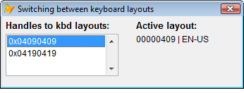
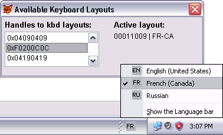

[ Home ](https://github.com/VFPX/Win32API)  

# Switching between keyboard layouts

## Note that this document contains some links to the old news2news website which does not work at the moment. This material will be available sometime in the future.

## Before you begin:
The form in this code sample displays input languages available for the current process and allows switching between them.  

  

In VFP9, this form also tracks input language changes initiated by a hot key or via Windows Taskbar. A form must have the *keyboard focus* to immediately reflect a change in input language.  

  


See also:


<!-- Anatoliy --> 
* [LanguageBar ActiveX control](?solution=7)  
<!-- Anatoliy -->
* <a href="?solution=7"></a>  
* [Saving available locale records into a cursor](sample_076.md)  
* [Retrieving national language settings](sample_077.md)  
* [Capturing keyboard activity of another application using the Raw Input API](sample_572.md)  
  
***  


## Code:
```foxpro  
PUBLIC oForm
oForm = CreateObject("Tform")
oForm.Visible=.T.

DEFINE CLASS Tform As Form
#DEFINE WM_INPUTLANGCHANGE 0x0051
#DEFINE WM_INPUTLANGCHANGEREQUEST 0x0050
#DEFINE GWL_WNDPROC -4

PROTECTED ActiveLayout, hWindow, hOrigProc
	hWindow=0
	hOrigProc=0

	Width=340
	Height=100
	BorderStyle=2
	MaxButton=.F.
	MinButton=.F.
	Caption="Available Keyboard Layouts"
	AutoCenter=.T.
	
	ADD OBJECT lblLst As Label WITH;
	Left=5, Top=5, Autosize=.T., FontBold=.T.,;
	FontSize=10, Caption="Handles to kbd layouts:"

	ADD OBJECT lst As ListBox WITH;
	Left=5, Top=25, Width=160, Height=60, Style=2
	
	ADD OBJECT lblLbl As Label WITH;
	Left=190, Top=5, Autosize=.T., FontBold=.T.,;
	FontSize=10, Caption="Active layout:"

	ADD OBJECT lbl As Label WITH;
	Left=190, Top=25, Autosize=.T.
	
PROCEDURE Init
	THIS.declare

	IF NOT THIS.EnumKbdlayouts()
		= MESSAGEBOX("Keyboard layout enumeration failed!",;
			48, "Error!")
		RETURN .F.
	ENDIF

	* save current layout
	THIS.ActiveLayout = GetKeyboardLayout(0)
	THIS.lst.ListIndex=1
	THIS.DisplayActiveLayout

PROCEDURE Destroy
* restore initial layout
	THIS.SwitchKbdLayout(THIS.ActiveLayout)

PROCEDURE Activate
	IF THIS.hWindow = 0
		THIS.hWindow = THIS.HWnd
		THIS.hOrigProc = GetWindowLong(THIS.hWindow, GWL_WNDPROC)

		* track WM_INPUTLANGCHANGE window messages
		IF VERSION(5) >= 900
			= BINDEVENT(THIS.hWindow, WM_INPUTLANGCHANGE,;
				THIS, "WindowProc")
		ENDIF
	ENDIF
	THIS.DisplayActiveLayout

PROCEDURE lst.InteractiveChange
	ThisForm.SwitchKbdLayout(VAL(THIS.Value))
	ThisForm.DisplayActivelayout

PROCEDURE WindowProc(hWindow as Integer, nMsgID as Integer,;
	wParam as Integer, lParam as Integer)
* requires VFP9, otherwise ignored

	LOCAL nReturn
	nReturn=0
	
	IF nMsgID=WM_INPUTLANGCHANGE
	* The input language has been changed for the applicaiton.
	* Note that only in-focus (active) form receives this message
		THIS.DisplayActivelayout
	ENDIF

	* pass control to the original window procedure
	nReturn = CallWindowProc(THIS.hOrigProc, THIS.hWindow,;
		m.nMsgID, m.wParam, m.lParam)
RETURN nReturn

PROCEDURE DisplayActivelayout
	LOCAL nLocaleId, cBuffer

	nLocaleId=GetKeyboardLayout(0)
	THIS.lst.Value=TRANSFORM(m.nLocaleId,"@0")

	cBuffer = REPLICATE(Chr(0), 250)
	= GetKeyboardLayoutName(@cBuffer)

	THIS.lbl.Caption = STRTRAN(cBuffer, CHR(0),"") +;
		" | " + THIS.GetLocaleName(m.nLocaleId)

PROCEDURE SwitchKbdLayout(hLayout)
	= ActivateKeyboardLayout(m.hLayout, 0)

PROCEDURE EnumKbdlayouts
	LOCAL cBuffer, nBufsize, nCount, nIndex, hLayout
	nBufsize = 256
	cBuffer = REPLICATE(CHR(0), nBufsize)
	nCount = GetKeyboardLayoutList(nBufsize, @cBuffer)

	FOR nIndex=1 TO nCount
		hLayout = buf2dword(SUBSTR(cBuffer, (nIndex-1)*4+1, 4))
		THIS.lst.AddItem(TRANSFORM(hLayout,"@0"))
	ENDFOR
RETURN (nCount > 0)

FUNCTION GetLocaleName(nLocaleId As Number) As String
#DEFINE LOCALE_ENGLISH_US 0x0409
#DEFINE LOCALE_ENGLISH_CANADA 0x1009
#DEFINE LOCALE_FRENCH_STANDARD 0x040c
#DEFINE LOCALE_FRENCH_CANADA 0x0c0c
#DEFINE LOCALE_RUSSIAN 0x0419
#DEFINE LOCALE_UKRAINIAN 0x0422

	LOCAL cLocaleName
	nLocaleId=BITAND(nLocaleId, 0xffff)

	DO CASE
	CASE nLocaleId=LOCALE_ENGLISH_US
		cLocaleName="EN-US"
	CASE nLocaleId=LOCALE_ENGLISH_CANADA
		cLocaleName="EN-CA"
	CASE nLocaleId=LOCALE_FRENCH_STANDARD
		cLocaleName="FR"
	CASE nLocaleId=LOCALE_FRENCH_CANADA
		cLocaleName="FR-CA"
	CASE nLocaleId=LOCALE_RUSSIAN
		cLocaleName="RU"
	CASE nLocaleId=LOCALE_UKRAINIAN
		cLocaleName="UA"
	OTHERWISE
		cLocaleName=TRANSFORM(nLocaleId, "@0")
	ENDCASE
RETURN m.cLocaleName

PROCEDURE declare
	DECLARE INTEGER GetWindowLong IN user32;
		INTEGER hWindow, INTEGER nIndex

	DECLARE INTEGER CallWindowProc IN user32;
		INTEGER lpPrevWndFunc, INTEGER hWindow, LONG Msg,;
		INTEGER wParam, INTEGER lParam

	DECLARE INTEGER GetKeyboardLayout IN user32;
		INTEGER idThread

	DECLARE INTEGER GetKeyboardLayoutName IN user32;
		STRING @pwszKLID

	DECLARE INTEGER GetKeyboardLayoutList IN user32;
		INTEGER nBuff, STRING @lpList

	DECLARE INTEGER ActivateKeyboardLayout IN user32;
		INTEGER hkl, INTEGER nFlags

ENDDEFINE

FUNCTION buf2dword(cBuffer)
RETURN Asc(SUBSTR(cBuffer, 1,1)) +;
	Asc(SUBSTR(cBuffer, 2,1)) * 256 +;
	Asc(SUBSTR(cBuffer, 3,1)) * 65536 +;
	Asc(SUBSTR(cBuffer, 4,1)) * 16777216  
```  
***  


## Listed functions:
[ActivateKeyboardLayout](../libraries/user32/ActivateKeyboardLayout.md)  
[CallWindowProc](../libraries/user32/CallWindowProc.md)  
[GetKeyboardLayout](../libraries/user32/GetKeyboardLayout.md)  
[GetKeyboardLayoutList](../libraries/user32/GetKeyboardLayoutList.md)  
[GetKeyboardLayoutName](../libraries/user32/GetKeyboardLayoutName.md)  
[GetWindowLong](../libraries/user32/GetWindowLong.md)  

## Comment:
The keyboard layout status, if any shown in the taskbar, reflects the layout selection made on the form.  
  
The name of the input locale identifier (keyboard layout) is a string composed of the hexadecimal value of the language identifier (low word) and a device identifier (high word).   
  
For example, English (United States) layout has a language identifier of 0x0409, so this layout is named "00000409". The variants of  it (such as the Dvorak layout) are named "00010409", "00020409", and so on.   
  
The indentifiers in the list correspond to the current set of input locales used by the system. The LoadKeyboardLayout function activates selected input locale identifier.  
  
 
  
***  

