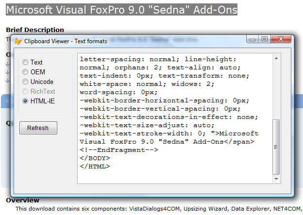

[ Home ](https://github.com/VFPX/Win32API)  

# Getting a bit more than the _CLIPTEXT offers

## Before you begin:
When you select a fragment of an application data to the Windows Clipboard, most often this is not just a raw ASCII text format you find later in, but several more data formats.   

  

> On the picture above a web page is shown that has a fragment selected and copied to the clipboard. Windows Clipboard stores this fragment in at least four different formats. The HTML format is shown.

To find out how many of them are involved when a fragment from a MS Word document is copied to the clipboard -- run [this code](sample_032.md).  

This code sample shows how to access several text-related data formats stored in the Clipboard. To test it **Cut** or **Copy** some data to the clipboard. Select data from MS Office documents, web pages, Notepad files and so on.  
  
***  


## Code:
```foxpro  
* standard Clipboard formats
#DEFINE CF_TEXT             1
#DEFINE CF_OEMTEXT          7
#DEFINE CF_UNICODETEXT     13

PUBLIC objForm
objForm = CreateObject("TForm")
objForm.Visible = .T.

DEFINE CLASS TForm As Form
	Width=760
	Height=500
	Caption="Clipboard Viewer - Text formats"
	Autocenter = .T.
	Keypreview=.T.
	
	ADD OBJECT og As TGroup WITH;
	Left=10, Top=10

	ADD OBJECT txtView As EditBox WITH;
	Left=160, Top=10, Width=620, Height=470,;
	Fontname="Courier New", FontSize=11
	
	ADD OBJECT cmdRefresh As CommandButton WITH;
	Caption="Refresh", Left=10, Width=80, Height=29,;
	Top=THIS.og.Top+THIS.og.Height+10

PROCEDURE  Init
	THIS.decl

PROCEDURE  Activate
	ThisForm.RefreshFormats

PROCEDURE  cmdRefresh.Click
	ThisForm.RefreshFormats

PROCEDURE  og.InteractiveChange
	LOCAL lnFormat
	lnFormat = Val(THIS.Buttons[THIS.Value].Tag)
	ThisForm.ShowFormatData (lnFormat)

PROCEDURE  RefreshFormats
	ThisForm.ShowAvailableFormats
	WITH ThisForm.og
		IF Not .Buttons[.Value].Enabled
			.Value = 1  && CF_TEXT
		ENDIF
		.InteractiveChange
	ENDWITH

PROCEDURE  ShowFormatData (lnFormat)
	ThisForm.txtView.Value = ""
	IF OpenClipboard(0) = 0
		RETURN
	ENDIF

	LOCAL hData, lcResult
	lcResult = ""

	IF IsClipboardFormatAvailable (lnFormat) <> 0
		hData = GetClipboardData (lnFormat)
		DO CASE
		CASE hData = 0
		* do nothing
		CASE lnFormat = CF_UNICODETEXT
			lcResult = memwchar2str(hData)
		OTHER
			lcResult = memchar2str(hData)
		ENDCASE
		IF hData <> 0
		ENDIF
	ENDIF

	= CloseClipboard()
	ThisForm.txtView.Value = lcResult

PROTECTED PROCEDURE  ShowAvailableFormats
	ThisForm.og.SetAll ("Enabled", .F.)

	IF OpenClipboard(0) = 0
		RETURN
	ENDIF
	ThisForm.og.CheckEnabled
	= CloseClipboard()

PROCEDURE  KeyPress (nKeyCode, nShiftAltCtrl)
	IF nKeyCode = 27
		ThisForm.Release
	ENDIF

PROCEDURE  decl
	DECLARE INTEGER GetLastError IN kernel32

	DECLARE INTEGER OpenClipboard   IN user32 INTEGER hwnd
	DECLARE INTEGER CloseClipboard  IN user32
	DECLARE INTEGER GetActiveWindow IN user32

	DECLARE INTEGER GetClipboardData IN user32 INTEGER uFormat
	DECLARE INTEGER IsClipboardFormatAvailable IN user32 INTEGER wFormat
ENDDEFINE

DEFINE CLASS TGroup As OptionGroup
	Width=140
	Height=140
	ADD OBJECT oText As TOption WITH Caption="Text", Top=10, Tag=STR(CF_TEXT)
	ADD OBJECT oOEM As TOption WITH Caption="OEM", Tag=STR(CF_OEMTEXT)
	ADD OBJECT oUnicode As TOption WITH Caption="Unicode", Tag=STR(CF_UNICODETEXT)

	* note that Tag values for these two guys are set during the Init event
	ADD OBJECT oRichText As TOption WITH Caption="RichText"
	ADD OBJECT oHTML As TOption WITH Caption="HTML-IE"
	ADD OBJECT oXml As TOption WITH Caption="XML Spreadsheet"

PROCEDURE  Init
	LOCAL CF_RICHTEXT, CF_HTML, CF_XML_SPR

	DECLARE INTEGER RegisterClipboardFormat IN user32 STRING lpszFormat
	
	* if these Clipboard formats already registered their actual values
	* will be returned to the CF_HTML and CF_RICHTEXT variables
	CF_HTML = RegisterClipboardFormat("HTML Format")
	CF_RICHTEXT = RegisterClipboardFormat("Rich Text Format")
	CF_XML_SPR = RegisterClipboardFormat("XML Spreadsheet")
	
	THIS.oHTML.Tag = STR(CF_HTML)
	THIS.oRichText.Tag = STR(CF_RICHTEXT)
	THIS.oXml.Tag = STR(CF_XML_SPR)

PROCEDURE  CheckEnabled
	LOCAL ii, lnFormat
	FOR ii=1 TO THIS.ButtonCount
		WITH THIS.Buttons[ii]
			lnFormat = Val(.Tag)
			.Enabled = (IsClipboardFormatAvailable(lnFormat) <> 0)
		ENDWITH
	ENDFOR
ENDDEFINE

DEFINE CLASS TOption As OptionButton
	Left=7
	Autosize=.T.
	Font="Arial"
	FontSize=10
	Enabled=.F.
ENDDEFINE

* ------------ support procedures ------------------

FUNCTION  memchar2str (lnMemBlock)
* copies characters from a memory address to a VFP string
RETURN  mem2str(lnMemBlock, Chr(0))

FUNCTION  memwchar2str (lnMemBlock)
* copies Unicode characters (two-byte) from a memory address to a VFP string
RETURN  mem2str(lnMemBlock, Chr(0)+Chr(0))

FUNCTION  mem2str(lnMemBlock, end_sequence)
#DEFINE BUFFER_SIZE   16
#DEFINE EMPTY_BUFFER  Repli(Chr(0), BUFFER_SIZE)

	DECLARE RtlMoveMemory IN kernel32 As Heap2Str;
		STRING @, INTEGER, INTEGER

	LOCAL lnPtr, lcResult, lcBuffer, lnPos
	lnPtr = lnMemBlock
	lcResult = ""

	DO WHILE .T.
		lcBuffer = EMPTY_BUFFER
		= Heap2Str (@lcBuffer, lnPtr, BUFFER_SIZE)
		lnPos = AT(end_sequence, lcBuffer)

		IF lnPos > 0
			lcResult = lcResult + SUBSTR(lcBuffer, 1, lnPos-1)
			RETURN  lcResult
		ELSE
			lcResult = lcResult + lcBuffer
			lnPtr = lnPtr + BUFFER_SIZE
		ENDIF
	ENDDO  
```  
***  


## Listed functions:
[CloseClipboard](../libraries/user32/CloseClipboard.md)  
[GetActiveWindow](../libraries/user32/GetActiveWindow.md)  
[GetClipboardData](../libraries/user32/GetClipboardData.md)  
[GetLastError](../libraries/kernel32/GetLastError.md)  
[IsClipboardFormatAvailable](../libraries/user32/IsClipboardFormatAvailable.md)  
[OpenClipboard](../libraries/user32/OpenClipboard.md)  
[RegisterClipboardFormat](../libraries/user32/RegisterClipboardFormat.md)  

## Comment:
Two Clipboard Data Formats: ***HTML Format*** and ***Rich Text Format*** are not standard but the registered ones. To reach data for these formats you have to register them first. Use the RegisterClipboardFormat function. If they are already registered by another application this function returns their actual Ids.  
  
Differently from the standard Clipboard Formats with constant numeric Ids, these two are linked to constant strings.  
  
Read the [HTML Clipboard Format](https://msdn.microsoft.com/en-us/library/windows/desktop/ms649015(v=vs.85).aspx) article on the MSDN.  
  
The Netscape 6 browser supports the ***HTML Format***. Its earlier version 4.75, and the Opera 5 -- both do not. So after all, this is how the application decides: to store or not to store.  
  
Somehow this example extends the _CLIPTEXT functionality (CF_TEXT is the only supported format). And dont forget that more Clipboard data formats are available.  
  
***  

