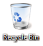

[ Home ](https://github.com/VFPX/Win32API)  

# How to empty the Recycle Bin

## Before you begin:
  

See also:

* [Deleting file into the Recycle Bin](sample_321.md)  
* [How to retrieve number of objects in the Recycle Bin](sample_302.md)  
* [How to remove a directory that is not empty](sample_541.md)  
* [Displaying standard progress dialog box when copying files](sample_508.md)  
  
***  


## Code:
```foxpro  
#DEFINE S_OK    0
#DEFINE SHERB_DEFAULT         0
#DEFINE SHERB_NOCONFIRMATION  1
#DEFINE SHERB_NOPROGRESSUI    2
#DEFINE SHERB_NOSOUND         4

	DECLARE INTEGER SHEmptyRecycleBin IN shell32;
		INTEGER hwnd, STRING pszRootPath, LONG dwFlags

	= SHEmptyRecycleBin (0, "C:", SHERB_DEFAULT)  
```  
***  


## Listed functions:
[SHEmptyRecycleBin](../libraries/shell32/SHEmptyRecycleBin.md)  
