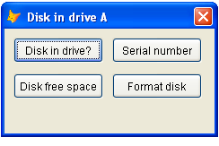

[ Home ](https://github.com/VFPX/Win32API)  

# Disk in drive A:

## Before you begin:
  
See also:

* [Displaying the drive type value](sample_012.md)  
* [Basic Volume information](sample_098.md)  
* [Setting the volume label](sample_151.md)  
* [Obtaining physical parameters for a drive: sectors, clusters, cylinders...](sample_101.md)  
* [Mapping and disconnecting network drives in FoxPro application](sample_387.md)  
* [How to detect when a removable drive gets connected or disconnected](sample_573.md)  

  
***  


## Code:
```foxpro  
LOCAL oForm
oForm = CreateObject("Tform", "A")
oForm.Show(1)

DEFINE CLASS Tform As Form
	Width=234
	Height=120
	MaxButton=.F.
	MinButton=.F.
	Caption=" Disk in drive A"
	Autocenter=.T.
	Keypreview=.T.
	diskname="A"
	
	ADD OBJECT cmd1 As Tcmd WITH Left=10, Top=10,;
	Caption="Disk in drive?"

	ADD OBJECT cmd2 As Tcmd WITH Left=120, Top=10,;
	Caption="Serial number"

	ADD OBJECT cmd3 As Tcmd WITH Left=10, Top=50,;
	Caption="Disk free space"

	ADD OBJECT cmd4 As Tcmd WITH Left=120, Top=50,;
	Caption="Format disk"

PROCEDURE Init(cDiskName)
	IF VARTYPE(m.cDiskName)="C" AND NOT EMPTY(m.cDiskName)
		THIS.diskname=UPPER(ALLTRIM(m.cDiskName))
	ENDIF

PROCEDURE KeyPress
LPARAMETERS nKeyCode, nShiftAltCtrl
	IF nKeyCode = 27
		THIS.Release
	ENDIF

PROCEDURE cmd1.Click
	IF DiskInDrive(ThisForm.diskname + ":\")
		= MESSAGEBOX("Disk found in drive " + ThisForm.diskname)
	ELSE
		= MESSAGEBOX("No disk found in drive " + ThisForm.diskname)
	ENDIF

PROCEDURE cmd2.Click
	LOCAL lnNumber
	lnNumber = GetSerialNumber(ThisForm.diskname + ":\")
	= MESSAGEBOX("Serial number: " + LTRIM(STR(lnNumber)))

PROCEDURE cmd3.Click
	LOCAL lnFreeSpace
	lnFreeSpace = GetFreeSpace(ThisForm.diskname + ":\")
	= MESSAGEBOX("Free space on disk: " +;
		ALLTR(TRANS(lnFreeSpace, "999,999,999")) + " bytes")

PROCEDURE cmd4.Click
	= FormatFloppy(ThisForm.diskname + ":\")

ENDDEFINE

DEFINE CLASS Tcmd As CommandButton
	Height=28
	Width=100
ENDDEFINE

* * *

FUNCTION DiskInDrive(lcRoot)
RETURN GetDiskInfo(lcRoot, 1)

FUNCTION GetSerialNumber(lcRoot)
RETURN GetDiskInfo(lcRoot, 2)

FUNCTION GetDiskInfo(lcRoot, lnMode)
	DECLARE SHORT GetVolumeInformation IN kernel32;
		STRING lcRootPathName, STRING @lpVolumeNameBuffer,;
		INTEGER nVolumeNameSize, INTEGER @lpVolumeSerialNumber,;
		INTEGER @lpMaximumComponentLength, INTEGER @lpFlags,;
		STRING @lpFileSystemNameBuffer, INTEGER nFileSystemNameSize

	LOCAL lcVolBuffer, lnSerial, lnMaxLen, lpFlags,;
		lcSysBuffer, lnResult

	STORE Repli(Chr(0), 250) TO lcVolBuffer, lcSysBuffer
	STORE 0 TO lnSerial, lnMaxLen, lpFlags

	lnResult = GetVolumeInformation(lcRoot, @lcVolBuffer,;
		Len(lcVolBuffer), @lnSerial, @lnMaxLen, @lpFlags,;
		@lcSysBuffer, Len(lcSysBuffer))

	DO CASE
	CASE lnMode = 1  && disk in drive
		RETURN (lnResult <> 0)
	CASE lnMode = 2  && serial number
		RETURN Iif(lnResult=0, 0, lnSerial)
	ENDCASE

DECLARE SHORT GetDiskFreeSpace IN kernel32;
	STRING lpRootPathName,;
	INTEGER @lpSectorsPerCluster,;
	INTEGER @lpBytesPerSector,;
	INTEGER @lpNumberOfFreeClusters,;
	INTEGER @lpTotalNumberOfClusters

STORE 0 TO lpSectorsPerCluster, lpBytesPerSector,;
	lpNumberOfFreeClusters, lpTotalNumberOfClusters

FUNCTION GetFreeSpace(lcRoot)
	IF Not DiskInDrive(lcRoot)
		RETURN 0
	ENDIF

	DECLARE SHORT GetDiskFreeSpace IN kernel32;
		STRING lpRootPathName, INTEGER @lpSectPerClust,;
		INTEGER @lpBytesPerSect, INTEGER @lpNumOfFreeClust,;
		INTEGER @lpTotNumOfClust

	LOCAL lnSecPerClust, lnBtPerSec,;
		lnFreeClust, lnTotClust, lnResult

	STORE 0 TO lnSecPerClust, lnBtPerSec,;
		lnFreeClust, lnTotClust

	lnResult = GetDiskFreeSpace(lcRoot, @lnSecPerClust,;
		@lnBtPerSec, @lnFreeClust, @lnTotClust)
RETURN Iif(lnResult=0, 0, (lnFreeClust * lnSecPerClust * lnBtPerSec))

FUNCTION FormatFloppy(lcRoot)
#DEFINE SHFMT_DRV_A 0
#DEFINE SHFMT_DRV_B 1
#DEFINE SHFMT_ID_DEFAULT 0xFFFF
#DEFINE SHFMT_OPT_QUICKFORMAT 0
#DEFINE SHFMT_OPT_FULLFORMAT 1
#DEFINE SHFMT_OPT_SYSONLY 2
#DEFINE SHFMT_ERROR -1
#DEFINE SHFMT_CANCEL -2
#DEFINE SHFMT_NOFORMAT -3

	IF Not DiskInDrive(lcRoot)
		= MESSAGEBOX("Disk not available")
		RETURN .F.
	ENDIF
	lcRoot = LEFT(lcRoot,1)
	IF Not lcRoot $ "AB"
		= MESSAGEBOX("Should be A or B")
		RETURN .F.
	ENDIF

	DECLARE INTEGER SHFormatDrive IN shell32;
		INTEGER hWindow, INTEGER lpDrive,;
		INTEGER fmtID, INTEGER options

	LOCAL lnResult
	lnResult = SHFormatDrive(0,;
		Iif(lcRoot="A", SHFMT_DRV_A, SHFMT_DRV_B), SHFMT_ID_DEFAULT,;
		SHFMT_OPT_QUICKFORMAT)

	DO CASE
	CASE lnResult = SHFMT_ERROR
		= MESSAGEBOX("Error formatting the drive")
	CASE lnResult = SHFMT_CANCEL
		= MESSAGEBOX("User canceled formatting the drive")
	CASE lnResult = SHFMT_NOFORMAT
		= MESSAGEBOX("Drive is not formatable")
	OTHER
		= MESSAGEBOX("Disk has been formatted")
	ENDCASE
RETURN  
```  
***  


## Listed functions:
[GetDiskFreeSpace](../libraries/kernel32/GetDiskFreeSpace.md)  
[GetVolumeInformation](../libraries/kernel32/GetVolumeInformation.md)  
[SHFormatDrive](../libraries/shell32/SHFormatDrive.md)  

## Comment:
Most of the time, DISKSPACE("A") works good enough.  
  
***  

