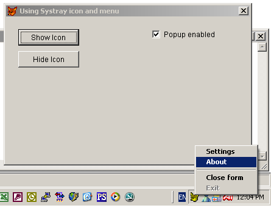
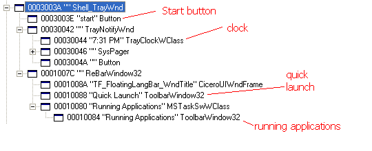
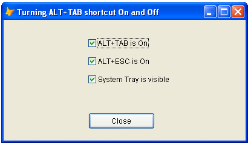

[ Home ](https://github.com/VFPX/Win32API)  

# Using FoxTray ActiveX control: System Tray Icon and menu attached to VFP form

## Before you begin:
Download an archive file with [FoxTray.ocx](../downloads/FoxTray.zip). Check the [Readme](../downloads/FoxTray_Readme.txt) file.  

  

Register control before testing the VFP code below:

`REGSVR32 FoxTray.ocx`

*(use full path to the file)*.  

This control has been created in VB6 and so -- alas! -- requires certain VB support files installed on your computer: 
`MSVBVM60.DLL`


See also:

* [Adding icon to the systray (requires VFP9) ](sample_235.md)  
* [Adding user-defined items to the Control Menu of VFP form (requires VFP9)](sample_512.md)  

  
***  


## Code:
```foxpro  
#DEFINE ccIcon  "house.ico"  && replace with valid ICO file name

PUBLIC objForm
objForm = CreateObject("Tform")
objForm.Visible = .T.

DEFINE CLASS Tform As Form
	Width=400
	Height=240
	MaxButton=.F.
	MinButton=.F.
	Autocenter=.T.
	Caption = " Using Systray icon and menu"
	
	ADD OBJECT cmdShowIcon As CommandButton WITH;
	Caption="Show Icon", Width=100, Height=27,;
	Left=20, Top=20

	ADD OBJECT cmdHideIcon As CommandButton WITH;
	Caption="Hide Icon", Width=100, Height=27,;
	Left=20, Top=56

	ADD OBJECT chPopup As CheckBox WITH;
	Caption=" Popup enabled", Value=.T.,;
	Left=240, Top=20, Autosize=.T., BackStyle=1

PROCEDURE Init
	THIS.AddTrayCtrl

PROCEDURE AddTrayCtrl
	LOCAL lErr
	ON ERROR lErr = .T.
	THIS.AddObject("FoxTray", "TFoxTray")
	ON ERROR
	IF lErr
		= MessageB("ActiveX control not registered   " + Chr(13) +;
			"or VB support not available.            " + Chr(13) + Chr(13) +;
			"Class: FoxTrayCtl.cFoxTray              " + Chr(13) +;
			"File: FoxTray.ocx   " + Chr(13) +;
			"VB support: msvbvm60.dll   ", 48, " FoxTray Control")
	ENDIF

PROCEDURE cmdShowIcon.Click
	WITH ThisForm.FoxTray
		.IconSource = ccIcon
		.ShowIcon
	ENDWITH

PROCEDURE cmdHideIcon.Click
	ThisForm.FoxTray.HideIcon
ENDDEFINE

DEFINE CLASS TFoxTray As OLEControl
	OleClass="FoxTrayCtl.cFoxTray"

PROCEDURE Init
	WITH THIS
		.IconSource = ccIcon
		.IconTip = "FoxPro App"
		.ShowIcon

		* setting popup items, max number = 5
		.GetPopupItem(1).Caption = "Settings"
		.GetPopupItem(2).Caption = "About"
		.GetPopupItem(3).Caption = "-"  && separator
		.GetPopupItem(4).Caption = "Close form"
		.GetPopupItem(5).Caption = "\Exit"  && item disabled
	ENDWITH

PROCEDURE BeforePopupActivate
PARAMETERS lResult
	lResult = ThisForm.chPopup.Value && .F. cancels popup activation

PROCEDURE OnPopupItemSelected
LPARAMETERS lnItem, lcCaption
	DO CASE
	CASE lnItem = 2
		= MessageB("System Tray Icon and Menu Control   ", 64, " About")
	CASE lnItem = 4
		ThisForm.Release
	CASE lnItem = 5
		IF MessageB("Exit FoxPro?   ", 32+4, " FoxTray Control") = 6
			QUIT
		ENDIF
	OTHER
		= MessageB("Popup item selected: " + LTRIM(STR(lnItem)) +;
			", [" + lcCaption + "]")
	ENDCASE
ENDDEFINE

* * *
*|The FoxPro code contains no Win32 functions, all calls moved
*|to the ActiveX part:
*|
*| LoadImage
*| ExtractAssociatedIcon
*| DestroyIcon
*| GetModuleFileName
*| Shell_NotifyIcon
*| CallWindowProc
*| GetWindowLong
*| SetWindowLong
*| CopyMemory
*| GetCursorPos
*| SetRectEmpty
*| CreatePopupMenu
*| TrackPopupMenuEx
*| InsertMenuItem  
```  
***  


## Listed functions:
[CallWindowProc](../libraries/user32/CallWindowProc.md)  
[CopyMemory](../libraries/kernel32/CopyMemory.md)  
[CreatePopupMenu](../libraries/user32/CreatePopupMenu.md)  
[DestroyIcon](../libraries/user32/DestroyIcon.md)  
[ExtractAssociatedIcon](../libraries/shell32/ExtractAssociatedIcon.md)  
[GetCursorPos](../libraries/user32/GetCursorPos.md)  
[GetModuleFileName](../libraries/kernel32/GetModuleFileName.md)  
[GetWindowLong](../libraries/user32/GetWindowLong.md)  
[InsertMenuItem](../libraries/user32/InsertMenuItem.md)  
[LoadImage](../libraries/user32/LoadImage.md)  
[SetWindowLong](../libraries/user32/SetWindowLong.md)  
[Shell_NotifyIcon](../libraries/shell32/Shell_NotifyIcon.md)  
[TrackPopupMenuEx](../libraries/user32/TrackPopupMenuEx.md)  

## Comment:
A fragment of Visual Studion Spy++ screen shows windows inside the system tray:  
  


Among those windows you may notice Windows Start button, Quick Launch toolbar, minimized windows for running applications, system tray clock, window with system tray icons and more.  
  
With quite simple code you may hide the whole system tray:  
  
```foxpro
#DEFINE SW_HIDE  0  
#DEFINE SW_SHOWNORMAL 1  
  
DECLARE INTEGER ShowWindow IN user32 AS ShowWindowA;  
	INTEGER hWindow, INTEGER nCmdShow  
  
DECLARE INTEGER FindWindow IN user32;  
	STRING lpClassName, STRING lpWindowName  
  
hWindow = FindWindow("Shell_TrayWnd", Null)  
= ShowWindowA(hWindow, SW_HIDE)
```

Call ShowWindow with SW_SHOWNORMAL to make the system tray visible again. You may try same code with TrayNotifyWnd and other child windows.  
  
* * *  
Take a look at this example as well [How to block the ALT+TAB shortcut (WinXP)](sample_432.md):  
  
[](sample_432.md)

***  

