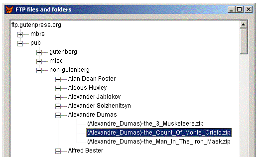

[ Home ](https://github.com/VFPX/Win32API)  

# Reading list of folders and files on FTP server

## Note that this document contains some links to the old news2news website which does not work at the moment. This material will be available sometime in the future.

## Before you begin:
<!-- Anatoliy -->
<table cellspacing=3 cellpadding=0 border=0><tr><td valign=top></td><td valign=top class=fdescr><a href="?article=3">Programming File Transfer Protocol in Visual FoxPro </a></td></tr></table>  

This code stores in a cursor list of all files and directories found on FTP server. Note that for some FTPs this can be a time consuming process.   

Substitute *???* question marks in the following code with valid FTP server *host*, *user* and *password* values.   

Resulting cursor can be displayed in a TreeView Control (this code is not included):  

  

  
***  


## Code:
```foxpro  
#DEFINE ERROR_FTP_TRANSFER_IN_PROGRESS 12110
#DEFINE INTERNET_OPEN_TYPE_DIRECT 1
#DEFINE INTERNET_SERVICE_FTP 1
#DEFINE INTERNET_INVALID_PORT_NUMBER 0

DO declare

LOCAL oFtp

* replace Init parameters with valid host, user and password
* for a FTP server

oFtp = CREATEOBJECT("TFtpDir",;
	"ftp.???.???", "anonymous", "ano@nymous.com")

IF TYPE("oFtp") = "O"
	oFtp.ScanFiles
ENDIF
* end of main

DEFINE CLASS TFtpDir As Custom
hInternet=0
hConnect=0

PROCEDURE Init(lcHost, lcUser, lcPwd)
	THIS.hInternet = InternetOpen("VfpFtp", INTERNET_OPEN_TYPE_DIRECT, 0,0,0)
	IF THIS.hInternet <> 0
		THIS.hConnect = InternetConnect(THIS.hInternet, lcHost,;
			INTERNET_INVALID_PORT_NUMBER, lcUser, lcPwd,;
			INTERNET_SERVICE_FTP, 0, 0)
	ENDIF
	IF THIS.hConnect = 0
		RETURN .F.
	ENDIF

PROCEDURE Destroy
	InternetCloseHandle(THIS.hConnect)
	InternetCloseHandle(THIS.hInternet)

PROCEDURE ScanFiles
	THIS.EnumFiles

	WITH THIS
		DO WHILE .T.
			lnResult = .NextNode()
			DO CASE
			CASE lnResult = 0
				LOOP
			CASE lnResult = 1
				.EnumFiles
			CASE lnResult = -1
				EXIT
			ENDCASE
		ENDDO
	ENDWITH

FUNCTION NextNode
* returns next unprocessed remote folder
	SELECT csResult
	LOCATE ALL FOR Not processed

	IF FOUND()
		IF FtpSetCurrentDirectory(THIS.hConnect, ALLTRIM(csResult.fpath)) <> 1
			REPLACE processed WITH .T., accesserr WITH .T.
			RETURN 0
		ELSE
			RETURN 1
		ENDIF
	ELSE
		RETURN -1
	ENDIF

PROTECTED FUNCTION GetCurrentDir
	DECLARE INTEGER FtpGetCurrentDirectory IN wininet;
		INTEGER hFtpSession, STRING @lpszDir, INTEGER @lpdwCurDir
	LOCAL lcDirectory, lnLen, lnResult
	lcDirectory = SPACE(250)
	lnLen = Len(lcDirectory)
	lnResult = FtpGetCurrentDirectory(THIS.hConnect, @lcDirectory, @lnLen)
RETURN Iif(lnResult=1, LEFT(lcDirectory, lnLen), "#error#")

PROCEDURE EnumFiles
#DEFINE FILE_ATTR_DIR 16
#DEFINE MAX_PATH  260
#DEFINE MAX_DWORD 0xffffffff + 1
#DEFINE FIND_DATA_SIZE 318
#DEFINE INTERNET_FLAG_NEED_FILE 16

	LOCAL lcFPath
	lcFPath = THIS.GetCurrentDir()
	
	IF Not USED("csResult")
		CREATE CURSOR csResult (;
			fpath     C(250),;
			fileattr  I,;
			filecount I,;
			dircount  I,;
			filesize  N(12),;
			isfile    L,;
			processed L,;
			accesserr L )

		INSERT INTO csResult VALUES (;
			lcFPath, 0,0,0,0, .F., .F., .F.)
	ENDIF
	? lcFPath

	LOCAL hFind, lcFBuff, lnFileattr, lcFilename, lnFileCount, lnDirCount,;
		lnFileSize, lProcessed, lIsFile

	STORE 0 TO lnDirCount, lnFileCount, lnFileSize
	lcFBuff = Repli(Chr(0), FIND_DATA_SIZE)

	hFind = FtpFindFirstFile(THIS.hConnect, lcFPath + "/*.*",;
		@lcFBuff, INTERNET_FLAG_NEED_FILE, 0)

	IF hFind <> 0
		DO WHILE .T.
			lcFilename = SUBSTR(lcFBuff, 45,MAX_PATH)
			lcFilename = Left(lcFilename, AT(Chr(0),lcFilename)-1)
			lnFileattr = buf2dword(SUBSTR(lcFBuff, 1,4))
			lnFileSize = buf2dword(SUBSTR(lcFBuff, 29,4)) * MAX_DWORD +;
				buf2dword(SUBSTR(lcFBuff, 33,4))

			IF BitAnd(lnFileattr, FILE_ATTR_DIR) = FILE_ATTR_DIR
			* for a directory
				lnDirCount = lnDirCount + 1
				lProcessed = (lcFilename==".." Or lcFilename==".")
				lIsFile = .F.
			ELSE
			* for a regular file
				lnFileCount = lnFileCount + 1
				lProcessed = .T.
				lIsFile = .T.
			ENDIF
			
			lcFullpath = lcFPath + "/" + lcFilename
			lcFullpath = STRTRAN(lcFullpath, "//", "/")

			INSERT INTO csResult VALUES (lcFullpath,;
				lnFileattr, 0, 0, lnFilesize, lIsFile, lProcessed, .F.)

			IF InternetFindNextFile(hFind, @lcFBuff) = 0
				EXIT
			ENDIF
		ENDDO
	ENDIF

	UPDATE csResult SET dircount = m.lnDirCount,;
		filecount = m.lnFileCount, filesize = m.lnFileSize,;
		processed = .T.;
	WHERE fpath == lcFPath

	= InternetCloseHandle(hFind)
ENDDEFINE

FUNCTION buf2dword(cBuffer)
RETURN Asc(SUBSTR(cBuffer, 1,1)) + ;
	BitLShift(Asc(SUBSTR(cBuffer, 2,1)),  8) +;
	BitLShift(Asc(SUBSTR(cBuffer, 3,1)), 16) +;
	BitLShift(Asc(SUBSTR(cBuffer, 4,1)), 24)

PROCEDURE declare
	DECLARE INTEGER InternetCloseHandle IN wininet INTEGER hInet

	DECLARE INTEGER InternetOpen IN wininet;
		STRING sAgent, INTEGER lAccessType, STRING sProxyName,;
		STRING sProxyBypass, STRING lFlags

    DECLARE INTEGER InternetConnect IN wininet;
		INTEGER hInternetSession, STRING sServerName, INTEGER nServerPort,;
		STRING sUsername, STRING sPassword, INTEGER lService,;
		INTEGER lFlags, INTEGER lContext

	DECLARE INTEGER FtpFindFirstFile IN wininet;
		INTEGER hFtpSession, STRING lpszSearchFile,;
		STRING @lpFindFileData, INTEGER dwFlags, INTEGER dwContent

	DECLARE INTEGER InternetFindNextFile IN wininet;
		INTEGER hFind, STRING @lpvFindData

	DECLARE INTEGER FtpSetCurrentDirectory IN wininet;
		INTEGER hFtpSession, STRING @lpszDirectory  
```  
***  


## Listed functions:
[FtpFindFirstFile](../libraries/wininet/FtpFindFirstFile.md)  
[FtpGetCurrentDirectory](../libraries/wininet/FtpGetCurrentDirectory.md)  
[FtpSetCurrentDirectory](../libraries/wininet/FtpSetCurrentDirectory.md)  
[InternetCloseHandle](../libraries/wininet/InternetCloseHandle.md)  
[InternetConnect](../libraries/wininet/InternetConnect.md)  
[InternetFindNextFile](../libraries/wininet/InternetFindNextFile.md)  
[InternetOpen](../libraries/wininet/InternetOpen.md)  

## Comment:
Two pairs of functions ( FtpFindFirstFile, InternetFindNextFile ) and ( FindFirstFile, FindNextFile ) work similarly, except one important difference.  
  
Between the FtpFindFirstFile and  the InternetCloseHandle calls, the application cannot make another FtpFindFirstFile call for a given FTP session handle. If nevertheless such call is made, the function fails with ERROR_FTP_TRANSFER_IN_PROGRESS error.  
  
The handle returned by the FtpFindFirstFile must be closed with the InternetCloseHandle function when no longer needed.  
  
The FindFirstFile has no such limit; it can have muliple handles opened at the same time.   

***  

