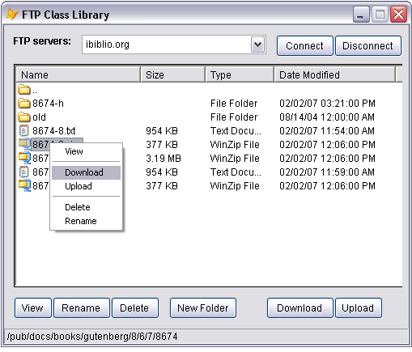

[ Home ](https://github.com/VFPX/Win32API)  

# Custom FTP Class for Visual FoxPro application

## Note that this document contains some links to the old news2news website which does not work at the moment. This material will be available sometime in the future.

## Before you begin:
<!-- Anatoliy  -->
<table cellspacing=3 cellpadding=0 border=0><tr><td valign=top></td><td valign=top class=fdescr><a href="?article=3">Programming File Transfer Protocol in Visual FoxPro </a></td></tr></table>  

The class implements basic FTP operations: connection, directories, downloading and uploading files. All functionality comes from the Microsoft Wininet API library.  

Simple FTP manager form built on this class:  

  

Here is a [sample code](sample_345.md) that uses this class.  

The interface:  

```foxpro
FUNCTION  FtpConnect(lcHost, lcUsr, lcPswd)  
PROCEDURE FtpDisconnect  
PROPERTY  IsConnected  

FUNCTION  GetCurrentDir  
FUNCTION  SetCurrentDir(lcDir)  

FUNCTION  RemoveDir(lcDir)  
FUNCTION  CreateDir(lcDir)  
FUNCTION  DirExists(lcDir)  

FUNCTION  Dir2Cursor(lcCursor)  

FUNCTION  PutToFtp(lcLocalFile, lcRemoteFile, lnChunkSize)  
FUNCTION  GetFromFtp(lcRemoteFile, lcLocalFile, lnChunkSize)  

FUNCTION  BeforePutFile(lcLocalFile, lcRemoteFile)  
PROCEDURE AfterPutFile(lcLocalFile, lcRemoteFile, lResult)  
PROCEDURE OnPutChunk(lcLocalFile, lcRemoteFile, lnBytesWritten)  

FUNCTION  BeforeGetFile(lcRemoteFile, lcLocalFile)  
PROCEDURE AfterGetFile(lcRemoteFile, lcLocalFile, lResult)  
PROCEDURE OnGetChunk(lcRemoteFile, lcLocalFile, lnBytesWritten)
```

See also:

* [Winsock: accessing FTP](sample_386.md)  
* [Using FTPCommand](sample_059.md)  

<!-- Anatoliy --> 

More advanced VFP-based FTP solution:  
<a href="http://www.news2news.com/vfp/?solution=1&src=x344"></a>  
  
***  


## Code:
```foxpro  
DEFINE CLASS clsFtp As Custom

#DEFINE INTERNET_OPEN_TYPE_DIRECT 1
#DEFINE INTERNET_INVALID_PORT_NUMBER 0
#DEFINE INTERNET_SERVICE_FTP 1
#DEFINE INTERNET_FLAG_NEED_FILE 16
#DEFINE FTP_TRANSFER_TYPE_ASCII 1
#DEFINE FTP_TRANSFER_TYPE_BINARY 2
#DEFINE FILE_ATTRIBUTE_READONLY 1
#DEFINE FILE_ATTRIBUTE_HIDDEN 2
#DEFINE FILE_ATTRIBUTE_SYSTEM 4
#DEFINE FILE_ATTRIBUTE_DIRECTORY 16
#DEFINE FILE_ATTRIBUTE_ARCHIVE 32
#DEFINE FILE_ATTRIBUTE_NORMAL 128
#DEFINE FILE_ATTRIBUTE_TEMPORARY 512
#DEFINE FILE_ATTRIBUTE_COMPRESSED 2048
#DEFINE FORMAT_MESSAGE_ALLOCATE_BUFFER 256
#DEFINE FORMAT_MESSAGE_FROM_SYSTEM 4096
#DEFINE FORMAT_MESSAGE_IGNORE_INSERTS 512
#DEFINE GENERIC_READ 0x80000000
#DEFINE GENERIC_WRITE 0x40000000

	LastErr=0
	ErrMsg=""
	host=""
	usr=""
	pswd=""
	IsConnected=.F.
	hInternet=0
	hConn=0

PROCEDURE  Init
	DECLARE INTEGER InternetOpen IN wininet.dll;
		STRING sAgent, INTEGER lAccessType, STRING sProxyName,;
		STRING sProxyBypass, STRING lFlags

	THIS.hInternet = InternetOpen ("VfpFtp 1.0",;
		INTERNET_OPEN_TYPE_DIRECT, 0,0,0)

	IF THIS.hInternet = 0
		RETURN .F.
	ENDIF
	THIS.declare

PROCEDURE Destroy
	THIS.FtpDisconnect
	= InternetCloseHandle(THIS.hInternet)

PROCEDURE ClearError
	THIS.LastErr = 0
	THIS.ErrMsg = ""

PROCEDURE SetError()
	DECLARE INTEGER GetLastError IN kernel32
	DECLARE INTEGER FormatMessage IN kernel32;
		INTEGER dwFlags, INTEGER lpSource, INTEGER dwMsgId,;
		INTEGER dwLangId, INTEGER @lpBuf, INTEGER nSz, INTEGER Args

	THIS.LastErr = GetLastError()

	LOCAL dwFlags, lpBuffer, lnLength
	* specifying format parameters
	dwFlags = FORMAT_MESSAGE_ALLOCATE_BUFFER +;
		FORMAT_MESSAGE_FROM_SYSTEM + FORMAT_MESSAGE_IGNORE_INSERTS

	lpBuffer = 0
	lnLength = FormatMessage (dwFlags, 0, THIS.LastErr, 0, @lpBuffer, 0, 0)
	IF lnLength <> 0
		lpResult = REPLI (Chr(0), 500)
		= CopyMemory (@lpResult, lpBuffer, lnLength)
		THIS.ErrMsg = STRTRAN(LEFT(lpResult, lnLength), Chr(13)+Chr(10), "")
	ELSE
		THIS.ErrMsg = "#undefined#"
	ENDIF

FUNCTION FtpConnect(lcHost, lcUsr, lcPswd)
	THIS.FtpDisconnect

	DECLARE INTEGER InternetConnect IN wininet.dll;
		INTEGER hInetSession, STRING sSrvName, INTEGER nSrvPort,;
		STRING sUsrname, STRING sPwd, INTEGER lService,;
		INTEGER lFlags, INTEGER lContext

	THIS.hConn = InternetConnect (THIS.hInternet, lcHost,;
		INTERNET_INVALID_PORT_NUMBER, lcUsr, lcPswd,;
		INTERNET_SERVICE_FTP, 0, 0)

	IF THIS.hConn <> 0
		THIS.host = lcHost
		THIS.usr = lcUsr
		THIS.pswd = lcPswd
		THIS.IsConnected = .T.
	ELSE
		THIS.SetError()
	ENDIF

PROCEDURE FtpDisconnect
	IF THIS.IsConnected
		= InternetCloseHandle(THIS.hConn)
		STORE "" TO THIS.host, THIS.usr, THIS.pswd
		THIS.IsConnected = .F.
	ENDIF

FUNCTION GetCurrentDir
	if Not THIS.IsConnected
		THIS.SetError()
		RETURN "#not connected#"
	ELSE
		LOCAL lcDirectory, lnLen, lnResult
		lcDirectory = SPACE(250)
		lnLen = Len(lcDirectory)
		lnResult = FtpGetCurrentDirectory (THIS.hConn, @lcDirectory, @lnLen)
		RETURN Iif (lnResult=1, LEFT(lcDirectory, lnLen), "#error#")
	ENDIF

FUNCTION SetCurrentDir(lcDir)
	if Not THIS.IsConnected
		RETURN .F.
	ELSE
		IF (FtpSetCurrentDirectory (THIS.hConn, @lcDir) = 1)
			RETURN .T.
		ELSE
			THIS.SetError()
			RETURN .F.
		ENDIF
	ENDIF

FUNCTION RemoveDir(lcDir)
	IF Not DirExists(lcDir)
		RETURN .T.
	ENDIF
	DECLARE INTEGER FtpRemoveDirectory IN wininet;
		INTEGER hConnect, STRING lpszDirectory
RETURN (FtpRemoveDirectory(THIS.hConn, lcDir) = 1)

FUNCTION CreateDir(lcDir)
	IF DirExists(lcDir)
		RETURN .F.
	ENDIF
	DECLARE INTEGER FtpCreateDirectory IN wininet;
		INTEGER hFtpSession, STRING lpszDirectory
RETURN (FtpCreateDirectory(THIS.hConn, lcDir) = 1)

FUNCTION DirExists(lcDir)
	IF Not THIS.IsConnected
		RETURN .F.
	ELSE
		LOCAL lcCurrentDir
		lcCurrentDir = THIS.GetCurrentDir()

		IF THIS.SetCurrentDir(lcDir)
			THIS.SetCurrentDir(lcCurrentDir)
			RETURN .T.
		ELSE
			RETURN .F.
		ENDIF
	ENDIF

FUNCTION  Dir2Cursor(lcCursor)
	LOCAL lcFullPath, lcFullName, W32struct, lpFndFile, hFind, lnResult
	lcFullPath = THIS.GetCurrentDir()

	* create the cursor
	IF TYPE("lcCursor") <> "C"
		lcCursor = "ftpquery"
	ENDIF

	CREATE CURSOR (lcCursor) (;
		filename   C(250),;
		filesize   N(12),;
		created    T,;
		accessed   T,;
		modified   T,;
		fileattrib N(12),;
		rdonlyfile L,;
		hiddenfile L,;
		sysfile    L,;
		folder     L,;
		archfile   L,;
		normalfile L,;
		tempfile   L,;
		compressed L,;
		rootpath   M;
	)

	* object simulating the WIN32_FIND_DATA structure
	W32struct = CreateObject("struct_WIN32_FIND_DATA")

	* starting from the first file found
	lpFndFile = Repli(Chr(0), 320)
	hFind = FtpFindFirstFile (THIS.hConn, "*.*",;
		@lpFndFile, INTERNET_FLAG_NEED_FILE, 0)

	IF hFind = 0
		lnResult = -1
	ELSE
		DO WHILE .T.
			W32struct.setValue (lpFndFile)
			DO CASE
			CASE W32struct.filename == ".."
				lcFullName = SUBSTR (lcFullPath, 1, RAT("/", lcFullPath)-1)
			CASE W32struct.filename == "."
				lcFullName = lcFullPath
			OTHER
				lcFullName = lcFullPath + "/" + W32struct.filename
			ENDCASE
			lcFullName = STRTRAN(lcFullName, "//","/")

			WITH W32struct
				INSERT INTO (lcCursor) VALUES (;
					.filename, .filesizelo, .creationtime, .lastaccesstime,;
					.lastwritetime, .fileattributes, .IsRdOnly(), .IsHidden(),;
					.IsSystem(), .IsDirectory(), .IsArchive(), .IsNormal(),;
					.IsTemporary(), .IsCompressed(), lcFullName;
			)
			ENDWITH
			IF InternetFindNextFile(hFind, @lpFndFile) <> 1
				EXIT
			ENDIF
		ENDDO
		lnResult = RECCOUNT(lcCursor)
		GO TOP IN (lcCursor)
		= InternetCloseHandle(hFind)
	ENDIF
	RELEASE W32struct
RETURN lnResult

FUNCTION BeforePutFile(lcLocalFile, lcRemoteFile)
* virtual; return .F. to cancel file transfer
RETURN .T.

PROCEDURE AfterPutFile(lcLocalFile, lcRemoteFile, lResult)
* virtual

PROCEDURE OnPutChunk(lcLocalFile, lcRemoteFile, lnBytesWritten)
* virtual

FUNCTION PutToFtp(lcLocalFile, lcRemoteFile, lnChunkSize)
	IF Not (THIS.IsConnected And FILE(lcLocalFile))
		RETURN .F.
	ENDIF

	IF TYPE("lcRemoteFile") <> "C" Or EMPTY(lcRemoteFile)
		lcRemoteFile = SUBSTR(lcLocalFile, RAT("\",lcLocalFile)+1)
	ENDIF
		
	IF Not THIS.BeforePutFile(lcLocalFile, lcRemoteFile)
		RETURN .F.
	ENDIF

	LOCAL lResult
	IF TYPE("lnChunkSize") = "N" And lnChunkSize > 0
		lResult = THIS.PutToFtp1(lcLocalFile, lcRemoteFile, lnChunkSize)
	ELSE
		lResult = (FtpPutFile(THIS.hConn, lcLocalFile, lcRemoteFile,;
			FTP_TRANSFER_TYPE_BINARY, 0) = 1)
	ENDIF
	THIS.AfterPutFile(lcLocalFile, lcRemoteFile, lResult)
RETURN lResult

PROTECTED FUNCTION PutToFtp1(lcLocalFile, lcRemoteFile, lnChunkSize)
* copying local file to the remote target by small portions
	LOCAL hLocal, hRemote, lnBytesWritten, lcBuffer, lnLength
	lnBytesWritten = 0
	hLocal = FOPEN(lcLocalFile)
	IF (hLocal = -1)
		RETURN .F.
	ENDIF

	hRemote = FtpOpenFile(THIS.hConn, lcRemoteFile, GENERIC_WRITE,;
		FTP_TRANSFER_TYPE_BINARY, 0)

	IF hRemote = 0
		= FCLOSE(hLocal)
		RETURN .F.
	ENDIF

	DO WHILE Not FEOF(hLocal)
		lcBuffer = FREAD(hLocal, lnChunkSize)
		lnLength = Len(lcBuffer)
		IF lnLength > 0
			IF InternetWriteFile(hRemote, @lcBuffer, lnLength, @lnLength) = 1
				lnBytesWritten = lnBytesWritten + lnLength
				THIS.OnPutChunk(lcLocalFile, lcRemoteFile, lnBytesWritten)
			ELSE
				EXIT
			ENDIF
		ELSE
			EXIT
		ENDIF
	ENDDO
	= InternetCloseHandle(hRemote)
	= FCLOSE(hLocal)
RETURN .T.

FUNCTION BeforeGetFile(lcRemoteFile, lcLocalFile)
* virtual; return .F. to cancel file transfer
RETURN .T.

PROCEDURE AfterGetFile(lcRemoteFile, lcLocalFile, lResult)
* virtual

PROCEDURE OnGetChunk(lcRemoteFile, lcLocalFile, lnBytesWritten)
* virtual

FUNCTION GetFromFtp (lcRemoteFile, lcLocalFile, lnChunkSize)
	IF Not THIS.IsConnected
		RETURN .F.
	ENDIF

	IF TYPE("lcLocalFile") <> "C" Or EMPTY(lcLocalFile)
		lcLocalFile = SUBSTR(lcRemoteFile, RAT("/",lcRemoteFile)+1)
		lcLocalFile = FULLPATH(lcLocalFile)
	ENDIF

	IF Not THIS.BeforeGetFile(lcRemoteFile, lcLocalFile)
		RETURN .F.
	ENDIF

	LOCAL lResult
	IF TYPE("lnChunkSize") = "N" And lnChunkSize > 0
		lResult = THIS.GetFromFtp1(lcRemoteFile, lcLocalFile, lnChunkSize)
	ELSE
		lResult = (FtpGetFile(THIS.hConn, lcRemoteFile, lcLocalFile,;
			0, FILE_ATTRIBUTE_NORMAL, FTP_TRANSFER_TYPE_BINARY, 0) = 1)
	ENDIF
	THIS.AfterGetFile(lcRemoteFile, lcLocalFile, lResult)
RETURN lResult

PROTECTED FUNCTION GetFromFtp1(lcRemoteFile, lcLocalFile, lnChunkSize)
	LOCAL hRemote, hLocal, lnBytesRead, lcBuffer, lnBufSize
	hLocal = FCREATE (lcLocalFile)
	IF hLocal = -1
		RETURN .F.
	ENDIF
	
	hRemote = FtpOpenFile(THIS.hConn, lcRemoteFile, GENERIC_READ,;
		FTP_TRANSFER_TYPE_BINARY, 0)

	IF hRemote = 0
		FCLOSE(hLocal)
		RETURN .F.
	ENDIF
	
	lnBytesRead = 0
	DO WHILE .T.
		lcBuffer = Repli(Chr(0), lnChunkSize)
		lnBufSize = lnChunkSize
		IF InternetReadFile(hRemote, @lcBuffer, lnBufSize, @lnBufSize) = 1
			IF lnBufSize <> 0
				= FWRITE (hLocal, lcBuffer, lnBufSize)
				lnBytesRead = lnBytesRead + lnBufSize
				THIS.OnGetChunk(lcRemoteFile, lcLocalFile, lnBytesRead)
			ELSE
				EXIT
			ENDIF
		ELSE
			EXIT
		ENDIF
	ENDDO
	= InternetCloseHandle(hRemote)
	= FCLOSE(hLocal)
RETURN .T.

PROCEDURE declare
	DECLARE INTEGER InternetCloseHandle IN wininet.dll INTEGER hInet

	DECLARE RtlMoveMemory IN kernel32 As CopyMemory;
		STRING @Destination, INTEGER Source, INTEGER nLength

	DECLARE INTEGER FtpGetCurrentDirectory IN wininet.dll;
		INTEGER  hFtpSession, STRING @lpszDir, INTEGER @lpdwCurDir

	DECLARE INTEGER FtpSetCurrentDirectory IN wininet.dll;
		INTEGER  hFtpSession, STRING @lpszDir

	DECLARE INTEGER FtpFindFirstFile IN wininet.dll;
		INTEGER hFtpSession, STRING lpszSrchFile,;
		STRING @lpFindFileData, INTEGER dwFlags, INTEGER dwContent

	DECLARE INTEGER InternetFindNextFile IN wininet.dll;
		INTEGER hFind, STRING @lpvFindData

	DECLARE INTEGER FileTimeToSystemTime IN kernel32.dll;
		STRING @lpFileTime, STRING @lpSystemTime

	DECLARE INTEGER FtpOpenFile IN wininet;
		INTEGER hFtpSession, STRING sFileName, INTEGER lAccess,;
		INTEGER lFlags, INTEGER lContext

	DECLARE INTEGER FtpPutFile IN wininet.dll;
		INTEGER hConnect, STRING lpszLocalFile,;
		STRING lpszNewRmtFile, INTEGER dwFlags, INTEGER dwContext

	DECLARE INTEGER FtpGetFile IN wininet;
		INTEGER hConnect, STRING lpszRemoteFile,;
		STRING  lpszNewFile, INTEGER fFailIfExists,;
		INTEGER dwFlagsAndAttr, INTEGER dwFlags, INTEGER dwContext

	DECLARE INTEGER InternetWriteFile IN wininet;
		INTEGER hFile, STRING @sBuffer,;
		INTEGER lBytesToWrite, INTEGER @dwBytesWritten

	DECLARE INTEGER InternetReadFile IN wininet.dll;
		INTEGER hFile, STRING @lpBuffer,;
		INTEGER dwNumberOfBytesToRead, INTEGER @dwBytesRead

ENDDEFINE

DEFINE CLASS struct_WIN32_FIND_DATA As Custom
* this class emulates WIN32_FIND_DATA structure
	value			 = ""
	fileAttributes   = 0
	creationTimeLo   = 0
	creationTimeHi   = 0
	lastAccessTimeHi = 0
	lastAccessTimeLo = 0
	lastWriteTimeHi  = 0
	lastWriteTimeLo  = 0
	fileSizeLo		 = 0 && fileSizeHi omitted
	fileName		 = ""
	creationTime	 = CTOT ("")
	lastAccessTime   = CTOT ("")
	lastWriteTime	 = CTOT ("")

PROCEDURE  setValue (lcValue)	
* translates the buffer"s content into the object"s properties
	THIS.value			  = lcValue
	THIS.fileAttributes   = THIS.buf2num (THIS.value,  0, 4)
	THIS.creationTimeLo   = THIS.buf2num (THIS.value,  4, 4)
	THIS.creationTimeHi   = THIS.buf2num (THIS.value,  8, 4)
	THIS.lastAccessTimeHi = THIS.buf2num (THIS.value, 12, 4)
	THIS.lastAccessTimeLo = THIS.buf2num (THIS.value, 16, 4)
	THIS.lastWriteTimeHi  = THIS.buf2num (THIS.value, 20, 4)
	THIS.lastWriteTimeLo  = THIS.buf2num (THIS.value, 24, 4)
	THIS.fileSizeLo		  = THIS.buf2num (THIS.value, 32, 4)
	THIS.creationTime	  = THIS.ftime2dtime (SUBSTR(THIS.value,  5, 8))
	THIS.lastAccessTime   = THIS.ftime2dtime (SUBSTR(THIS.value, 13, 8))
	THIS.lastWriteTime	  = THIS.ftime2dtime (SUBSTR(THIS.value, 21, 8))
	THIS.fileName		  = ALLTRIM(SUBSTR(THIS.value, 45,250))
	IF AT(Chr(0), THIS.fileName) <> 0
		THIS.fileName = SUBSTR (THIS.fileName, 1, AT(Chr(0), THIS.fileName)-1)
	ENDIF

FUNCTION AttribSet (lnAttrib)
RETURN BitAnd(THIS.fileAttributes, lnAttrib) = lnAttrib

FUNCTION IsRdOnly
RETURN THIS.AttribSet(FILE_ATTRIBUTE_READONLY)

FUNCTION IsHidden
RETURN THIS.AttribSet(FILE_ATTRIBUTE_HIDDEN)

FUNCTION IsSystem
RETURN THIS.AttribSet(FILE_ATTRIBUTE_SYSTEM)

FUNCTION IsDirectory
RETURN THIS.AttribSet(FILE_ATTRIBUTE_DIRECTORY)

FUNCTION IsArchive
RETURN THIS.AttribSet(FILE_ATTRIBUTE_ARCHIVE)

FUNCTION IsNormal
RETURN THIS.AttribSet(FILE_ATTRIBUTE_NORMAL)

FUNCTION IsTemporary
RETURN THIS.AttribSet(FILE_ATTRIBUTE_TEMPORARY)

FUNCTION IsCompressed
RETURN THIS.AttribSet(FILE_ATTRIBUTE_COMPRESSED)

FUNCTION buf2num(lcBuffer, lnOffset, lnBytes)
* converts N bytes from the buffer into a numeric value
	lnResult = 0
	FOR ii=1 TO lnBytes
		lnResult = lnResult +;
			BitLShift(Asc(SUBSTR(lcBuffer, lnOffset+ii, 1)), (ii-1)*8)
	ENDFOR
RETURN lnResult

FUNCTION  ftime2dtime (lcFileTime)
	LOCAL lcSystemTime, ltResult, lcStoredSet
	IF lcFileTime = REPLI (Chr(0), 8)
		ltResult = CTOT ("")
	ELSE
		lcSystemTime = REPLI (Chr(0), 16)
		= FileTimeToSystemTime (@lcFileTime, @lcSystemTime)
		wYear   = THIS.buf2num (lcSystemTime,  0, 2)
		wMonth  = THIS.buf2num (lcSystemTime,  2, 2)
		wDay	= THIS.buf2num (lcSystemTime,  6, 2)
		wHour   = THIS.buf2num (lcSystemTime,  8, 2)
		wMinute = THIS.buf2num (lcSystemTime, 10, 2)
		wSecond = THIS.buf2num (lcSystemTime, 12, 2)

		lcStoredSet = SET ("DATE")
		SET DATE TO MDY
		lcDate = STRTRAN (STR(wMonth,2) + "/" +;
			STR(wDay,2) + "/" + STR(wYear,4), " ","0")
		lcTime = STRTRAN (STR(wHour,2) + ":" +;
			STR(wMinute,2) + ":" + STR(wSecond,2), " ","0")
		ltResult = CTOT (lcDate + " " + lcTime)
		SET DATE TO &lcStoredSet
	ENDIF
RETURN ltResult
ENDDEFINE  
```  
***  


## Listed functions:
[CopyMemory](../libraries/kernel32/CopyMemory.md)  
[FileTimeToSystemTime](../libraries/kernel32/FileTimeToSystemTime.md)  
[FormatMessage](../libraries/kernel32/FormatMessage.md)  
[FtpCreateDirectory](../libraries/wininet/FtpCreateDirectory.md)  
[FtpFindFirstFile](../libraries/wininet/FtpFindFirstFile.md)  
[FtpGetCurrentDirectory](../libraries/wininet/FtpGetCurrentDirectory.md)  
[FtpGetFile](../libraries/wininet/FtpGetFile.md)  
[FtpOpenFile](../libraries/wininet/FtpOpenFile.md)  
[FtpPutFile](../libraries/wininet/FtpPutFile.md)  
[FtpRemoveDirectory](../libraries/wininet/FtpRemoveDirectory.md)  
[FtpSetCurrentDirectory](../libraries/wininet/FtpSetCurrentDirectory.md)  
[GetLastError](../libraries/kernel32/GetLastError.md)  
[InternetCloseHandle](../libraries/wininet/InternetCloseHandle.md)  
[InternetConnect](../libraries/wininet/InternetConnect.md)  
[InternetFindNextFile](../libraries/wininet/InternetFindNextFile.md)  
[InternetOpen](../libraries/wininet/InternetOpen.md)  
[InternetReadFile](../libraries/wininet/InternetReadFile.md)  
[InternetWriteFile](../libraries/wininet/InternetWriteFile.md)  

## Comment:
Because of the VFP one-process and one-thread nature such FTP class -- under some circumstances -- is able to freeze the whole VFP application. With less reliable FTP connections I would choose an external library allowing to drop a frozen FTP connection.  
  
* * *  
To create a passive data connection to an FTP server, use INTERNET_FLAG_PASSIVE for *dwFlags* parameter in the InternetConnect call:  
  
```foxpro
#DEFINE INTERNET_INVALID_PORT_NUMBER 0  
#DEFINE INTERNET_SERVICE_FTP         1  
#DEFINE INTERNET_FLAG_PASSIVE 0x08000000  
  
nFlags = INTERNET_FLAG_PASSIVE  </font><font color=#008000>&& use 0 for the active mode</font></font>  
  
hConnection = InternetConnect(m.hInternet, m.host,;  
	INTERNET_INVALID_PORT_NUMBER,;  
	m.usr, m.cPsw, INTERNET_SERVICE_FTP, m.nFlags, 0)
```

***  

