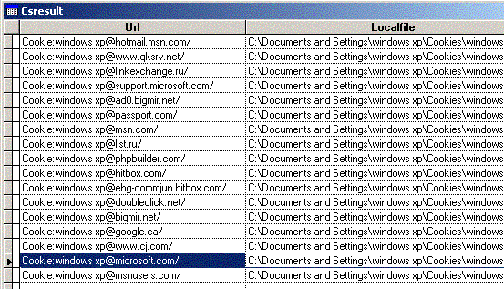

[ Home ](https://github.com/VFPX/Win32API)  

# How to enumerate cookies and URL History entries in the cache of the local computer

## Before you begin:
Definitely this code can return a kind of revealing results :)  
  
  
***  


## Code:
```foxpro  
#DEFINE CACHEGROUP_SEARCH_ALL 0
DO decl

LOCAL hGroup, lcGroupId
lcGroupId = Repli(Chr(0), 64)
hGroup = FindFirstUrlCacheGroup(0,CACHEGROUP_SEARCH_ALL,0,0, @lcGroupId, 0)

IF hGroup <> 0
	DO WHILE .T.
		DO ProcessGroup
		IF FindNextUrlCacheGroup(hGroup, @lcGroupId, 0) = 0
			lnError = GetLastError()  && usually 2 = ERROR_FILE_NOT_FOUND
			EXIT
		ENDIF
	ENDDO
ENDIF
= FindCloseUrlCache(hGroup)
* end of main

PROCEDURE ProcessGroup
*|typedef struct _INTERNET_CACHE_ENTRY_INFO  {
*| DWORD dwStructSize;         0:4
*| LPTSTR lpszSourceUrlName;   4:4
*| LPTSTR lpszLocalFileName;   8:4
*| DWORD CacheEntryType;      12:4
*| DWORD dwUseCount;
*| DWORD dwHitRate;
*| DWORD dwSizeLow;
*| DWORD dwSizeHigh;
*| FILETIME LastModifiedTime;
*| FILETIME ExpireTime;
*| FILETIME LastAccessTime;
*| FILETIME LastSyncTime;
*| LPBYTE lpHeaderInfo;
*| DWORD dwHeaderInfoSize;
*| LPTSTR lpszFileExtension;
*| union {
*| 	DWORD dwReserved;
*| 	DWORD dwExemptDelta;
*| 	};
*|} INTERNET_CACHE_ENTRY_INFO, *LPINTERNET_CACHE_ENTRY_INFO;

#DEFINE SUFFICIENT_BUF_SIZE  16384

	LOCAL hFind, lpBuffer, lnBufsize, lcBuffer,;
		lcSourceUrl, lcLocalFile

	lpBuffer = GlobalAlloc(0, SUFFICIENT_BUF_SIZE)
	lnBufsize = SUFFICIENT_BUF_SIZE

	* choose one of the following three options: cookies, history, all
	* important: one at a time :)

	* cookies
	hFind = FindFirstUrlCacheEntry("cookie:", lpBuffer, @lnBufsize)

	* history
*	hFind = FindFirstUrlCacheEntry("visited:", lpBuffer, @lnBufsize)

	* all cached urls
*	hFind = FindFirstUrlCacheEntry("*.*", lpBuffer, @lnBufsize)

	IF hFind <> 0
		CREATE CURSOR csResult (url C(250), localfile C(250))
		DO WHILE .T.
			* parsing returned buffer, an ugly way, no other option?
			lcBuffer = Repli(Chr(0), lnBufsize)
			Mem2Str(@lcBuffer, lpBuffer, lnBufsize)
			
			* source URL
			lcSourceUrl = SUBSTR(lcBuffer,;
				buf2dword(SUBSTR(lcBuffer,5,4))-lpBuffer+1)
			lcSourceUrl = SUBSTR(lcSourceUrl, 1,AT(Chr(0),lcSourceUrl)-1)
			
			* local file name
			lcLocalFile = SUBSTR(lcBuffer,;
				buf2dword(SUBSTR(lcBuffer,9,4))-lpBuffer+1)
			lcLocalFile = SUBSTR(lcLocalFile, 1,AT(Chr(0),lcLocalFile)-1)
			
			INSERT INTO csResult VALUES (lcSourceUrl, lcLocalFile)
			
			lnBufsize = SUFFICIENT_BUF_SIZE
			IF FindNextUrlCacheEntry(hFind, lpBuffer, @lnBufsize) = 0
				EXIT  && usually 259 = ERROR_NO_MORE_ITEMS
			ENDIF
		ENDDO
		= FindCloseUrlCache(hFind)
		GO TOP
		BROWSE NORMAL NOWAIT
	ELSE
		? "Error code:", GetLastError()
	ENDIF
	= GlobalFree(lpBuffer)

PROCEDURE decl
	DECLARE INTEGER FindFirstUrlCacheGroup In wininet;
		LONG dwFlags, LONG dwFilter, LONG lpSearchCond,;
		LONG dwSearchCond, STRING @lpGroupId, INTEGER @lpReserved

	DECLARE INTEGER FindNextUrlCacheGroup IN wininet;
		INTEGER hFind, STRING @lpGroupId, INTEGER @lpReserved

	DECLARE INTEGER FindCloseUrlCache IN wininet INTEGER hEnumHandle
	DECLARE INTEGER GetLastError IN kernel32

	DECLARE INTEGER FindFirstUrlCacheEntry In wininet;
		STRING lpszUrlSearchPattern, LONG lpFirstCacheEntryInfo,;
		LONG @lpdwFirstCacheEntryInfoBufferSize

	DECLARE INTEGER FindNextUrlCacheEntry IN wininet;
		INTEGER hEnumHandle, LONG lpNextCacheEntryInfo,;
		LONG @lpdwNextCacheEntryInfoBufferSize

	DECLARE RtlMoveMemory IN kernel32 As Mem2Str;
		STRING @Dest, INTEGER Src, INTEGER nLength

	DECLARE INTEGER GlobalFree IN kernel32 INTEGER hMem
	DECLARE INTEGER GlobalAlloc IN kernel32;
		INTEGER wFlags, INTEGER dwBytes

FUNCTION  buf2dword (lcBuffer)
RETURN Asc(SUBSTR(lcBuffer, 1,1)) + ;
	BitLShift(Asc(SUBSTR(lcBuffer, 2,1)),  8) +;
	BitLShift(Asc(SUBSTR(lcBuffer, 3,1)), 16) +;
	BitLShift(Asc(SUBSTR(lcBuffer, 4,1)), 24)  
```  
***  


## Listed functions:
[FindCloseUrlCache](../libraries/wininet/FindCloseUrlCache.md)  
[FindFirstUrlCacheEntry](../libraries/wininet/FindFirstUrlCacheEntry.md)  
[FindFirstUrlCacheGroup](../libraries/wininet/FindFirstUrlCacheGroup.md)  
[FindNextUrlCacheEntry](../libraries/wininet/FindNextUrlCacheEntry.md)  
[FindNextUrlCacheGroup](../libraries/wininet/FindNextUrlCacheGroup.md)  
[GetLastError](../libraries/kernel32/GetLastError.md)  
[GlobalAlloc](../libraries/kernel32/GlobalAlloc.md)  
[GlobalFree](../libraries/kernel32/GlobalFree.md)  

***  

