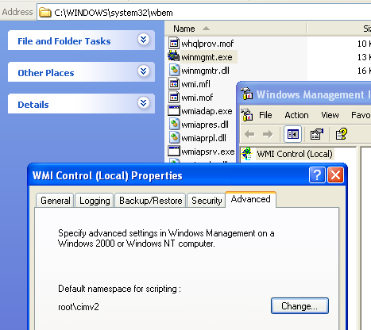

[ Home ](https://github.com/VFPX/Win32API)  

# How to enumerate, add and delete shares on the local computer (WinNT/XP)

## Before you begin:
This code sample presents the SharedResources class that encapsulates a collection of the SHARE_INFO_2 objects.   

Note that all NetShare API calls require Unicode string parameters.  

Use the following code to test the SharedResources class:  
 
```foxpro
LOCAL oShares As SharedResources, oShare As Share_Info_2  
oShares = CREATEOBJECT("SharedResources")  && local computer  

FOR EACH oShare IN oShares.shares  
	IF oShare.sharetype=0  && disk drive  
		? FromUnicode(oShare.sharename) + "=" +;  
			FromUnicode(oShare.localpath)  
	ENDIF  
NEXT
```

See also:


* [Enumerating network resources](sample_313.md)  
* [Mapping and disconnecting network drives in FoxPro application](sample_387.md)  
* [Retrieving lists of servers of the specified type visible in the primary domain (WinNT/2K)](sample_165.md)  
* [Enumerating sessions established on a server](sample_505.md)  

  
***  


## Code:
```foxpro  
DEFINE CLASS SharedResources As Session
PROTECTED servername
	servername=NULL
	shares=NULL
	errorno=0

PROCEDURE Init(cServer)
	IF VARTYPE(m.cServer)="C"
		THIS.servername=ToUnicode(m.cServer)
	ENDIF
	THIS.declare
	THIS.shares = CREATEOBJECT("Collection")
	THIS.EnumShares

PROCEDURE Destroy
	IF !ISNULL(THIS.shares)
		LOCAL oShare As Share_Info_2
		FOR EACH oShare IN THIS.shares
			oShare.Release
			oShare=NULL
		NEXT
		DO WHILE THIS.shares.Count > 0
			THIS.shares.Remove(1)
		ENDDO
	ENDIF

PROCEDURE GetShare(cSharename)
	THIS.EnumShares
	LOCAL oShare As Share_Info_2
	FOR EACH oShare IN THIS
		IF oShare.sharename=m.cSharename
			RETURN m.oShare
		ENDIF
		oShare=NULL
	NEXT
RETURN NULL

PROCEDURE AddShare(cSharename, nSharetype,;
	cRemark, nPermissions, nMaxuses,;
	cLocalpath, cPasswd)

	LOCAL oShare As Share_Info_2, cBuffer, nParmErr
	oShare = CREATEOBJECT("Share_Info_2",;
		cSharename, nSharetype, cRemark, nPermissions,;
		nMaxuses, cLocalpath, cPasswd)

	cBuffer = oShare.ToString()
	nParmErr=0
	THIS.errorno = NetShareAdd(THIS.servername, 2,;
		@cBuffer, @nParmErr)

	oShare=NULL
	THIS.EnumShares
RETURN (THIS.errorno=0)

PROCEDURE EnumShares
#DEFINE INFO_2_SIZE 32
#DEFINE MAX_PREFERRED_LENGTH -1
	DO WHILE THIS.shares.Count > 0
		THIS.shares.Remove(1)
	ENDDO

	LOCAL nBuffer, nCount, nTotal, nBufsize, cBuffer, cInfo
	STORE 0 TO nBuffer, nCount, nTotal, nBufsize

	THIS.errorno = NetShareEnum(THIS.servername, 2,;
		@nBuffer, MAX_PREFERRED_LENGTH, @nCount, @nTotal, 0)

	IF THIS.errorno <> 0;
		OR nBuffer=0 OR nCount=0
		RETURN
	ENDIF

	* copy data from memory to string
	= NetApiBufferSize(nBuffer, @nBufsize)
	cBuffer = REPLICATE(Chr(0), nBufsize)
	= Mem2Str(@cBuffer, nBuffer, nBufsize)
	= NetApiBufferFree(nBuffer)
	
	* parse returned buffer
	FOR nIndex=0 TO nCount-1
		LOCAL oShare As Share_Info_2
		oShare = CREATEOBJECT("Share_Info_2")
		cInfo = SUBSTR(cBuffer, (nIndex)*INFO_2_SIZE+1, INFO_2_SIZE)
		WITH oShare
			.AllShares=THIS
			.sharetype=buf2dword(SUBSTR(cInfo,5,4))
			.permissions=buf2dword(SUBSTR(cInfo,13,4))
			.maxuses=buf2dword(SUBSTR(cInfo,17,4))
			.currentuses=buf2dword(SUBSTR(cInfo,21,4))

			.sharename=THIS.StrFromMem(@cBuffer,;
				buf2dword(SUBSTR(cInfo,1,4))-nBuffer)
			.remark=THIS.StrFromMem(@cBuffer,;
				buf2dword(SUBSTR(cInfo,9,4))-nBuffer)
			.localpath=THIS.StrFromMem(@cBuffer,;
				buf2dword(SUBSTR(cInfo,25,4))-nBuffer)
			.passwd=THIS.StrFromMem(@cBuffer,;
				buf2dword(SUBSTR(cInfo,29,4))-nBuffer)
		ENDWITH
		THIS.shares.Add(oShare)
		oShare=NULL
	NEXT

PROTECTED FUNCTION StrFromMem(cBuffer, nOffset)
	LOCAL cResult, ch
	cResult=""
	IF nOffset >= 0
		FOR nOffset=nOffset+1 TO LEN(cBuffer) STEP 2
			ch = SUBSTR(cBuffer, nOffset, 2)
			IF m.ch = CHR(0)+CHR(0)
				EXIT
			ENDIF
			cResult=m.cResult + m.ch
		NEXT
	ENDIF
RETURN m.cResult

PROTECTED PROCEDURE declare
	DECLARE INTEGER NetApiBufferFree IN netapi32 INTEGER Buffer

	DECLARE INTEGER NetApiBufferSize IN netapi32;
		INTEGER Buffer, INTEGER @ByteCount

	DECLARE INTEGER NetShareEnum IN netapi32;
		STRING servername, LONG lvl, INTEGER @bufptr,;
		LONG prefmaxlen, LONG @entriesread, LONG @totalentries,;
		LONG resume_handle

	DECLARE RtlMoveMemory IN kernel32 As Mem2Str;
		STRING @Destination, INTEGER Source, INTEGER nLength

	DECLARE INTEGER NetShareAdd IN netapi32;
		STRING servername, LONG lvl,;
		STRING @buffer, LONG @parm_err

	DECLARE INTEGER NetShareDel IN netapi32;
		STRING servername, STRING netname, LONG reserved

	DECLARE INTEGER NetShareSetInfo IN netapi32;
		STRING servername, STRING netname, LONG lvl,;
		STRING @buf, LONG @parm_err

ENDDEFINE

DEFINE CLASS Share_Info_2 As Session
PROTECTED oSharename, oRemark, oLocalpath, oPasswd
	sharename=""
	sharetype=0
	remark=""
	permissions=0
	maxuses=-1
	currentuses=0
	localpath=""
	passwd=""
	AllShares=NULL

PROCEDURE Init(cSharename, nSharetype,;
	cRemark, nPermissions, nMaxuses,;
	cLocalpath, cPasswd)

	THIS.sharename=m.cSharename
	THIS.sharetype=m.nSharetype
	THIS.remark=m.cRemark
	THIS.permissions=m.nPermissions
	THIS.maxuses=m.nMaxuses
	THIS.localpath=m.cLocalpath
	THIS.passwd=m.cPasswd

PROCEDURE sharename_ASSIGN(vValue)
	IF VARTYPE(m.vValue)="C"
		THIS.sharename=ToUnicode(m.vValue)
	ENDIF

PROCEDURE remark_ASSIGN(vValue)
	IF VARTYPE(m.vValue)="C"
		THIS.remark=ToUnicode(m.vValue)
	ENDIF

PROCEDURE localpath_ASSIGN(vValue)
	IF VARTYPE(m.vValue)="C"
		THIS.localpath=ToUnicode(m.vValue)
	ENDIF

PROCEDURE passwd_ASSIGN(vValue)
	IF VARTYPE(m.vValue)="C"
		THIS.passwd=ToUnicode(m.vValue)
	ENDIF

PROCEDURE sharetype_ASSIGN(vValue)
	IF VARTYPE(m.vValue)="N"
		THIS.sharetype=m.vValue
	ENDIF

PROCEDURE permissions_ASSIGN(vValue)
	IF VARTYPE(m.vValue)="N"
		THIS.permissions=m.vValue
	ENDIF

PROCEDURE maxuses_ASSIGN(vValue)
	IF VARTYPE(m.vValue)="N"
		THIS.maxuses=m.vValue
	ENDIF

PROCEDURE currentuses_ASSIGN(vValue)
	IF VARTYPE(m.vValue)="N"
		THIS.currentuses=m.vValue
	ENDIF

PROCEDURE Destroy
	THIS.UnlockData
	THIS.AllShares=NULL

PROCEDURE UnlockData
	STORE NULL TO THIS.oSharename, THIS.oRemark,;
		THIS.oLocalpath, THIS.oPasswd

PROCEDURE ToString
	THIS.UnlockData

	THIS.oSharename = CREATEOBJECT("PChar", THIS.sharename)
	THIS.oRemark = CREATEOBJECT("PChar", THIS.remark)
	THIS.oLocalpath = CREATEOBJECT("PChar", THIS.localpath)
	THIS.oPasswd = CREATEOBJECT("PChar", THIS.passwd)

	LOCAL cBuffer
	cBuffer = num2dword(THIS.oSharename.GetAddr()) +;
		num2dword(THIS.sharetype) +;
		num2dword(THIS.oRemark.GetAddr()) +;
		num2dword(THIS.permissions) +;
		num2dword(THIS.maxuses) +;
		num2dword(THIS.currentuses) +;
		num2dword(THIS.oLocalpath.GetAddr()) +;
		num2dword(THIS.oPasswd.GetAddr())
RETURN m.cBuffer

PROCEDURE DeleteShare
	LOCAL nResult
	nResult = NetShareDel(THIS.servername, THIS.sharename, 0)
	
	IF NOT ISNULL(THIS.AllShares)
		THIS.AllShares.EnumShares
	ENDIF
RETURN (nResult=0)

PROCEDURE UpdateInfo
	LOCAL cBuffer, nParmErr, nResult

	WITH THIS
		.remark = m.cRemark
		.permissions = m.nPermissions
		.maxuses = m.nMaxuses
		.localpath = m.cLocalpath
		.passwd = m.cPasswd
	ENDWITH

	cBuffer=THIS.ToString()
	nParmErr=0

	nResult = NetShareSetInfo(THIS.servername,;
		THIS.sharename, 2,;
		@cBuffer, @nParmErr)

	IF NOT ISNULL(THIS.AllShares)
		THIS.AllShares.EnumShares
	ENDIF
RETURN (nResult=0)

ENDDEFINE

************************ static library ***************************
FUNCTION IsUnicode(cSource)
RETURN LEN(cSource) > 2 AND SUBSTR(cSource,2,1)=CHR(0);
	AND SUBSTR(cSource,3,1)!=CHR(0)

FUNCTION ToUnicode(cSource) As String
RETURN IIF(IsUnicode(m.cSource), m.cSource,;
	STRCONV(cSource+CHR(0),5))

FUNCTION FromUnicode(cSource) As String
RETURN IIF(IsUnicode(m.cSource),;
	STRCONV(cSource+CHR(0),6), m.cSource)

FUNCTION buf2dword(cBuffer)
RETURN Asc(SUBSTR(cBuffer, 1,1)) + ;
	BitLShift(Asc(SUBSTR(cBuffer, 2,1)),  8) +;
	BitLShift(Asc(SUBSTR(cBuffer, 3,1)), 16) +;
	BitLShift(Asc(SUBSTR(cBuffer, 4,1)), 24)

FUNCTION num2dword(lnValue)
#DEFINE m0 0x0000100
#DEFINE m1 0x0010000
#DEFINE m2 0x1000000
	IF lnValue < 0
		lnValue = 0x100000000 + lnValue
	ENDIF
	LOCAL b0, b1, b2, b3
	b3 = Int(lnValue/m2)
	b2 = Int((lnValue - b3*m2)/m1)
	b1 = Int((lnValue - b3*m2 - b2*m1)/m0)
	b0 = Mod(lnValue, m0)
RETURN Chr(b0)+Chr(b1)+Chr(b2)+Chr(b3)

DEFINE CLASS PChar As Session
PROTECTED hMem

PROCEDURE Init(lcString)
	THIS.hMem = 0
	THIS.setValue(lcString)

PROCEDURE Destroy
	THIS.ReleaseString

FUNCTION GetAddr
RETURN THIS.hMem

FUNCTION GetValue
	LOCAL lnSize, lcBuffer
	lnSize = THIS.GetAllocSize()
	lcBuffer = SPACE(lnSize)

	IF THIS.hMem <> 0
		DECLARE RtlMoveMemory IN kernel32 As MemToStr;
			STRING @, INTEGER, INTEGER
		= MemToStr(@lcBuffer, THIS.hMem, lnSize)
	ENDIF
RETURN lcBuffer

FUNCTION GetAllocSize
	DECLARE INTEGER GlobalSize IN kernel32 INTEGER hMem
RETURN Iif(THIS.hMem=0, 0, GlobalSize(THIS.hMem))

PROCEDURE SetValue(lcString)
#DEFINE GMEM_FIXED 0
	THIS.ReleaseString

	DECLARE INTEGER GlobalAlloc IN kernel32 INTEGER, INTEGER
	DECLARE RtlMoveMemory IN kernel32 As StrToMem;
		INTEGER, STRING @, INTEGER

	LOCAL lnSize
	lcString = lcString + Chr(0)
	lnSize = Len(lcString)
	THIS.hMem = GlobalAlloc(GMEM_FIXED, lnSize)
	IF THIS.hMem <> 0
		= StrToMem(THIS.hMem, @lcString, lnSize)
	ENDIF

PROCEDURE ReleaseString
	IF THIS.hMem <> 0
		DECLARE INTEGER GlobalFree IN kernel32 INTEGER
		= GlobalFree (THIS.hMem)
		THIS.hMem = 0
	ENDIF
ENDDEFINE  
```  
***  


## Listed functions:
[GlobalAlloc](../libraries/kernel32/GlobalAlloc.md)  
[GlobalFree](../libraries/kernel32/GlobalFree.md)  
[GlobalSize](../libraries/kernel32/GlobalSize.md)  
[NetApiBufferFree](../libraries/netapi32/NetApiBufferFree.md)  
[NetApiBufferSize](../libraries/netapi32/NetApiBufferSize.md)  
[NetShareAdd](../libraries/netapi32/NetShareAdd.md)  
[NetShareDel](../libraries/netapi32/NetShareDel.md)  
[NetShareEnum](../libraries/netapi32/NetShareEnum.md)  
[NetShareSetInfo](../libraries/netapi32/NetShareSetInfo.md)  

## Comment:
Code rewritten: Dec.2, 2005  
  
Administrator, Power User, Print Operator, or Server Operator group membership is required to successfully execute the NetShareEnum function at levels 2 and 502.  
  

* * *  




***  

