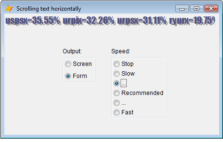
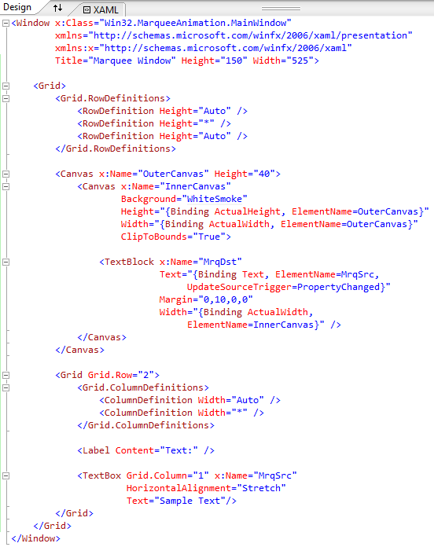

[ Home ](https://github.com/VFPX/Win32API)  

# How to put a horizontal text scrolling on the form (a news line, marquee)

## Before you begin:
  

See also:

* [Scrolling text on the form vertically (a movie cast)](sample_354.md)  
* [Shaking VFP form controls](sample_526.md)  
* [Playing AVI on _screen](sample_430.md)  
* [Displaying animated images](sample_355.md)  
* [Form Magnifier](sample_414.md)  

  
***  


## Code:
```foxpro  
PUBLIC oForm
oForm = CreateObject("Tform")
oForm.Visible = .T.

DEFINE CLASS Tform As Form
	Width=540
	Height=250
	Caption=" Scrolling text horizontally"
	Autocenter=.T.
	
	SrcLen=3000      && width of source memory bitmap
	TrgLen=400       && target width
	TrgHeight=24     && target height
	SrcOffs=0        && initial offset
	MSecPerPixel=0   && scroll speed in milliseconds per pixel
	LastTickCount=0  && saved ticker value
	OffsCollected=0  && collects offset fractions
	
	* sample long string to be scrolled
	content = "foctx=23.93%  thpsx=14.77%  nbssx=14.57%  " +;
		"nbfcx=14.55%  nbfax=14.45%  hefgx=13.12%  " +;
		"lmnvx=12.18%  gnaax=12.14%  lmvfx=12.08%  " +;
		"lmvtx=11.84%  uspix=36.56%  uspsx=35.55%  " +;
		"urpix=32.26%  urpsx=31.11%  ryurx=19.75%  " +;
		"ryuax=19.11%  brpix=18.17%  brpsx=16.89%  " +;
		"pspsx=15.64%  anpax=5.86%  urpix=23.25%  " +;
		"urpsx=22.19%  ryurx=16.79%  ryuax=16.16%  " +;
		"hibcx=15.39%  brpix=15.28%  brpsx=14.20%  " +;
		"pspsx=11.16%  mpgfx=8.92%  thpgx=7.66%  "

	hMemDC=0   && memory device context
	hMemBmp=0  && memory bitmap
	hForm=0    && window handle for the form
	hFormDC=0  && device context for the form
	hFont=0    && font handle

	ADD OBJECT lbl1 As Tlbl WITH Left=120, Top=70, Caption="Output:"
	ADD OBJECT lbl2 As Tlbl WITH Left=220, Top=70, Caption="Speed:"
	ADD OBJECT ogOutput As Toutput WITH Left=120, Top=90, Value=2
	ADD OBJECT ogSpeed As Tspeed WITH Left=220, Top=90
	ADD OBJECT tm As Timer WITH interval=0

PROCEDURE Init
	THIS.decl
	THIS.CreateSource

PROCEDURE Destroy
	= ReleaseDC(THIS.hForm, THIS.hFormDC)
	= DeleteObject(THIS.hMemBmp)
	= DeleteObject(THIS.hFont)
	= DeleteDC(THIS.hMemDC)

PROCEDURE Activate
	IF ThisForm.hForm = 0
	* window handle and device context for the form
		ThisForm.hForm = GetFocus()
		ThisForm.hFormDC = GetWindowDC(ThisForm.hForm)
	ENDIF
	
PROCEDURE tm.timer
	ThisForm.CopyToTarget

PROCEDURE ogSpeed.InteractiveChange
* changes scroll speed
	IF THIS.Value = 1
		ThisForm.tm.Interval = 0
	ELSE
		ThisForm.tm.Interval = 10
		DO CASE
		CASE THIS.Value = 2
			ThisForm.MSecPerPixel = 50
		CASE THIS.Value = 3
			ThisForm.MSecPerPixel = 20
		CASE THIS.Value = 4
			ThisForm.MSecPerPixel = 10
		CASE THIS.Value = 5
			ThisForm.MSecPerPixel = 7
		CASE THIS.Value = 6
			ThisForm.MSecPerPixel = 3
		ENDCASE
	ENDIF

PROCEDURE CreateSource
* creates compatible device context and draws text on it
#DEFINE OUT_OUTLINE_PRECIS  8
#DEFINE CLIP_STROKE_PRECIS  2
#DEFINE PROOF_QUALITY       2
#DEFINE ANTIALIASED_QUALITY 4
#DEFINE CLEARTYPE_QUALITY   5
#DEFINE WM_SETFONT          48

	LOCAL hDsk, hDskDC, hBr, rect
	hDsk = GetDesktopWindow()
	hDskDC = GetWindowDC(hDsk)
	
	THIS.hMemDC = CreateCompatibleDC(hDskDC)
	THIS.hMemBmp = CreateCompatibleBitmap(hDskDC,;
		THIS.SrcLen, THIS.TrgHeight)

	= DeleteObject(SelectObject(THIS.hMemDC, THIS.hMemBmp))

	THIS.hFont = CreateFont(THIS.TrgHeight, 0,0,0, 300, 0,0,0,;
		0, OUT_OUTLINE_PRECIS, CLIP_STROKE_PRECIS,;
		BITOR(PROOF_QUALITY,ANTIALIASED_QUALITY), 0,"Impact")

	IF THIS.hFont <> 0
		= DeleteObject(SelectObject(THIS.hMemDC, THIS.hFont))
	ENDIF

	* background color
	hBr = CreateSolidBrush(ThisForm.BackColor)
	rect = num2dword(0) + num2dword(0) +;
		num2dword(THIS.SrcLen) + num2dword(THIS.TrgHeight)
	= FillRect(THIS.hMemDC, @rect, hBr)
	= DeleteObject(hBr)

	* setting text parameters
	= SetBkMode(THIS.hMemDC, 1)  && transparent

	= SetTextColor(THIS.hMemDC, RGB(164,164,164))
	= TextOut(THIS.hMemDC, 3,3, THIS.content, Len(THIS.content))

	= SetTextColor(THIS.hMemDC, RGB(80,80,128))
	= TextOut(THIS.hMemDC, 0,0, THIS.content, Len(THIS.content))

	= ReleaseDC(hDsk, hDskDC)
	
PROCEDURE CopyToTarget
* copies frames from memory device context to the target
#DEFINE SRCCOPY  0xCC0020
	LOCAL hTarget, hTargetDC, x,y, nTickCount, nDelta, nOffs, nOffsInt
	
	* converting time delta to pixels
	nTickCount = GetTickCount()

	IF THIS.LastTickCount = 0
		STORE 0 TO nOffs, THIS.OffsCollected
	ELSE
		nDelta = nTickCount - THIS.LastTickCount
		nOffs = nDelta/THIS.MSecPerPixel
		nOffsInt = Int(nOffs)

		THIS.OffsCollected = THIS.OffsCollected + nOffsInt - nOffsInt
		DO WHILE THIS.OffsCollected > 1
			nOffs = nOffs + 1
			THIS.OffsCollected = THIS.OffsCollected - 1
		ENDDO
	ENDIF
	THIS.LastTickCount = nTickCount

	* calculating offset for the memory device context
	THIS.SrcOffs = THIS.SrcOffs + nOffs
	IF THIS.SrcOffs + THIS.TrgLen > THIS.SrcLen
		THIS.SrcOffs = 0
	ENDIF
	
	* the target either main FoxPro window or the form
	IF THIS.ogOutput.Value = 1
		hTarget = GetActiveWindow()
		hTargetDC = GetWindowDC(hTarget)
		x = 100
		y = 100
	ELSE
		hTarget = 0
		hTargetDC = ThisForm.hFormDC
		x = 10
		y = 30
		THIS.TrgLen = ThisForm.Width - 10
	ENDIF
	
	* the copying of graphics data is here
	= BitBlt(hTargetDC, x,y, THIS.TrgLen, THIS.TrgHeight,;
		THIS.hMemDC, THIS.SrcOffs, 0, SRCCOPY)

	IF hTarget <> 0
		= ReleaseDC(hTarget, hTargetDC)
	ENDIF

PROCEDURE decl
	DECLARE INTEGER GetFocus IN user32
	DECLARE INTEGER GetActiveWindow IN user32
	DECLARE INTEGER DeleteDC IN gdi32 INTEGER hdc
	DECLARE INTEGER DeleteObject IN gdi32 INTEGER hObj
	DECLARE INTEGER GetWindowDC IN user32 INTEGER hwnd
	DECLARE INTEGER CreateSolidBrush IN gdi32 LONG crColor
	DECLARE INTEGER ReleaseDC IN user32 INTEGER hwnd, INTEGER hdc
	DECLARE INTEGER SetBkColor IN gdi32 INTEGER hdc, LONG crColor
	DECLARE INTEGER SelectObject IN gdi32 INTEGER hdc, INTEGER hObj
	DECLARE INTEGER SetBkMode IN gdi32 INTEGER hdc, INTEGER iBkMode
	DECLARE INTEGER SetTextColor IN gdi32 INTEGER hdc, INTEGER crColor
	DECLARE INTEGER GetTickCount IN kernel32
	DECLARE INTEGER GetDesktopWindow IN user32
	DECLARE INTEGER CreateCompatibleDC IN gdi32 INTEGER hdc

	DECLARE INTEGER CreateCompatibleBitmap IN gdi32;
		INTEGER hdc, INTEGER nWidth, INTEGER nHeight

	DECLARE INTEGER CreateFont IN gdi32;
		INTEGER nHeight, INTEGER nWidth, INTEGER nEscapement,;
		INTEGER nOrientation, INTEGER fnWeight, INTEGER fdwItalic,;
		INTEGER fdwUnderline, INTEGER fdwStrikeOut, INTEGER fdwCharSet,;
		INTEGER fdwOutPrecis, INTEGER fdwClipPrecis, INTEGER fdwQuality,;
		INTEGER fdwPitchAndFamily, STRING lpszFace

	DECLARE INTEGER FillRect IN user32;
		INTEGER hDC, STRING @RECT, INTEGER hBrush

	DECLARE INTEGER TextOut IN gdi32;
		INTEGER hdc, INTEGER x, INTEGER y,;
		STRING lpString, INTEGER nCount

	DECLARE INTEGER BitBlt IN gdi32 INTEGER hDestDC,;
		INTEGER x, INTEGER y, INTEGER nWidth, INTEGER nHeight,;
		INTEGER hSrcDC, INTEGER xSrc, INTEGER ySrc, INTEGER dwRop
ENDDEFINE

DEFINE CLASS Tlbl As Label
	Autosize=.T.
	Backstyle=0
ENDDEFINE

DEFINE CLASS Toutput As OptionGroup
	ButtonCount=2
	Autosize=.T.
	Option1.Caption="Screen"
	Option1.Top=5
	Option1.Autosize=.T.
	Option2.Caption="Form"
	Option2.Top=30
	Option2.Autosize=.T.
ENDDEFINE

DEFINE CLASS Tspeed As OptionGroup
	ButtonCount=6
	Autosize=.T.
	Option1.Caption="Stop"
	Option2.Caption="Slow"
	Option3.Caption="..."
	Option4.Caption="Recommended"
	Option5.Caption="..."
	Option6.Caption="Fast"

PROCEDURE Init
	LOCAL ii, obj, nTop
	nTop = 5
	FOR ii=1 To 6
		obj = Eval("THIS.Option" + LTRIM(STR(ii)))
		WITH obj
			.Top=nTop
			.Autosize=.T.
			nTop = nTop + 20
		ENDWITH
	ENDFOR
ENDDEFINE

FUNCTION  num2dword (lnValue)
#DEFINE m0       256
#DEFINE m1     65536
#DEFINE m2  16777216
	LOCAL b0, b1, b2, b3
	b3 = Int(lnValue/m2)
	b2 = Int((lnValue - b3*m2)/m1)
	b1 = Int((lnValue - b3*m2 - b2*m1)/m0)
	b0 = Mod(lnValue, m0)
RETURN Chr(b0)+Chr(b1)+Chr(b2)+Chr(b3)  
```  
***  


## Listed functions:
[BitBlt](../libraries/gdi32/BitBlt.md)  
[CreateCompatibleBitmap](../libraries/gdi32/CreateCompatibleBitmap.md)  
[CreateCompatibleDC](../libraries/gdi32/CreateCompatibleDC.md)  
[CreateFont](../libraries/gdi32/CreateFont.md)  
[CreateSolidBrush](../libraries/gdi32/CreateSolidBrush.md)  
[DeleteDC](../libraries/gdi32/DeleteDC.md)  
[DeleteObject](../libraries/gdi32/DeleteObject.md)  
[FillRect](../libraries/gdi32/FillRect.md)  
[GetActiveWindow](../libraries/user32/GetActiveWindow.md)  
[GetDesktopWindow](../libraries/user32/GetDesktopWindow.md)  
[GetFocus](../libraries/user32/GetFocus.md)  
[GetTickCount](../libraries/kernel32/GetTickCount.md)  
[GetWindowDC](../libraries/user32/GetWindowDC.md)  
[ReleaseDC](../libraries/user32/ReleaseDC.md)  
[SelectObject](../libraries/gdi32/SelectObject.md)  
[SetBkColor](../libraries/gdi32/SetBkColor.md)  
[SetBkMode](../libraries/gdi32/SetBkMode.md)  
[SetTextColor](../libraries/gdi32/SetTextColor.md)  
[TextOut](../libraries/gdi32/TextOut.md)  

## Comment:
The complete character string is written on invisible canvas, which is a virtual device context.   
  
At each Timer tick an offset is calculated, and a smaller part of the large image is copied from the invisible canvas to a visible one.  
  
A visible canvas is the Device Context created either for an instance of a Form or for the _SCREEN object -- the object must have valid HWnd.  
  
* * *  
WPF XAML for the C# sample code:  

  

***  

