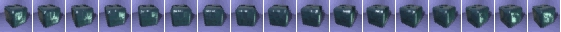

[ Home ](https://github.com/VFPX/Win32API)  

# Displaying animated images on FoxPro form with BitBlt and StretchBlt functions

## Before you begin:
Save this file to the same directory with the following code:  

  

See also:

* [Scrolling text on the form horizontally (a newsreel)](sample_352.md)  
* [Scrolling text on the form vertically (a movie cast)](sample_354.md)  
* [Shaking VFP form controls](sample_526.md)  
* [Playing AVI on _screen](sample_430.md)  
* [Form Magnifier](sample_414.md)  

  
***  


## Code:
```foxpro  
PUBLIC objForm
objForm = CreateObject("Tform")
objForm.Visible = .T.

DEFINE CLASS Tform As Form
#DEFINE SRCCOPY  13369376
#DEFINE SRCAND   8913094
#DEFINE SRCPAINT 15597702
#DEFINE SRCERASE 4457256
	Width=590
	Height=250
	Autocenter=.T.
	Caption=" Using animated images"
	hWindow=0
	hDC=0
	hMemBmp=0
	hMemDC=0
	BmpWidth=0
	BmpHeight=0
	FrameIndex=1

	ADD OBJECT tm As Timer WITH interval=0
	ADD OBJECT cmd As CommandButton WITH;
		Top=210, Left=255, Height=24, Width=80,;
		Caption="Close", Cancel=.T.

PROCEDURE Init
	THIS.decl

PROCEDURE Activate
	IF THIS.hDC = 0
		THIS.hWindow = GetFocus()
		THIS.hDC = GetWindowDC(THIS.hWindow)
		THIS.SetBackImage
		
		THIS.FrameIndex = 1
		THIS.tm.Interval = 50
	ENDIF

PROCEDURE cmd.Click
	ThisForm.Release

PROCEDURE Destroy
	= DeleteObject(THIS.hMemBmp)
	= DeleteDC(THIS.hMemDC)
	= ReleaseDC(THIS.hWindow, THIS.hDC)

PROCEDURE SetBackImage
#DEFINE ccFilename "spin24.bmp"
#DEFINE LR_LOADFROMFILE  16

	LOCAL hDesktop, hDskDC
	hDesktop = GetDesktopWindow()
	hDskDC = GetWindowDC(hDesktop)

	THIS.hMemBmp = LoadImage (0, ccFilename, 0,;
		0,0, LR_LOADFROMFILE)
	THIS.GetBitmapSize
	THIS.hMemDC = CreateCompatibleDC(hDskDC)
	= SelectObject(THIS.hMemDC, THIS.hMemBmp)

	ReleaseDC(hDesktop, hDskDC)
	= BitBlt(THIS.hDC, 10,50, THIS.BmpWidth, THIS.BmpHeight,;
		THIS.hMemDC, 0,0, SRCCOPY)

PROCEDURE GetBitmapSize
#DEFINE BITMAP_STRU_SIZE   24
	LOCAL lcBuffer
	lcBuffer = Repli(Chr(0), BITMAP_STRU_SIZE)

	IF GetObjectA(THIS.hMemBmp, BITMAP_STRU_SIZE, @lcBuffer) <> 0
		THIS.BmpWidth  = buf2dword(SUBSTR(lcBuffer, 5,4))
		THIS.BmpHeight = buf2dword(SUBSTR(lcBuffer, 9,4))
   	ENDIF

PROCEDURE tm.Timer
* rendering the image several times using BitBlt for non-scaled
* and StretchBlt for scaled images

	* all frames together
	= BitBlt(ThisForm.hDC, 20,30,;
		ThisForm.BmpWidth, ThisForm.BmpHeight,;
		ThisForm.hMemDC, 0,0, SRCCOPY)

	= BitBlt(ThisForm.hDC, 125,70, 32, 32,;
		ThisForm.hMemDC,;
		(ThisForm.FrameIndex-1) * 33,;
		0, SRCCOPY)

	= StretchBlt(ThisForm.hDC, 161,70, 64, 64,;
		ThisForm.hMemDC,;
		(ThisForm.FrameIndex-1) * 33,;
		0, 32,32, SRCCOPY)

	= StretchBlt(ThisForm.hDC, 229,70, 128, 128,;
		ThisForm.hMemDC,;
		(17-ThisForm.FrameIndex) * 33,;
		0, 32,32, SRCCOPY)

	= StretchBlt(ThisForm.hDC, 361,70, 96, 64,;
		ThisForm.hMemDC,;
		(17-ThisForm.FrameIndex) * 33,;
		0, 32,32, SRCCOPY)

	= StretchBlt(ThisForm.hDC, 461,70, 32, 32,;
		ThisForm.hMemDC,;
		(17-ThisForm.FrameIndex) * 33,;
		0, 32,32, SRCCOPY)

	* next frame
	ThisForm.FrameIndex = ThisForm.FrameIndex + 1
	IF ThisForm.FrameIndex > 17
		ThisForm.FrameIndex = 1
	ENDIF

PROCEDURE decl
	DECLARE INTEGER StretchBlt IN gdi32;
		INTEGER hdcDest, INTEGER nXOrigDst, INTEGER nYOrigDst,;
		INTEGER nWidthDest, INTEGER nHeightDest,;
		INTEGER hdcSrc, INTEGER nXOrigSrc, INTEGER nYOrigSrc,;
		INTEGER nWidthSrc, INTEGER nHeightSrc, INTEGER dwRop

	DECLARE INTEGER BitBlt IN gdi32 INTEGER hDestDC,;
		INTEGER x, INTEGER y, INTEGER nWidth, INTEGER nHeight,;
		INTEGER hSrcDC, INTEGER xSrc, INTEGER ySrc, INTEGER dwRop

	DECLARE INTEGER GetObject IN gdi32 AS GetObjectA;
		INTEGER hgdiobj, INTEGER cbBuffer, STRING @lpvObject

	DECLARE INTEGER LoadImage IN user32;
		INTEGER hinst, STRING lpszName, INTEGER uType,;
		INTEGER cxDesired, INTEGER cyDesired, INTEGER fuLoad

	DECLARE INTEGER GetDesktopWindow IN user32
	DECLARE INTEGER GetWindowDC IN user32 INTEGER hWnd
	DECLARE INTEGER GetFocus IN user32
	DECLARE INTEGER DeleteObject IN gdi32 INTEGER hObj
	DECLARE INTEGER SelectObject IN gdi32 INTEGER hdc, INTEGER hObj
	DECLARE INTEGER DeleteDC IN gdi32 INTEGER hdc
	DECLARE INTEGER ReleaseDC IN user32 INTEGER hwnd, INTEGER hdc
	DECLARE INTEGER CreateCompatibleDC IN gdi32 INTEGER hdc
ENDDEFINE

FUNCTION buf2dword(lcBuffer)
RETURN Asc(SUBSTR(lcBuffer, 1,1)) + ;
	BitLShift(Asc(SUBSTR(lcBuffer, 2,1)),  8) +;
	BitLShift(Asc(SUBSTR(lcBuffer, 3,1)), 16) +;
	BitLShift(Asc(SUBSTR(lcBuffer, 4,1)), 24)  
```  
***  


## Listed functions:
[BitBlt](../libraries/gdi32/BitBlt.md)  
[CreateCompatibleDC](../libraries/gdi32/CreateCompatibleDC.md)  
[DeleteDC](../libraries/gdi32/DeleteDC.md)  
[DeleteObject](../libraries/gdi32/DeleteObject.md)  
[GetDesktopWindow](../libraries/user32/GetDesktopWindow.md)  
[GetFocus](../libraries/user32/GetFocus.md)  
[GetObject](../libraries/gdi32/GetObject.md)  
[GetWindowDC](../libraries/user32/GetWindowDC.md)  
[LoadImage](../libraries/user32/LoadImage.md)  
[ReleaseDC](../libraries/user32/ReleaseDC.md)  
[SelectObject](../libraries/gdi32/SelectObject.md)  
[StretchBlt](../libraries/gdi32/StretchBlt.md)  

## Comment:
The Timer control works as a projector, retrieving frames from the bitmap, which is selected into memory device context. Obviuosly it takes a small fraction of time and does not degrade performance too much.  
  
Though you must understand that the Timer is in the same process and thread as the whole FoxPro application. That means it can stop or slow down while there is another time consuming operation around.  
  
***  

