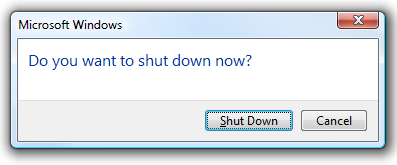

[ Home ](https://github.com/VFPX/Win32API)  

# Using the RestartDialog function -- restarting Windows

## Before you begin:
  

See also: 

* [How to initiate System shutdown (WinNT only)](sample_122.md)  
* [Closing Windows](sample_036.md)  
* [Enabling the SE_SHUTDOWN_NAME privilege for the application](sample_552.md)  
  
***  


## Code:
```foxpro  
#DEFINE EWX_LOGOFF      0
#DEFINE EWX_SHUTDOWN    1
#DEFINE EWX_REBOOT      2
#DEFINE EWX_FORCE       4
#DEFINE EWX_POWEROFF    8
#DEFINE EWX_FORCEIFHUNG 16

DO decl

LOCAL lcMessage
lcMessage = Conv2Unicode("Using the RestartDialog function:     "+;
	Chr(13)+Chr(13))

= RestartDialog(GetActiveWindow(), lcMessage,;
		EWX_SHUTDOWN)
	
FUNCTION Conv2Unicode (lcString)
	LOCAL lcResult, ii
	lcResult=""
	FOR ii=1 To Len(lcString)
		lcResult = lcResult + SUBSTR(lcString, ii,1) + Chr(0)
	ENDFOR
RETURN lcResult+Chr(0)

PROCEDURE decl
	DECLARE INTEGER GetActiveWindow IN user32

	DECLARE INTEGER RestartDialog IN shell32;
		INTEGER hParent, STRING pszPrompt, LONG dwFlags  
```  
***  


## Listed functions:
[GetActiveWindow](../libraries/user32/GetActiveWindow.md)  
[RestartDialog](../libraries/shell32/RestartDialog.md)  

## Comment:
To shut down the local computer, the calling thread must have the SE_SHUTDOWN_NAME privilege.  
  
***  

